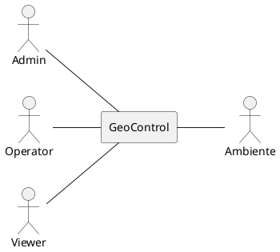
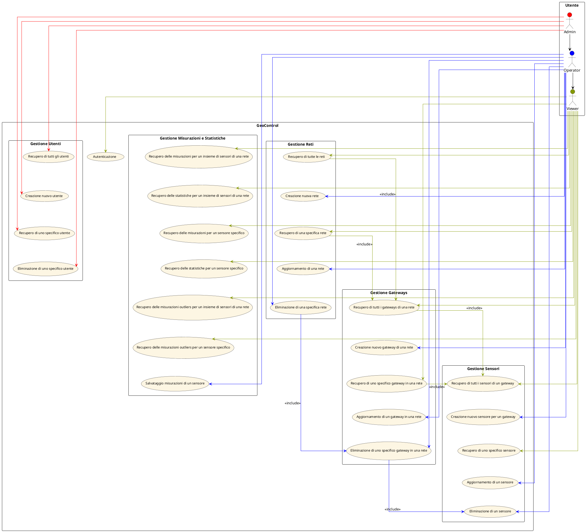
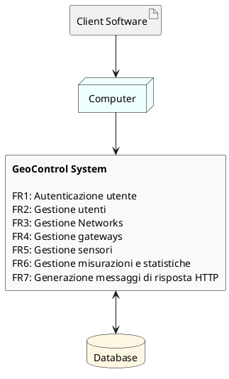
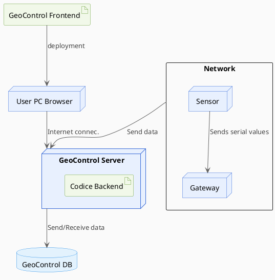

# Requirements Document - GeoControl

Date: April 2nd, 2025

Version: V1 - description of Geocontrol as described in the swagger

| Version number | Change |
| :------------: | :----: |
|                |        |

# Contents

- [Requirements Document - GeoControl](#requirements-document---geocontrol)
- [Contents](#contents)
- [Informal description](#informal-description)
- [Business model](#business-model)
- [Stakeholders](#stakeholders)
- [Context Diagram and interfaces](#context-diagram-and-interfaces)
  - [Context Diagram](#context-diagram)
  - [Interfaces](#interfaces)
- [Stories and personas](#stories-and-personas)
- [Functional and non functional requirements](#functional-and-non-functional-requirements)
  - [Functional Requirements](#functional-requirements)
  - [Non Functional Requirements](#non-functional-requirements)
- [Use case diagram and use cases](#use-case-diagram-and-use-cases)
  - [Use case diagram](#use-case-diagram)
  - [API Response Handling Use Cases](#api-response-handling-use-cases)
    - [Caso d'Uso 1: Autenticazione](#caso-duso-1-autenticazione)
    - [Caso d'Uso 2: Recupero di tutti gli utenti](#caso-duso-2-recupero-di-tutti-gli-utenti)
    - [Caso d'Uso 3: Creazione nuovo utente](#caso-duso-3-creazione-nuovo-utente)
    - [Caso d'Uso 4: Recupero di uno specifico utente](#caso-duso-4-recupero-di-uno-specifico-utente)
    - [Caso d'Uso 5: Eliminazione di uno specifico utente](#caso-duso-5-eliminazione-di-uno-specifico-utente)
    - [Caso_d'Uso_6:_Recupero_di_tutte_le_reti](#caso-duso-6-recupero-di-tutte-le-reti)
    - [Caso_d'Uso_7:_Creazione_nuova_rete](#caso-duso-7-creazione-nuova-rete)
    - [Caso_d'Uso_8:_Recupero_di_una_specifica_rete](#caso-duso-8-recupero-di-una-specifica-rete)
    - [Caso_d'Uso_9:_Aggiornamento_di_una_rete](#caso-duso-9-aggiornamento-di-una-rete)
    - [Caso_d'Uso_10:_Eliminazione_di_una_specifica_rete](#caso-duso-10-eliminazione-di-una-specifica-rete)
    - [Caso_d'Uso_11:_Recupero_di_tutti_i_gateways_di_una_rete](#caso-duso-11-recupero-di-tutti-i-gateways-di-una-rete)
    - [Caso_d'Uso_12:_Creazione_nuovo_gateway_di_una_rete](#caso-duso-12-creazione-nuovo-gateway-di-una-rete)
    - [Caso_d'Uso_13:_Recupero_di_uno_specifico_gateway_in_una_rete](#caso-duso-13-recupero-di-uno-specifico-gateway-in-una-rete)
    - [Caso_d'Uso_14:_Aggiornamento_di_un_gateway_in_una_rete](#caso-duso-14-aggiornamento-di-un-gateway-in-una-rete)
    - [Caso_d'Uso_15:_Eliminazione_di_uno_specifico_gateway_in_una_rete](#caso-duso-15-eliminazione-di-uno-specifico-gateway-in-una-rete)
    - [Caso_d'Uso_16:_Recupero_di_tutti_i_sensori_di_un_gateway](#caso-duso-16-recupero-di-tutti-i-sensori-di-un-gateway)
    - [Caso_d'Uso_17:_Creazione_nuovo_sensore_di_un_gateway](#caso-duso-17-creazione-nuovo-sensore-di-un-gateway)
    - [Caso_d'Uso_18:_Recupero_di_uno_specifico_sensore](#caso-duso-18-recupero-di-uno-specifico-sensore)
    - [Caso_d'Uso_19:_Aggiornamento_di_un_sensore](#caso-duso-19-aggiornamento-di-un-sensore)
    - [Caso_d'Uso_20:_Eliminazione_di_un_sensore](#caso-duso-20-eliminazione-di-un-sensore)
    - [Caso_d'Uso_21:_Recupero_delle_misurazioni_per_un_insieme_di_sensori_di_una_rete](#caso-duso-21-recupero-delle-misurazioni-per-un-insieme-di-sensori-di-una-rete)
    - [Caso_d'Uso_22:_Recupero_delle_statistiche_per_un_insieme_di_sensori_di_una_rete](#caso-duso-22-recupero-delle-statistiche-per-un-insieme-di-sensori-di-una-rete)
    - [Caso_d'Uso_23:_Recupero_delle_misurazioni_outliers_per_un_insieme_di_sensori_di_una_rete](#caso-duso-23-recupero-delle-misurazioni-outliers-per-un-insieme-di-sensori-di-una-rete)
    - [Caso_d'Uso_24:_Registrazione_delle_misurazioni_di_un_sensore](#caso-duso-24-registrazione-delle-misurazioni-di-un-sensore)
    - [Caso_d'Uso_25:_Recupero_delle_misurazioni_per_un_sensore_specifico](#caso-duso-25-recupero-delle-misurazioni-per-un-sensore-specifico)
    - [Caso_d'Uso_26:_Recupero_delle_statistiche_per_un_sensore_specifico](#caso-duso-26-recupero-delle-statistiche-per-un-sensore-specifico)
    - [Caso_d'Uso_27:_Recupero_delle_misurazioni_outliers_per_un_sensore_specifico](#caso-duso-27-recupero-delle-misurazioni-outliers-per-un-sensore-specifico)
- [Glossary](#glossary)
- [System Design](#system-design)
- [Deployment Diagram](#deployment-diagram)

# Informal description

GeoControl è un software progettato per monitorare variabili fisiche e ambientali in diversi contesti: dalle analisi idrogeologiche in aree montane al monitoraggio di edifici storici, fino al controllo di parametri interni come temperatura e illuminazione in ambienti residenziali o lavorativi.

# Business Model

|                  |                                                    Chi paga lo sviluppo                                                    |                                                                                                                                                                                                 Proprietà Server                                                                                                                                                                                                 |                                                                   Chi visualizza i dati                                                                   |
| :--------------: | :------------------------------------------------------------------------------------------------------------------------: | :--------------------------------------------------------------------------------------------------------------------------------------------------------------------------------------------------------------------------------------------------------------------------------------------------------------------------------------------------------------------------------------------------------------: | :-------------------------------------------------------------------------------------------------------------------------------------------------------: |
| **Alternative**  |                                  UMC   _vs_   UMC e altre entità pubbliche/private                                   |                                                                                                                                                                           Proprietà sviluppatori   _vs_   Proprietà ente pagante                                                                                                                                                                           |   - Admin globale   - Operators globali   - Viewers   _vs_   - Admin dell'azienda   - Operators dell'azienda   - Viewers dell'azienda   |
| **Implicazioni** | "UMC e altre entità pubbliche/private"   $\rightarrow$ Il servizio è generalizzato e non applicabile a una sola azienda | - "Proprietà sviluppatori"   $\rightarrow$ Admin e operators sono centralizzati (team dell'applicazione)   $\rightarrow$ Servizio di manutenzione obbligatorio     - "Proprietà ente pagante"   $\rightarrow$ Admin e operators dedicati per ciascun ente   $\rightarrow$ Servizio di manutenzione opzionale   $\rightarrow$ Controllo completo sulla gestione e configurazione del sistema | - "Ruolo globale"   $\rightarrow$ Dipendenti dell'applicazione     - "Ruolo corporate"   $\rightarrow$ Dipendenti dell'azienda commissionante |

|                                      |               Chi paga                |           Proprietà Server            |                                  Chi visualizza i dati                                  | Chi inserisce i dati |
|:------------------------------------:| :-----------------------------------: | :-----------------------------------: | :-------------------------------------------------------------------------------------: |:--------------------:|
|      _Licenza d'uso standalone_      | - UMC   - Entità pubbliche/private | - UMC   - Entità pubbliche/private |                          - Admin   - Operator   -Viewer                           |       Gateway        |
| _Prodotto standalone + Manutenzione_ | - UMC   - Entità pubbliche/private | - UMC   - Entità pubbliche/private |                          - Admin   - Operator   -Viewer                           |       Gateway        |
| _**Prodotto Cloud + Manutenzione**_  | - UMC   - Entità pubbliche/private |  Team di sviluppo dell'applicazione   | - Admin (team dell'applicazione)   - Operator (team dell'applicazione)   - Viewer |       Gateway        |

### Scelta Business Model:
Il Business Model scelto è _**Prodotto Cloud + Manutenzione**_ in quanto consente una gestione centralizzata dei permessi, evitando la necessità di definire ruoli e accessi per ogni ente, semplificando in questo modo l’adozione del sistema.

# Stakeholders

|                                                     Stakeholder                                                     |                                                                                  Descrizione                                                                                   |
|:-------------------------------------------------------------------------------------------------------------------:|:------------------------------------------------------------------------------------------------------------------------------------------------------------------------------:|
|                                                        Admin                                                        |                                            Ruolo con accesso completo a tutte le risorse, inclusa la gestione di utenti e network.                                             |    
|                                                      Operator                                                       |               Ruolo con la possibilità di gestire network, gateway, sensori e di inserire misurazioni, ma senza accesso alle funzionalità relative agli utenti.                |
|                                                       Viewer                                                        | Ruolo con la possibilità di consultare i dati (operazioni in sola lettura su network, gateway, sensori e misurazioni) e non ha accesso alle informazioni relative agli utenti. |
| Buyer   ( - Union of Mountain Communities of the Piedmont region   - Entità pubbliche   - Entità private ) |          Organizzazione che commissiona e finanzia il progetto.   Definisce i requisiti, si occupa della supervisione e dell'approvazione delle fasi di sviluppo.           |
|                                              Produttori di componenti                                               |                    Aziende che producono le componenti hardware, che vengono utilizzate per la raccolta e la trasmissione di dati utilizzati dal software.                     |
|                                                    Team hardware                                                    |                           Insieme di figure professionali che lavorano insieme per gestire, riparare e sostituire componenti hardware di un sistema.                           |
|                                                    Team software                                                    |                                Insieme di figure professionali che lavorano insieme per progettare, sviluppare, testare e rilasciare software.                                 |
|                                                      Ambiente                                                       |                                           Area in cui vengono effettuate le misurazioni, comprende diversi contesti di applicazione.                                           |

# Context Diagram and interfaces

## Context Diagram

## Interfaces

|             Attore             |        Interfaccia logica        | Interfaccia fisica |
| :----------------------------: |:--------------------------------:| :----------------: |
|             Admin              |          Internet (GUI)          |   Terminale (PC)   |
|            Operator            |          Internet (GUI)          |   Terminale (PC)   |
|             Viewer             |          Internet (GUI)          |   Terminale (PC)   |
| Ambiente   (attore passivo) | Cambiamento variabili ambientali |      Sensore       |

# Stories and personas

* **Persona1**: Dalia, femmina, mezza età, esperta in tecnologia e gestione sistemi.
  - **Story**: Accede al sistema GeoControl come ADMIN per creare e gestire i diversi utenti. Ha pieno accesso a tutte le funzionalità, inclusa la gestione delle reti e dei dispositivi.

* **Persona2**: Silvestro, maschio, età media, tecnico elettronico sul campo.
  - **Story**: Accede al sistema GeoControl come OPERATOR, installa e registra nuovi gateway e sensori installati, li associa correttamente alla rete e verifica che le misurazioni vengano trasmesse correttamente. Non può gestire gli utenti o modificare la struttura organizzativa del sistema.

* **Persona3**: Giada, femmina, giovane, analista ambientale.
  - **Story**: Accede al sistema GeoControl come VIEWER, consulta le serie storiche delle misurazioni raccolte in un determinato intervallo temporale per produrre report e valutazioni ambientali. Non può modificare i dati né intervenire sull’infrastruttura dei dispositivi.

# Functional and non functional requirements

## Functional Requirements

I **_requisiti funzionali_** delineano le azioni specifiche che il sistema deve essere in grado di eseguire, come le operazioni che gli utenti possono compiere o i servizi che il sistema deve fornire.

| Codice requisito |                                                       Descrizione                                                        |
|:----------------:|:------------------------------------------------------------------------------------------------------------------------:|
|       FR1        |                                               Autenticazione (token-based)                                               |
|      FR1.1       |                                                          Login                                                           |
|      FR1.2       |                                           Generazione token di autenticazione                                            |
|      FR1.3       |                                                          Logout                                                          |
|       FR2        |                                                     Gestione utenti                                                      |
|      FR2.1       |                                            Recupero dati di tutti gli utenti                                             |
|      FR2.2       |                                                  Creazione nuovo utente                                                  |
|      FR2.3       |                                          Recupero dati di uno specifico utente                                           |
|      FR2.4       |                                                   Eliminazione utente                                                    |
|       FR3        |                                                    Gestione networks                                                     |
|      FR3.1       |                                            Recupero dati di tutte le networks                                            |
|      FR3.2       |                                                 Creazione nuova network                                                  | 
|      FR3.3       |                                          Recupero dati di una specifica network                                          |
|      FR3.4       |                                                  Aggiornamento network                                                   |
|      FR3.5       |                                                   Eliminazione network                                                   |
|       FR4        |                                                    Gestione gateways                                                     |
|      FR4.1       |                                     Recupero dati di tutti i gateways di una network                                     |
|      FR4.2       |                                          Creazione nuovo gateway di una network                                          |
|      FR4.3       |                                          Recupero dati di uno specifico gateway                                          | 
|      FR4.4       |                                                  Aggiornamento gateway                                                   |   
|      FR4.5       |                                                   Eliminazione gateway                                                   | 
|       FR5        |                                                     Gestione sensori                                                     | 
|      FR5.1       |                                      Recupero dati di tutti i sensori di un gateway                                      | 
|      FR5.2       |                                          Creazione nuovo sensore di un gateway                                           |   
|      FR5.3       |                                          Recupero dati di uno specifico sensore                                          | 
|      FR5.4       |                                                  Aggiornamento sensore                                                   |     
|      FR5.5       |                                                   Eliminazione sensore                                                   |         
|       FR6        |                                            Gestione misurazioni e statistiche                                            |                         
|      FR6.1       |                          Recupero misurazioni di un insieme di sensori di una specifica network                          |                         
|      FR6.2       |                          Recupero statistiche di un insieme di sensori di una specifica network                          |                         
|     FR6.2.1      |            Calcolo media su un intervallo di tempo definito di un insieme di sensori di una specifica network            |                         
|     FR6.2.2      |          Calcolo varianza su un intervallo di tempo definito di un insieme di sensori di una specifica network           |                         
|     FR6.2.3      |                        Calcolo soglia superiore di un insieme di sensori di una specifica network                        |                         
|     FR6.2.4      |                        Calcolo soglia inferiore di un insieme di sensori di una specifica network                        |                         
|      FR6.3       |                     Recupero misurazioni outliers di un insieme di sensori di una specifica network                      |                         
|      FR6.4       |                                          Salvataggio misurazioni di un sensore                                           |                         
|      FR6.5       |                                      Recupero misurazioni di uno specifico sensore                                       |                         
|      FR6.6       |                                      Recupero statistiche di uno specifico sensore                                       |                         
|     FR6.6.1      |                        Calcolo media su un intervallo di tempo definito di uno specifico sensore                         |                         
|     FR6.6.2      |                       Calcolo varianza su un intervallo di tempo definito di uno specifico sensore                       |                         
|     FR6.6.3      |                                    Calcolo soglia superiore di uno specifico sensore                                     |                         
|     FR6.6.4      |                                    Calcolo soglia inferiore di uno specifico sensore                                     |                         
|      FR6.7       |                                  Recupero misurazioni outliers di uno specifico sensore                                  |
|      FR6.8       |                     Conversione timestamps delle misurazioni in formato ISO 8601 nel fuso orario UTC                     |                         
|      FR6.9       |                    Memorizzazione timestamps delle misurazion in formato ISO 8601 nel fuso orario UTC                    |
|     FR6.10       |                        Conversione timestamps delle misurazioni nel fuso orario locale del client                        |
|       FR7        |                                          Generazione messaggi di risposta HTTP                                           |                         
|      FR7.1       |                        Generazione messaggio corrispondente a "200 Token generated successfully"                         |                         
|      FR7.2       |                             Generazione messaggio corrispondente a "400 Invalid input data"                              |                         
|      FR7.3       |                        Generazione messaggio corrispondente a "401 Invalid username or password"                         |                         
|      FR7.4       |                                Generazione messaggio corrispondente a "401 Unauthorized"                                 |                         
|      FR7.5       |                             Generazione messaggio corrispondente a "403 Insufficient rights"                             |                         
|      FR7.6       |                            Generazione messaggio corrispondente a "500 Internal server error"                            |                         
|      FR7.7       |                  Generazione messaggio corrispondente a "200 A list of users/networks/gateways/sensors"                  |                         
|      FR7.8       |                    Generazione messaggio corrispondente a "200 A single user/network/gateway/sensor"                     |                         
|      FR7.9       |                     Generazione messaggio corrispondente a "201 User/Network/Gateway/Sensor created"                     |                         
|      FR7.10      |                     Generazione messaggio corrispondente a "204 User/Network/Gateway/Sensor deleted"                     |                         
|      FR7.11      |                       Generazione messaggio corrispondente a "204 Network/Gateway/Sensor updated"                        |                         
|      FR7.12      |                    Generazione messaggio corrispondente a "404 User/Network/Gateway/Sensor not found"                    |                         
|      FR7.13      | Generazione messaggio corrispondente a "409 Username/Network code/Gateway mac address/Sensor mac address already in use" |

## Non Functional Requirements

|  ID   |       Tipo       |                                                 Descrizione                                                 | Riferito a |
|:-----:|:----------------:|:-----------------------------------------------------------------------------------------------------------:|:----------:|
| NFR1  |     Security     |  L'esecuzione di azioni deve essere protetta tramite controlli basati sui ruoli (Admin, Operator, Viewer)   |    FR1     |
| NFR2  |   Reliability    |                            Ogni sensore può perdere al massimo 6 misure all'anno                            |   FR6.4    |
| NFR3  |    Efficiency    |                        Ogni sensore deve misurare una quantità fisica ogni 10 minuti                        |   FR6.4    |
| NFR4  |      Domain      |                               Ogni sensore è identificato da un indirizzo MAC                               |    FR5     |
| NFR5  |    Standards     |                  Ogni sensore è connesso al proprio gateway attraverso connessioni seriali                  |   FR5.2    |
| NFR6  |      Domain      |         Ogni sensore invia timestamps al proprio gateway in formato ISO 8601 nel fuso orario locale         |   FR6.4    |
| NFR7  |     Accuracy     |    Le misurazioni effettuate da ogni sensore devono riflettere la realtà nel modo più preciso possibile     |   FR6.4    |
| NFR8  |      Domain      |                         Ogni network è identificata da un codice alfanumerico unico                         |    FR3     |
| NFR9  |      Domain      |                               Ogni gateway è identificato da un indirizzo MAC                               |    FR4     |
| NFR10 |    Standards     | Ogni gateway è equipaggiato con un'interfaccia network attraverso cui può connettersi al sistema GeoControl |   FR4.2    |
| NFR11 | Interoperability |                             Ogni gateway deve connettersi ad almeno un sensore                              |   FR4.2    |
| NFR12 |      Domain      |            Ogni gateway deve performare la conversione digitale dei dati provenienti dai sensori            |   FR6.4    |
| NFR13 | Interoperability |                  Ogni gateway deve trasmettere i dati digitalizzati sulla propria network                   |   FR6.4    |
| NFR14 |    Standards     |                               Le API devono restituire output in formato JSON                               |    FR7     |

# Use case diagram and use cases

## Use case diagram

---

## API Response Handling Use Cases

Questa sezione descrive i casi d'uso relativi alle risposte delle API, evidenziando per ciascuna operazione i possibili output in base al codice di response HTTP.

---

### Caso d'Uso 1: Autenticazione

|   **Attori Coinvolti**   |                  Admin, Operator, Viewer                   |
|:------------------------:|:----------------------------------------------------------:|
|     **Precondition**     |             L'utente non è ancora autenticato              |
|    **Postcondition**     | L'utente viene autenticato e viene restituito un token JWT |
|   **Nominal Scenario**   |                        Scenario 1.1                        |
|       **Variants**       |                          Nessuna                           |
|      **Exceptions**      |                 Scenari 1.2, 1.3, 1.4, 1.5                 |

#### Scenario 1.1: Autenticazione riuscita (_Response 200_)

| **Scenario 1.1**  |                                                                          |
|:-----------------:|:------------------------------------------------------------------------:|
| **Precondition**  |                    L'utente non è ancora autenticato                     |
| **Postcondition** |        L'utente viene autenticato e viene restituito un token JWT        |
|     **Step#**     |                             **Descrizione**                              |
|         1         | Il sistema riceve la richiesta di autenticazione con username e password |
|         2         |                Il sistema individua il record dell'utente                |
|         3         |       La password fornita viene confrontata con quella memorizzata       |
|         4         | Le password corrispondono, il sistema genera e restituisce un token JWT  |

#### Scenario 1.2: Input non valido (_Response 400_)

| **Scenario 1.2**  |                                                                                         |
|:-----------------:|:---------------------------------------------------------------------------------------:|
| **Precondition**  |                            L'utente non è ancora autenticato                            |
| **Postcondition** |           L'utente non viene autenticato e non viene restituito un token JWT            |
|     **Step#**     |                                     **Descrizione**                                     |
|         1         |        Il sistema riceve la richiesta di autenticazione con username e password         |
|         2         |          La richiesta contiene proprietà mancanti o formattate in modo errato           |
|         3         |                          Il sistema rileva l'input non valido                           |
|         4         | Il sistema genera il messaggio di errore "/body/xxx' must have required property 'xxx'" |

#### Scenario 1.3: Autenticazione non riuscita (_Response 401_)

| **Scenario 1.3**  |                                                                               |
|:-----------------:|:-----------------------------------------------------------------------------:|
| **Precondition**  |                       L'utente non è ancora autenticato                       |
| **Postcondition** |      L'utente non viene autenticato e non viene restituito un token JWT       |
|     **Step#**     |                                **Descrizione**                                |
|         1         |   Il sistema riceve la richiesta di autenticazione con username e password    |
|         2         |                           Il sistema valida l'input                           |
|         3         |   Le credenziali fornite non corrispondono a quelle di un utente registrato   |
|         4         |                           Il sistema nega l'accesso                           |
|         5         | Il sistema genera il messaggio di errore "Unauthorized: Invalid token format" |

#### Scenario 1.4: Utente non trovato (_Response 404_)

| **Scenario 1.4**  |                                                                          |
|:-----------------:|:------------------------------------------------------------------------:|
| **Precondition**  |                    L'utente non è ancora autenticato                     |
| **Postcondition** |    L'utente non viene autenticato e non viene restituito un token JWT    |
|     **Step#**     |                             **Descrizione**                              |
|         1         | Il sistema riceve la richiesta di autenticazione con username e password |
|         2         |                        Il sistema valida l'input                         |
|         3         |                  L'utente non viene trovato nel sistema                  |
|         4         |                        Il sistema nega l'accesso                         |
|         5         |       Il sistema genera il messaggio di errore "Entity not found"        |

#### Scenario 1.5: Errore interno del server (_Response 500_)

| **Scenario 1.5**  |                                                                                 |
|:-----------------:|:-------------------------------------------------------------------------------:|
| **Precondition**  |                        L'utente non è ancora autenticato                        |
| **Postcondition** |       L'utente non viene autenticato e non viene restituito un token JWT        |
|     **Step#**     |                                 **Descrizione**                                 |
|         1         |    Il sistema riceve la richiesta di autenticazione con username e password     |
|         2         |       Si verifica un errore interno inaspettato durante l'autenticazione        |
|         3         |        Il sistema genera il messaggio di errore "Internal server error"         |

---

### Caso d'Uso 2: Recupero di tutti gli utenti

|  **Attori Coinvolti**  |                        Admin                         |
|:----------------------:|:----------------------------------------------------:|
|    **Precondition**    | L'utente è correttamente autenticato nel ruolo Admin |
|   **Postcondition**    | I dati degli utenti vengono recuperati con successo  |
|  **Nominal Scenario**  |                     Scenario 2.1                     |
|      **Variants**      |                       Nessuna                        |
|     **Exceptions**     |                Scenari 2.2, 2.3, 2.4                 |

#### Scenario 2.1: Recupero di tutti gli utenti con successo (_Response 200_)

| **Scenario 2.1**  |                                                                          |
|:-----------------:|:------------------------------------------------------------------------:|
| **Precondition**  |           L'utente è correttamente autenticato nel ruolo Admin           |
| **Postcondition** |        I dati di tutti gli utenti vengono recuperati con successo        |
|     **Step#**     |                             **Descrizione**                              |
|         1         | L'utente invia una richiesta per recuperare la lista di tutti gli utenti |
|         2         |          Il sistema verifica il token associato alla richiesta           |
|         3         |        Il sistema recupera e restituisce un array di oggetti User        |

#### Scenario 2.2: Utente non autorizzato (_Response 401_)

| **Scenario 2.2**  |                                                                               |
|:-----------------:|:-----------------------------------------------------------------------------:|
| **Precondition**  |             L'utente è correttamente autenticato nel ruolo Admin              |
| **Postcondition** |        I dati di tutti gli utenti non vengono recuperati con successo         |
|     **Step#**     |                                **Descrizione**                                |
|         1         |   L'utente invia una richiesta per recuperare la lista di tutti gli utenti    |
|         2         |             Il sistema verifica il token associato alla richiesta             |
|         3         |            Il sistema rileva che il token ha un formato non valido            |
|         4         | Il sistema genera il messaggio di errore "Unauthorized: Invalid token format" |

#### Scenario 2.3: Diritti insufficienti (_Response 403_)

| **Scenario 2.3**  |                                                                           |
|:-----------------:|:-------------------------------------------------------------------------:|
| **Precondition**  |         L'utente non è correttamente autenticato nel ruolo Admin          |
| **Postcondition** |      I dati di tutti gli utenti non vengono recuperati con successo       |
|     **Step#**     |                              **Descrizione**                              |
|         1         | L'utente invia una richiesta per recuperare la lista di tutti gli utenti  |
|         2         |           Il sistema verifica il token associato alla richiesta           |
|         3         |     Il sistema riconosce che l'utente è privo dei permessi necessari      |
|         4         | Il sistema genera il messaggio di errore "Forbidden: Insufficient rights" |

#### Scenario 2.4: Errore interno del server (_Response 500_)

| **Scenario 2.4**  |                                                                           |
|:-----------------:|:-------------------------------------------------------------------------:|
| **Precondition**  |           L'utente è correttamente autenticato nel ruolo Admin            |
| **Postcondition** |      I dati di tutti gli utenti non vengono recuperati con successo       |
|     **Step#**     |                              **Descrizione**                              |
|         1         | L'utente invia una richiesta per recuperare la lista di tutti gli utenti  |
|         2         | Si verifica un errore interno inaspettato durante l'invio della richiesta |
|         3         |     Il sistema genera il messaggio di errore "Internal server error"      |

---

### Caso d'Uso 3: Creazione nuovo utente

|  **Attori Coinvolti**  |                         Admin                         |
|:----------------------:|:-----------------------------------------------------:|
|    **Precondition**    | L'utente è correttamente autenticato nel ruolo Admin  |
|   **Postcondition**    | Il nuovo utente viene creato e registrato nel sistema |
|  **Nominal Scenario**  |                     Scenario 3.1                      |
|      **Variants**      |                        Nessuna                        |
|     **Exceptions**     |            Scenari 3.2, 3.3, 3.4, 3.5, 3.6            |

#### Scenario 3.1: Utente creato con successo (_Response 201_)

| **Scenario 3.1**  |                                                                 |
|:-----------------:|:---------------------------------------------------------------:|
| **Precondition**  |      L'utente è correttamente autenticato nel ruolo Admin       |
| **Postcondition** |      Il nuovo utente viene creato e registrato nel sistema      |
|     **Step#**     |                         **Descrizione**                         |
|         1         | L'Admin invia una richiesta per la creazione di un nuovo utente |
|         2         | L'Admin fornisce i dati necessari (username, password e ruolo)  |
|         3         |                    Il sistema valida l'input                    |
|         4         |          Il sistema crea e registra il nuovo utente             |

#### Scenario 3.2: Input non valido (_Response 400_)

| **Scenario 3.2**  |                                                                                         |
|:-----------------:|:---------------------------------------------------------------------------------------:|
| **Precondition**  |                  L'utente è correttamente autenticato nel ruolo Admin                   |
| **Postcondition** |                Il nuovo utente non viene creato e registrato nel sistema                |
|     **Step#**     |                                     **Descrizione**                                     |
|         1         |             L'Admin invia una richiesta per la creazione di un nuovo utente             |
|         2         |             L'Admin fornisce i dati necessari (username, password e ruolo)              |
|         3         |                                Il sistema valida l'input                                |
|         4         |                          Il sistema rileva l'input non valido                           |
|         5         | Il sistema genera il messaggio di errore "/body/xxx' must have required property 'xxx'" |

#### Scenario 3.3: Utente non autorizzato (_Response 401_)

| **Scenario 3.3**  |                                                                               |
|:-----------------:|:-----------------------------------------------------------------------------:|
| **Precondition**  |             L'utente è correttamente autenticato nel ruolo Admin              |
| **Postcondition** |           Il nuovo utente non viene creato e registrato nel sistema           |
|     **Step#**     |                                **Descrizione**                                |
|         1         |        L'Admin invia una richiesta per la creazione di un nuovo utente        |
|         2         |             Il sistema verifica il token associato alla richiesta             |
|         3         |            Il sistema rileva che il token ha un formato non valido            |
|         4         | Il sistema genera il messaggio di errore "Unauthorized: Invalid token format" |

#### Scenario 3.4: Diritti insufficienti (_Response 403_)

| **Scenario 3.4**  |                                                                           |
|:-----------------:|:-------------------------------------------------------------------------:|
| **Precondition**  |         L'utente non è correttamente autenticato nel ruolo Admin          |
| **Postcondition** |         Il nuovo utente non viene creato e registrato nel sistema         |
|     **Step#**     |                              **Descrizione**                              |
|         1         |     L'utente invia una richiesta per la creazione di un nuovo utente      |
|         2         |           Il sistema verifica il token associato alla richiesta           |
|         3         |     Il sistema riconosce che l'utente è privo dei permessi necessari      |
|         4         | Il sistema genera il messaggio di errore "Forbidden: Insufficient rights" |

#### Scenario 3.5: Username già in uso (_Response 409_)

| **Scenario 3.5**  |                                                                                  |
|:-----------------:|:--------------------------------------------------------------------------------:|
| **Precondition**  |               L'utente è correttamente autenticato nel ruolo Admin               |
| **Postcondition** |            Il nuovo utente non viene creato e registrato nel sistema             |
|     **Step#**     |                                 **Descrizione**                                  |
|         1         |         L'Admin invia una richiesta per la creazione di un nuovo utente          |
|         2         |          L'Admin fornisce i dati necessari (username, password e ruolo)          |
|         3         |                            Il sistema valida l'input                             |
|         4         |      Il sistema rileva che lo username inserito è già presente nel database      |
|         5         | Il sistema genera il messaggio di errore "Entity with code xxxxx already exists" |

#### Scenario 3.6: Errore interno del server (_Response 500_)

| **Scenario 3.6**  |                                                                           |
|:-----------------:|:-------------------------------------------------------------------------:|
| **Precondition**  |           L'utente è correttamente autenticato nel ruolo Admin            |
| **Postcondition** |         Il nuovo utente non viene creato e registrato nel sistema         |
|     **Step#**     |                              **Descrizione**                              |
|         1         |     L'utente invia una richiesta per la creazione di un nuovo utente      |
|         2         | Si verifica un errore interno inaspettato durante l'invio della richiesta |
|         3         |     Il sistema genera il messaggio di errore "Internal server error"      |

---

### Caso d'Uso 4: Recupero di uno specifico utente

|  **Attori Coinvolti**  |                             Admin                              |
|:----------------------:|:--------------------------------------------------------------:|
|    **Precondition**    |      L'utente è correttamente autenticato nel ruolo Admin      |
|   **Postcondition**    | I dati dell'utente specificato vengono recuperati con successo |
|  **Nominal Scenario**  |                          Scenario 4.1                          |
|      **Variants**      |                            Nessuna                             |
|     **Exceptions**     |                   Scenari 4.2, 4.3, 4.4, 4.5                   |

#### Scenario 4.1: Recupero di uno specifico utente con successo (_Response 200_)

| **Scenario 4.1**  |                                                                      |
|:-----------------:|:--------------------------------------------------------------------:|
| **Precondition**  |         L'utente è correttamente autenticato nel ruolo Admin         |
| **Postcondition** |    I dati dell'utente specificato vengono recuperati con successo    |
|     **Step#**     |                           **Descrizione**                            |
|         1         |   L'Admin invia una richiesta per recuperare uno specifico utente    |
|         2         |              L'Admin fornisce lo username dell'utente                |
|         3         | Il sistema verifica l'esistenza nel database dell'utente specificato |
|         4         |          Il sistema recupera e restituisce un oggetto User           |

#### Scenario 4.2: Utente non autorizzato (_Response 401_)

| **Scenario 4.2**  |                                                                               |
|:-----------------:|:-----------------------------------------------------------------------------:|
| **Precondition**  |             L'utente è correttamente autenticato nel ruolo Admin              |
| **Postcondition** |      I dati dell'utente specificato non vengono recuperati con successo       |
|     **Step#**     |                                **Descrizione**                                |
|         1         |        L'Admin invia una richiesta per recuperare uno specifico utente        |
|         2         |             Il sistema verifica il token associato alla richiesta             |
|         3         |            Il sistema rileva che il token ha un formato non valido            |
|         4         | Il sistema genera il messaggio di errore "Unauthorized: Invalid token format" |

#### Scenario 4.3: Diritti insufficienti (_Response 403_)

| **Scenario 4.3**  |                                                                           |
|:-----------------:|:-------------------------------------------------------------------------:|
| **Precondition**  |         L'utente non è correttamente autenticato nel ruolo Admin          |
| **Postcondition** |    I dati dell'utente specificato non vengono recuperati con successo     |
|     **Step#**     |                              **Descrizione**                              |
|         1         |     L'utente invia una richiesta per recuperare uno specifico utente      |
|         2         |           Il sistema verifica il token associato alla richiesta           |
|         3         |     Il sistema riconosce che l'utente è privo dei permessi necessari      |
|         4         | Il sistema genera il messaggio di errore "Forbidden: Insufficient rights" |

#### Scenario 4.4: User non trovato (_Response 404_)

| **Scenario 4.4**  |                                                                        |
|:-----------------:|:----------------------------------------------------------------------:|
| **Precondition**  |          L'utente è correttamente autenticato nel ruolo Admin          |
| **Postcondition** |   I dati dell'utente specificato non vengono recuperati con successo   |
|     **Step#**     |                            **Descrizione**                             |
|         1         |    L'Admin invia una richiesta per recuperare uno specifico utente     |
|         2         |                L'Admin fornisce lo username dell'utente                |
|         3         |  Il sistema verifica l'esistenza nel database dell'utente specificato  |
|         4         | Il sistema non trova alcun utente corrispondente allo username fornito |
|         5         |      Il sistema genera il messaggio di errore "Entity not found"       |

#### Scenario 4.5: Errore interno del server (_Response 500_)

| **Scenario 4.5**  |                                                                           |
|:-----------------:|:-------------------------------------------------------------------------:|
| **Precondition**  |           L'utente è correttamente autenticato nel ruolo Admin            |
| **Postcondition** |      I dati di tutti gli utenti non vengono recuperati con successo       |
|     **Step#**     |                              **Descrizione**                              |
|         1         |     L'utente invia una richiesta per recuperare uno specifico utente      |
|         2         | Si verifica un errore interno inaspettato durante l'invio della richiesta |
|         3         |     Il sistema genera il messaggio di errore "Internal server error"      |

---

### Caso d'Uso 5: Eliminazione di uno specifico utente

|  **Attori Coinvolti**  |                        Admin                         |
|:----------------------:|:----------------------------------------------------:|
|    **Precondition**    | L'utente è correttamente autenticato nel ruolo Admin |
|   **Postcondition**    |    L'utente specificato viene rimosso dal sistema    |
|  **Nominal Scenario**  |                     Scenario 5.1                     |
|      **Variants**      |                       Nessuna                        |
|     **Exceptions**     |              Scenari 5.2, 5.3, 5.4, 5.5              |

#### Scenario 5.1: Eliminazione di uno specifico utente con successo (_Response 204_)

| **Scenario 5.1**  |                                                                        |
|:-----------------:|:----------------------------------------------------------------------:|
| **Precondition**  |          L'utente è correttamente autenticato nel ruolo Admin          |
| **Postcondition** |             L'utente specificato viene rimosso dal sistema             |
|     **Step#**     |                            **Descrizione**                             |
|         1         |     L'Admin invia una richiesta per eliminare uno specifico utente     |
|         2         |                L'Admin fornisce lo username dell'utente                |
|         3         |  Il sistema verifica l'esistenza nel database dell'utente specificato  |
|         4         | Il sistema elimina l'oggetto User corrispondente allo username fornito |

#### Scenario 5.2: Utente non autorizzato (_Response 401_)

| **Scenario 5.2**  |                                                                               |
|:-----------------:|:-----------------------------------------------------------------------------:|
| **Precondition**  |             L'utente è correttamente autenticato nel ruolo Admin              |
| **Postcondition** |              L'utente specificato non viene rimosso dal sistema               |
|     **Step#**     |                                **Descrizione**                                |
|         1         |        L'Admin invia una richiesta per eliminare uno specifico utente         |
|         2         |             Il sistema verifica il token associato alla richiesta             |
|         3         |            Il sistema rileva che il token ha un formato non valido            |
|         4         | Il sistema genera il messaggio di errore "Unauthorized: Invalid token format" |

#### Scenario 5.3: Diritti insufficienti (_Response 403_)

| **Scenario 5.3**  |                                                                           |
|:-----------------:|:-------------------------------------------------------------------------:|
| **Precondition**  |         L'utente non è correttamente autenticato nel ruolo Admin          |
| **Postcondition** |            L'utente specificato non viene rimosso dal sistema             |
|     **Step#**     |                              **Descrizione**                              |
|         1         |      L'utente invia una richiesta per eliminare uno specifico utente      |
|         2         |           Il sistema verifica il token associato alla richiesta           |
|         3         |     Il sistema riconosce che l'utente è privo dei permessi necessari      |
|         4         | Il sistema genera il messaggio di errore "Forbidden: Insufficient rights" |

#### Scenario 5.4: User non trovato (_Response 404_)

| **Scenario 5.4**  |                                                                        |
|:-----------------:|:----------------------------------------------------------------------:|
| **Precondition**  |          L'utente è correttamente autenticato nel ruolo Admin          |
| **Postcondition** |           L'utente specificato non viene rimosso dal sistema           |
|     **Step#**     |                            **Descrizione**                             |
|         1         |     L'Admin invia una richiesta per eliminare uno specifico utente     |
|         2         |                L'Admin fornisce lo username dell'utente                |
|         3         |  Il sistema verifica l'esistenza nel database dell'utente specificato  |
|         4         | Il sistema non trova alcun utente corrispondente allo username fornito |
|         5         |      Il sistema genera il messaggio di errore "Entity not found"       |

#### Scenario 5.5: Errore interno del server (_Response 500_)

| **Scenario 5.5**  |                                                                           |
|:-----------------:|:-------------------------------------------------------------------------:|
| **Precondition**  |           L'utente è correttamente autenticato nel ruolo Admin            |
| **Postcondition** |            L'utente specificato non viene rimosso dal sistema             |
|     **Step#**     |                              **Descrizione**                              |
|         1         |      L'utente invia una richiesta per eliminare uno specifico utente      |
|         2         | Si verifica un errore interno inaspettato durante l'invio della richiesta |
|         3         |     Il sistema genera il messaggio di errore "Internal server error"      |

---

### Caso d'Uso 6: Recupero di tutte le reti

| **Attori Coinvolti**  |                 Admin, Operator, Viewer                  |
|:----------------------:|:--------------------------------------------------------:|
| **Precondizione**      |           L'utente è autenticato correttamente           |
| **Postcondizione**     | Una lista di tutte le reti viene restituita con successo |
| **Scenario Nominale**  |                       Scenario 6.1                       |
| **Varianti**           |                         Nessuna                          |
| **Eccezioni**          |                     Scenari 6.2, 6.3                     |

#### Scenario 6.1: Recupero di tutte le reti con successo (_Response 200_)

|  **Scenario 6.1**  |                                                                        |
|:------------------:|:----------------------------------------------------------------------:|
| **Precondizione**  |                  L'utente è autenticato correttamente                  |
| **Postcondizione** |        Una lista di tutte le reti viene restituita con successo        |
|     **Step#**      |                            **Descrizione**                             |
|         1          | L'utente invia una richiesta per recuperare la lista di tutte le reti  |
|         2          |            Il sistema verifica l'autenticazione dell'utente            |
|         3          |     Il sistema recupera e restituisce un array di oggetti Network      |

#### Scenario 6.2: Utente non autorizzato (_Response 401_)

|  **Scenario 6.2**  |                                                                                 |
|:------------------:|:-------------------------------------------------------------------------------:|
| **Precondizione**  |                    L'utente non è autenticato correttamente                     |
| **Postcondizione** |                 Una lista di tutte le reti non viene restituita                 |
|     **Step#**      |                                 **Descrizione**                                 |
|         1          |      L'utente invia una richiesta per recuperare la lista di tutte le reti      |
|         2          |                Il sistema verifica l'autenticazione dell'utente                 |
|         3          |             Il sistema rileva che il token ha un formato non valido             |
|         4          |  Il sistema genera il messaggio di errore "Unauthorized: Invalid token format"  |

#### Scenario 6.3: Errore interno del server (_Response 500_)

|  **Scenario 6.3**  |                                                                           |
|:------------------:|:-------------------------------------------------------------------------:|
| **Precondizione**  |                   L'utente è autenticato correttamente                    |
| **Postcondizione** |              Una lista di tutte le reti non viene restituita              |
|    **Step#**       |                              **Descrizione**                              |
|         1          |   L'utente invia una richiesta per recuperare la lista di tutte le reti   |
|         2          | Si verifica un errore interno inaspettato durante l'invio della richiesta |
|         3          |     Il sistema genera il messaggio di errore "Internal server error"      |

---

### Caso d'Uso 7: Creazione nuova rete

| **Attori Coinvolti**  |                         Admin, Operator                         |
|:----------------------:|:---------------------------------------------------------------:|
| **Precondizione**      | L'utente è correttamente autenticato nel ruolo Admin o Operator |
| **Postcondizione**     |       La nuova rete viene creata e registrata nel sistema       |
| **Scenario Nominale**  |                          Scenario 7.1                           |
| **Varianti**           |                             Nessuna                             |
| **Eccezioni**          |                 Scenari 7.2, 7.3, 7.4, 7.5, 7.6                 |

#### Scenario 7.1: Rete creata con successo (_Response 201_)

|  **Scenario 7.1**  |                                                                                        |
|:------------------:|:--------------------------------------------------------------------------------------:|
| **Precondizione**  |            L'utente è correttamente autenticato nel ruolo Admin o Operator             |
| **Postcondizione** |                  La nuova rete viene creata e registrata nel sistema                   |
|     **Step#**      |                                    **Descrizione**                                     |
|         1          |            L'utente invia una richiesta per la creazione di una nuova rete             |
|         2          |                       L'utente fornisce i dati della nuova rete                        |
|         3          |                 Il sistema verifica il token associato alla richiesta                  |
|         4          | Il sistema crea e registra la nuova rete con i dati forniti (ignora gateway e sensori) |

#### Scenario 7.2: Input non valido (_Response 400_)

|  **Scenario 7.2**  |                                                                                         |
|:------------------:|:---------------------------------------------------------------------------------------:|
| **Precondizione**  |             L'utente è correttamente autenticato nel ruolo Admin o Operator             |
| **Postcondizione** |                 La nuova rete non viene creata e registrata nel sistema                 |
|     **Step#**      |                                     **Descrizione**                                     |
|         1          |             L'utente invia una richiesta per la creazione di una nuova rete             |
|         2          |                        L'utente fornisce i dati della nuova rete                        |
|         3          |                               Il sistema verifica l'input                               |
|         4          |                          Il sistema rileva l'input non valido                           |
|         5          | Il sistema genera il messaggio di errore "/body/xxx' must have required property 'xxx'" |

#### Scenario 7.3: Utente non autorizzato (_Response 401_)

|  **Scenario 7.3**  |                                                                               |
|:------------------:|:-----------------------------------------------------------------------------:|
| **Precondizione**  |        L'utente è correttamente autenticato nel ruolo Admin o Operator        |
| **Postcondizione** |           La nuova rete non viene creata e registrata nel sistema             |
|     **Step#**      |                                **Descrizione**                                |
|         1          |        L'utente invia una richiesta per la creazione di una nuova rete        |
|         2          |             Il sistema verifica il token associato alla richiesta             |
|         3          |            Il sistema rileva che il token ha un formato non valido            |
|         4          | Il sistema genera il messaggio di errore "Unauthorized: Invalid token format" |

#### Scenario 7.4: Diritti insufficienti (_Response 403_)

|  **Scenario 7.4**  |                                                                           |
|:------------------:|:-------------------------------------------------------------------------:|
| **Precondizione**  |    L'utente non è correttamente autenticato nel ruolo Admin o Operator    |
| **Postcondizione** |          La nuova rete non viene creata e registrata nel sistema          |
|     **Step#**      |                              **Descrizione**                              |
|         1          |      L'utente invia una richiesta per la creazione di una nuova rete      |
|         2          |           Il sistema verifica il token associato alla richiesta           |
|         3          |     Il sistema riconosce che l'utente è privo dei permessi necessari      |
|         4          | Il sistema genera il messaggio di errore "Forbidden: Insufficient rights" |

#### Scenario 7.5: Codice della rete già in uso (_Response 409_)

|  **Scenario 7.5**  |                                                                                  |
|:------------------:|:--------------------------------------------------------------------------------:|
| **Precondizione**  |         L'utente è correttamente autenticato nel ruolo Admin o Operator          |
| **Postcondizione** |             La nuova rete non viene creata e registrata nel sistema              |
|     **Step#**      |                                 **Descrizione**                                  |
|         1          |         L'utente invia una richiesta per la creazione di una nuova rete          |
|         2          |                    L'utente fornisce i dati della nuova rete                     |
|         3          |                            Il sistema valida l'input                             |
|         4          | Il sistema rileva che il codice della rete inserito è già presente nel database  |
|         5          | Il sistema genera il messaggio di errore "Entity with code xxxxx already exists" |

#### Scenario 7.6: Errore interno del server (_Response 500_)

|  **Scenario 7.6**  |                                                                           |
|:------------------:|:-------------------------------------------------------------------------:|
| **Precondizione**  |      L'utente è correttamente autenticato nel ruolo Admin o Operator      |
| **Postcondizione** |          La nuova rete non viene creata e registrata nel sistema          |
|     **Step#**      |                              **Descrizione**                              |
|         1          |      L'utente invia una richiesta per la creazione di una nuova rete      |
|         2          | Si verifica un errore interno inaspettato durante l'invio della richiesta |
|         3          |     Il sistema genera il messaggio di errore "Internal server error"      |

---

### Caso d'Uso 8: Recupero di una specifica rete

| **Attori Coinvolti**  |              Admin, Operator, Viewer              |
|:----------------------:|:-------------------------------------------------:|
| **Precondizione**      |       L'utente è autenticato correttamente        |
| **Postcondizione**     | La rete specificata viene restituita con successo |
| **Scenario Nominale**  |                   Scenario 8.1                    |
| **Varianti**           |                      Nessuna                      |
| **Eccezioni**          |               Scenari 8.2, 8.3, 8.4               |

#### Scenario 8.1: Recupero di una specifica rete con successo (_Response 200_)

|  **Scenario 8.1**  |                                                                     |
|:------------------:|:-------------------------------------------------------------------:|
| **Precondizione**  |                L'utente è autenticato correttamente                 |
| **Postcondizione** |          La rete specificata viene restituita con successo          |
|     **Step#**      |                           **Descrizione**                           |
|         1          |   L'utente invia una richiesta per recuperare una specifica rete    |
|         2          |               L'utente fornisce il codice della rete                |
|         3          | Il sistema verifica l'esistenza nel database della rete specificata |
|         4          |        Il sistema recupera e restituisce un oggetto Network         |

#### Scenario 8.2: Utente non autorizzato (_Response 401_)

|  **Scenario 8.2**  |                                                                               |
|:------------------:|:-----------------------------------------------------------------------------:|
| **Precondizione**  |                     L'utente è autenticato correttamente                      |
| **Postcondizione** |                   La rete specificata non viene restituita                    |
|     **Step#**      |                                **Descrizione**                                |
|         1          |        L'utente invia una richiesta per recuperare una specifica rete         |
|         2          |             Il sistema verifica il token associato alla richiesta             |
|         3          |            Il sistema rileva che il token ha un formato non valido            |
|         4          | Il sistema genera il messaggio di errore "Unauthorized: Invalid token format" |

#### Scenario 8.3: Rete non trovata (_Response 404_)

|  **Scenario 8.3**  |                                                                     |
|:------------------:|:-------------------------------------------------------------------:|
| **Precondizione**  |                L'utente è autenticato correttamente                 |
| **Postcondizione** |               La specifica rete non viene restituita                |
|     **Step#**      |                           **Descrizione**                           |
|         1          |   L'utente invia una richiesta per recuperare una specifica rete    |
|         2          |               L'utente fornisce il codice della rete                |
|         3          | Il sistema verifica l'esistenza nel database della rete specificata |
|         4          |  Il sistema non trova alcuna rete corrispondente al codice fornito  |
|         5          |    Il sistema genera il messaggio di errore "Entity not found"      |

#### Scenario 8.4: Errore interno del server (_Response 500_)

|  **Scenario 8.4**  |                                                                           |
|:------------------:|:-------------------------------------------------------------------------:|
| **Precondizione**  |          L'utente è autenticato e possiede i diritti di accesso           |
| **Postcondizione** |                       Nessuna rete viene restituita                       |
|     **Step#**      |                              **Descrizione**                              |
|         1          |      L'utente invia una richiesta per recuperare una specifica rete       |
|         2          | Si verifica un errore interno inaspettato durante l'invio della richiesta |
|         3          |     Il sistema genera il messaggio di errore "Internal server error"      |

---

### Caso d'Uso 9: Aggiornamento di una rete

| **Attori Coinvolti**  |                         Admin, Operator                         |
|:----------------------:|:---------------------------------------------------------------:|
| **Precondizione**      | L'utente è correttamente autenticato nel ruolo Admin o Operator |
| **Postcondizione**     |        La rete specificata è aggiornata con i nuovi dati        |
| **Scenario Nominale**  |                          Scenario 9.1                           |
| **Varianti**           |                             Nessuna                             |
| **Eccezioni**          |              Scenari 9.2, 9.3, 9.4, 9.5, 9.6, 9.7               |

#### Scenario 9.1: Aggiornamento di una rete con successo (_Response 204_)

|  **Scenario 9.1**  |                                                                           |
|:------------------:|:-------------------------------------------------------------------------:|
| **Precondizione**  |      L'utente è correttamente autenticato nel ruolo Admin o Operator      |
| **Postcondizione** |             La rete specificata è aggiornata con i nuovi dati             |
|     **Step#**      |                              **Descrizione**                              |
|         1          |            L'utente invia una richiesta per aggiornare la rete            |
|         2          |           Il sistema verifica il token associato alla richiesta           |
|         3          |                  L'utente fornisce il codice della rete                   |
|         4          |    Il sistema verifica l'esistenza nel database della rete specificata    |
|         5          |                   Il sistema aggiorna i dati della rete                   |

#### Scenario 9.2: Input non valido (_Response 400_)

|  **Scenario 9.2**  |                                                                                           |
|:------------------:|:-----------------------------------------------------------------------------------------:|
| **Precondizione**  |              L'utente è correttamente autenticato nel ruolo Admin o Operator              |
| **Postcondizione** |                   La rete specificata non è aggiornata con i nuovi dati                   |
|     **Step#**      |                                      **Descrizione**                                      |
|         1          |                    L'utente invia una richiesta per aggiornare la rete                    |
|         2          |                          L'utente fornisce il codice della rete                           |
|         3          |                                Il sistema verifica l'input                                |
|         4          |                           Il sistema rileva l'input non valido                            |
|         5          | Il sistema genera il messaggio di errore "/body/xxx' must have required property 'xxx'"   |

#### Scenario 9.3: Utente non autorizzato (_Response 401_)

|  **Scenario 9.3**  |                                                                               |
|:------------------:|:-----------------------------------------------------------------------------:|
| **Precondizione**  |        L'utente è correttamente autenticato nel ruolo Admin o Operator        |
| **Postcondizione** |             La rete specificata non è aggiornata con i nuovi dati             |
|     **Step#**      |                                **Descrizione**                                |
|         1          |              L'utente invia una richiesta per aggiornare la rete              |
|         2          |             Il sistema verifica il token associato alla richiesta             |
|         3          |            Il sistema rileva che il token ha un formato non valido            |
|         4          | Il sistema genera il messaggio di errore "Unauthorized: Invalid token format" |

#### Scenario 9.4: Diritti insufficienti (_Response 403_)

|  **Scenario 9.4**  |                                                                           |
|:------------------:|:-------------------------------------------------------------------------:|
| **Precondizione**  |    L'utente non è correttamente autenticato nel ruolo Admin o Operator    |
| **Postcondizione** |           La rete specificata non è aggiornata con i nuovi dati           |
|     **Step#**      |                              **Descrizione**                              |
|         1          |            L'utente invia una richiesta per aggiornare la rete            |
|         2          |           Il sistema verifica il token associato alla richiesta           |
|         3          |     Il sistema riconosce che l'utente è privo dei permessi necessari      |
|         4          | Il sistema genera il messaggio di errore "Forbidden: Insufficient rights" |

#### Scenario 9.5: Rete non trovata (_Response 404_)

|  **Scenario 9.5**  |                                                                     |
|:------------------:|:-------------------------------------------------------------------:|
| **Precondizione**  |   L'utente è correttamente autenticato nel ruolo Admin o Operator   |
| **Postcondizione** |        La rete specificata non è aggiornata con i nuovi dati        |
|     **Step#**      |                           **Descrizione**                           |
|         1          |         L'utente invia una richiesta per aggiornare la rete         |
|         2          |               L'utente fornisce il codice della rete                |
|         3          | Il sistema verifica l'esistenza nel database della rete specificata |
|         4          | Il sistema non trova alcuna rete corrispondente al codice fornito   |
|         5          |     Il sistema genera il messaggio di errore "Entity not found"     |

#### Scenario 9.6: Codice della rete già in uso (_Response 409_)

|  **Scenario 9.6**  |                                                                                  |
|:------------------:|:--------------------------------------------------------------------------------:|
| **Precondizione**  |         L'utente è correttamente autenticato nel ruolo Admin o Operator          |
| **Postcondizione** |              La rete specificata non è aggiornata con i nuovi dati               |
|     **Step#**      |                                 **Descrizione**                                  |
|         1          |               L'utente invia una richiesta per aggiornare la rete                |
|         2          |                        L'utente fornisce i dati necessari                        |
|         3          |                            Il sistema valida l'input                             |
|         4          |       Il sistema rileva che il codice inserito è già presente nel database       |
|         5          | Il sistema genera il messaggio di errore "Entity with code xxxxx already exists" |

#### Scenario 9.7: Errore interno del server (_Response 500_)

|  **Scenario 9.7**  |                                                                           |
|:------------------:|:-------------------------------------------------------------------------:|
| **Precondizione**  |      L'utente è correttamente autenticato nel ruolo Admin o Operator      |
| **Postcondizione** |           La rete specificata non è aggiornata con i nuovi dati           |
|     **Step#**      |                              **Descrizione**                              |
|         1          |            L'utente invia una richiesta per aggiornare la rete            |
|         2          | Si verifica un errore interno inaspettato durante l'invio della richiesta |
|         3          |     Il sistema genera il messaggio di errore "Internal server error"      |

---

### Caso d'Uso 10: Eliminazione di una specifica rete

| **Attori Coinvolti**  |                         Admin, Operator                         |
|:---------------------:|:---------------------------------------------------------------:|
|   **Precondizione**   | L'utente è correttamente autenticato nel ruolo Admin o Operator |
|  **Postcondizione**   |          La rete specificata viene rimossa dal sistema          |
| **Scenario Nominale** |                          Scenario 10.1                          |
|     **Varianti**      |                             Nessuna                             |
|     **Eccezioni**     |                 Scenari 10.2, 10.3, 10.4, 10.5                  |

#### Scenario 10.1: Eliminazione di una specifica rete con successo (_Response 204_)

| **Scenario 10.1**  |                                                                       |
|:------------------:|:---------------------------------------------------------------------:|
| **Precondizione**  |    L'utente è correttamente autenticato nel ruolo Admin o Operator    |
| **Postcondizione** |             La rete specificata viene rimossa dal sistema             |
|     **Step#**      |                            **Descrizione**                            |
|         1          |     L'utente invia una richiesta per eliminare una specifica rete     |
|         2          |                L'utente fornisce il codice della rete                 |
|         3          |  Il sistema verifica l'esistenza nel database della rete specificata  |
|         4          | Il sistema elimina l'oggetto Network corrispondente al codice fornito |

#### Scenario 10.2: Utente non autorizzato (_Response 401_)

|  **Scenario 10.2**   |                                                                               |
|:--------------------:|:-----------------------------------------------------------------------------:|
| **Precondizione**    |        L'utente è correttamente autenticato nel ruolo Admin o Operator        |
|  **Postcondizione**  |               La rete specificata non viene rimossa dal sistema               |
|      **Step#**       |                                **Descrizione**                                |
|          1           |         L'utente invia una richiesta per eliminare una specifica rete         |
|          2           |             Il sistema verifica il token associato alla richiesta             |
|          3           |            Il sistema rileva che il token ha un formato non valido            |
|          4           | Il sistema genera il messaggio di errore "Unauthorized: Invalid token format" |

#### Scenario 10.3: Diritti insufficienti (_Response 403_)

|  **Scenario 10.3**   |                                                                           |
|:--------------------:|:-------------------------------------------------------------------------:|
| **Precondizione**    |    L'utente non è correttamente autenticato nel ruolo Admin o Operator    |
|  **Postcondizione**  |             La rete specificata non viene rimossa dal sistema             |
|      **Step#**       |                              **Descrizione**                              |
|          1           |       L'utente invia una richiesta per eliminare una specifica rete       |
|          2           |           Il sistema verifica il token associato alla richiesta           |
|          3           |      Il sistema riconosce che l'utente è privo dei permessi necessari     |
|          4           | Il sistema genera il messaggio di errore "Forbidden: Insufficient rights" |

#### Scenario 10.4: Rete non trovata (_Response 404_)

| **Scenario 10.4**  |                                                                        |
|:------------------:|:----------------------------------------------------------------------:|
| **Precondizione**  |    L'utente è correttamente autenticato nel ruolo Admin o Operator     |
| **Postcondizione** |           La rete specificata non viene rimossa dal sistema            |
|     **Step#**      |                            **Descrizione**                             |
|         1          |     L'utente invia una richiesta per eliminare una specifica rete      |
|         2          |                 L'utente fornisce il codice della rete                 | 
|         3          |  Il sistema verifica l'esistenza nel database della rete specificata   |
|         4          | Il sistema non trova alcun utente corrispondente allo username fornito |
|         5          |      Il sistema genera il messaggio di errore "Entity not found"       |

#### Scenario 10.5: Errore interno del server (_Response 500_)

|   **Scenario 10.5**   |                                                                           |
|:---------------------:|:-------------------------------------------------------------------------:|
| **Precondizione**     |      L'utente è correttamente autenticato nel ruolo Admin o Operator      |
|  **Postcondizione**   |             La rete specificata non viene rimossa dal sistema             |
|       **Step#**       |                              **Descrizione**                              |
|           1           |       L'utente invia una richiesta per eliminare una specifica rete       |
|           2           | Si verifica un errore interno inaspettato durante l'invio della richiesta |
|           3           |     Il sistema genera il messaggio di errore "Internal server error"      |

---

### Caso d'Uso 11: Recupero di tutti i gateways di una rete

| **Attori Coinvolti**  |                     Admin, Operator, User                      |
|:----------------------:|:--------------------------------------------------------------:|
| **Precondizione**      |              L'utente è autenticato correttamente              |
| **Postcondizione**     | Una lista di gateways della rete viene restituita con successo |
| **Scenario Nominale**  |                         Scenario 11.1                          |
| **Varianti**           |                            Nessuna                             |
| **Eccezioni**          |                    Scenari 11.2, 11.3, 11.4                    |

#### Scenario 11.1: Recupero di tutti i gateways di una rete con successo (_Response 200_)

| **Scenario 11.1**  |                                                                                                |
|:------------------:|:----------------------------------------------------------------------------------------------:|
| **Precondizione**  |                              L'utente è autenticato correttamente                              |
| **Postcondizione** |                 Una lista di gateways della rete viene restituita con successo                 |
|     **Step#**      |                                        **Descrizione**                                         |
|         1          | L'utente invia una richiesta per recuperare la lista di tutti i gateways di una rete specifica |
|         2          |                             L'utente fornisce il codice della rete                             |
|         3          |                        Il sistema verifica l'autenticazione dell'utente                        |
|         4          |                 Il sistema recupera e restituisce un array di oggetti Gateway                  |

#### Scenario 11.2: Utente non autorizzato (_Response 401_)

| **Scenario 11.2**  |                                                                                                |
|:------------------:|:----------------------------------------------------------------------------------------------:|
| **Precondizione**  |                              L'utente è autenticato correttamente                              |
| **Postcondizione** |               Una lista di gateways della rete non viene restituita con successo               |
|     **Step#**      |                                        **Descrizione**                                         |
|         1          | L'utente invia una richiesta per recuperare la lista di tutti i gateways di una rete specifica |
|         2          |                        Il sistema verifica l'autenticazione dell'utente                        |
|         3          |                    Il sistema rileva che il token ha un formato non valido                     |
|         4          |         Il sistema genera il messaggio di errore "Unauthorized: Invalid token format"          |

#### Scenario 11.3: Rete non trovata (_Response 404_)

| **Scenario 11.3**  |                                                                                                |
|:------------------:|:----------------------------------------------------------------------------------------------:|
| **Precondizione**  |                              L'utente è autenticato correttamente                              |
| **Postcondizione** |               Una lista di gateways della rete non viene restituita con successo               |
|     **Step#**      |                                        **Descrizione**                                         |
|         1          | L'utente invia una richiesta per recuperare la lista di tutti i gateways di una rete specifica |
|         2          |                             L'utente fornisce il codice della rete                             |
|         3          |                     Il sistema verifica l'esistenza della rete specificata                     |
|         4          |               Il sistema non trova alcuna rete corrispondente al codice fornito                |
|         5          |                  Il sistema genera il messaggio di errore "Entity not found"                   |

#### Scenario 11.4: Errore interno del server (_Response 500_)

| **Scenario 11.4**  |                                                                                                |
|:------------------:|:----------------------------------------------------------------------------------------------:|
| **Precondizione**  |                              L'utente è autenticato correttamente                              |
| **Postcondizione** |               Una lista di gateways della rete non viene restituita con successo               |
|     **Step#**      |                                        **Descrizione**                                         |
|         1          | L'utente invia una richiesta per recuperare la lista di tutti i gateways di una rete specifica |
|         2          |           Si verifica un errore interno inaspettato durante l'invio della richiesta            |
|         3          |                Il sistema genera il messaggio di errore "Internal server error"                |

---

### Caso d'Uso 12: Creazione nuovo gateway di una rete

| **Attori Coinvolti**  |                         Admin, Operator                         |
|:----------------------:|:---------------------------------------------------------------:|
| **Precondizione**      | L'utente è correttamente autenticato nel ruolo Admin o Operator |
| **Postcondizione**     |      Il nuovo gateway viene creato e registrato nella rete      |
| **Scenario Nominale**  |                          Scenario 12.1                          |
| **Varianti**           |                             Nessuna                             |
| **Eccezioni**          |              Scenari 12.2, 12.3, 12.4, 12.5, 12.6               |

#### Scenario 12.1: Gateway creato con successo (_Response 201_)

| **Scenario 12.1**  |                                                                                          |
|:------------------:|:----------------------------------------------------------------------------------------:|
| **Precondizione**  |             L'utente è correttamente autenticato nel ruolo Admin o Operator              |
| **Postcondizione** |                  Il nuovo gateway viene creato e registrato nella rete                   |
|     **Step#**      |                                     **Descrizione**                                      |
|         1          | L'utente invia una richiesta per la creazione di un nuovo gateway per una rete specifica |
|         2          |                        L'utente fornisce i dati del nuovo gateway                        |
|         3          |                  Il sistema verifica il token associato alla richiesta                   |
|         4          |               Il sistema crea e registra il nuovo gateway (ignora sensori)               |

#### Scenario 12.2: Input non valido (_Response 400_)

| **Scenario 12.2**  |                                                                                          |
|:------------------:|:----------------------------------------------------------------------------------------:|
| **Precondizione**  |             L'utente è correttamente autenticato nel ruolo Admin o Operator              |
| **Postcondizione** |                Il nuovo gateway non viene creato e registrato nella rete                 |
|     **Step#**      |                                     **Descrizione**                                      |
|         1          | L'utente invia una richiesta per la creazione di un nuovo gateway per una rete specifica |
|         2          |                        L'utente fornisce i dati del nuovo gateway                        |
|         3          |                               Il sistema verifica l'input                                |
|         4          |                           Il sistema rileva l'input non valido                           |
|         5          | Il sistema genera il messaggio di errore "/body/xxx' must have required property 'xxx'"  |

#### Scenario 12.3: Utente non autorizzato (_Response 401_)

| **Scenario 12.3**  |                                                                                          |
|:------------------:|:----------------------------------------------------------------------------------------:|
| **Precondizione**  |             L'utente è correttamente autenticato nel ruolo Admin o Operator              |
| **Postcondizione** |                Il nuovo gateway non viene creato e registrato nella rete                 |
|     **Step#**      |                                     **Descrizione**                                      |
|         1          | L'utente invia una richiesta per la creazione di un nuovo gateway per una rete specifica |
|         2          |                  Il sistema verifica il token associato alla richiesta                   |
|         3          |                 Il sistema rileva che il token ha un formato non valido                  |
|         4          |      Il sistema genera il messaggio di errore "Unauthorized: Invalid token format"       |

#### Scenario 12.4: Diritti insufficienti (_Response 403_)

| **Scenario 12.4**  |                                                                                          |
|:------------------:|:----------------------------------------------------------------------------------------:|
| **Precondizione**  |           L'utente non è correttamente autenticato nel ruolo Admin o Operator            |
| **Postcondizione** |                Il nuovo gateway non viene creato e registrato nella rete                 |
|     **Step#**      |                                     **Descrizione**                                      |
|         1          | L'utente invia una richiesta per la creazione di un nuovo gateway per una rete specifica |
|         2          |                  Il sistema verifica il token associato alla richiesta                   |
|         3          |             Il sistema riconosce che l'utente è privo dei permessi necessari             |
|         4          |        Il sistema genera il messaggio di errore "Forbidden: Insufficient rights"         |

#### Scenario 12.5: Rete non trovata (_Response 404_)

| **Scenario 12.5**  |                                                                                          |
|:------------------:|:----------------------------------------------------------------------------------------:|
| **Precondizione**  |           L'utente non è correttamente autenticato nel ruolo Admin o Operator            |
| **Postcondizione** |                Il nuovo gateway non viene creato e registrato nella rete                 |
|     **Step#**      |                                     **Descrizione**                                      |
|         1          | L'utente invia una richiesta per la creazione di un nuovo gateway per una rete specifica |
|         2          |           L'utente fornisce l'indirizzo MAC del gateway e il codice della rete           |
|         3          |                 Il sistema verifica l'esistenza della rete specificata                   |
|         4          |            Il sistema non trova alcuna rete corrispondente al codice fornito             |
|         5          |               Il sistema genera il messaggio di errore "Entity not found"                |

#### Scenario 12.6: Indirizzo MAC del gateway già in uso (_Response 409_)

| **Scenario 12.6**  |                                                                                          |
|:------------------:|:----------------------------------------------------------------------------------------:|
| **Precondizione**  |           L'utente non è correttamente autenticato nel ruolo Admin o Operator            |
| **Postcondizione** |                Il nuovo gateway non viene creato e registrato nella rete                 |
|     **Step#**      |                                     **Descrizione**                                      |
|         1          | L'utente invia una richiesta per la creazione di un nuovo gateway per una rete specifica |
|         2          |                        L'utente fornisce i dati del nuovo gateway                        |
|         3          |                                Il sistema valida l'input                                 |
|         4          |  Il sistema rileva che l'indirizzo MAC del gateway inserito è già presente nel database  |
|         5          |    Il sistema genera il messaggio di errore "Entity with code xxxxx already exists"      |

#### Scenario 12.7: Errore interno del server (_Response 500_)

| **Scenario 12.7**  |                                                                                           |
|:------------------:|:-----------------------------------------------------------------------------------------:|
| **Precondizione**  |            L'utente non è correttamente autenticato nel ruolo Admin o Operator            |
| **Postcondizione** |                 Il nuovo gateway non viene creato e registrato nella rete                 |
|     **Step#**      |                                      **Descrizione**                                      |
|         1          | L'utente invia una richiesta per la creazione di un nuovo gateway per una rete specifica  |
|         2          | Si verifica un errore interno inaspettato durante l'invio della richiesta |
|         3          |     Il sistema genera il messaggio di errore "Internal server error"      |

---

### Caso d'Uso 13: Recupero di uno specifico gateway in una rete

| **Attori Coinvolti**  |              Admin, Operator, Viewer               |
|:----------------------:|:--------------------------------------------------:|
| **Precondizione**      |        L'utente è autenticato correttamente        |
| **Postcondizione**     | Il gateway specifico viene restituito con successo |
| **Scenario Nominale**  |                   Scenario 13.1                    |
| **Varianti**           |                      Nessuna                       |
| **Eccezioni**          |              Scenari 13.2, 13.3, 13.4              |

#### Scenario 13.1: Recupero di uno specifico gateway con successo (_Response 200_)

| **Scenario 13.1**  |                                                                               |
|:------------------:|:-----------------------------------------------------------------------------:|
| **Precondizione**  |                     L'utente è autenticato correttamente                      |
| **Postcondizione** |              Il gateway specifico viene restituito con successo               |
|     **Step#**      |                                **Descrizione**                                |
|         1          | L'utente invia una richiesta per recuperare uno specifico gateway in una rete |
|         2          |     L'utente fornisce l'indirizzo MAC del gateway e il codice della rete      |
|         3          |     Il sistema verifica l'esistenza nel database del gateway specificato      |
|         4          |             Il sistema recupera e restituisce un oggetto Gateway              |

#### Scenario 13.2: Utente non autorizzato (_Response 401_)

| **Scenario 13.2**  |                                                                               |
|:------------------:|:-----------------------------------------------------------------------------:|
| **Precondizione**  |                      L'utente è autenticato correttamente                     |
| **Postcondizione** |                   Il gateway specifico non viene restituito                   |
|    **Step#**       |                                **Descrizione**                                |
|         1          | L'utente invia una richiesta per recuperare uno specifico gateway in una rete |
|         2          |             Il sistema verifica il token associato alla richiesta             |
|         3          |            Il sistema rileva che il token ha un formato non valido            |
|         4          | Il sistema genera il messaggio di errore "Unauthorized: Invalid token format" |

#### Scenario 13.3: Rete o gateway non trovato (_Response 404_)

| **Scenario 13.3**  |                                                                                                                                      |
|:------------------:|:------------------------------------------------------------------------------------------------------------------------------------:|
| **Precondizione**  |                                                 L'utente è autenticato correttamente                                                 |
| **Postcondizione** |                                              Il gateway specifico non viene restituito                                               |
|     **Step#**      |                                                           **Descrizione**                                                            |
|         1          |                            L'utente invia una richiesta per recuperare uno specifico gateway in una rete                             |
|         2          |                                 L'utente fornisce l'indirizzo MAC del gateway e il codice della rete                                 |
|         3          |                    Il sistema verifica l'esistenza nel database del gateway specificato e della rete specificata                     |
|         4          | Il sistema non trova alcuna rete corrispondente al codice fornito o non trova alcun gateway corrispondente all'indirizzo MAC fornito |
|         5          |                                     Il sistema genera il messaggio di errore "Entity not found"                                      |

#### Scenario 13.4: Errore interno del server (_Response 500_)

| **Scenario 13.4**  |                                                                               |
|:------------------:|:-----------------------------------------------------------------------------:|
| **Precondizione**  |                     L'utente è autenticato correttamente                      |
| **Postcondizione** |                   Il gateway specifico non viene restituito                   |
|     **Step#**      |                                **Descrizione**                                |
|         1          | L'utente invia una richiesta per recuperare uno specifico gateway in una rete |
|         2          |   Si verifica un errore interno inaspettato durante l'invio della richiesta   |
|         3          |       Il sistema genera il messaggio di errore "Internal server error"        |

---

### Caso d'Uso 14: Aggiornamento di un gateway in una rete

| **Attori Coinvolti**  |                         Admin, Operator                          |
|:----------------------:|:----------------------------------------------------------------:|
| **Precondizione**      | L'utente è correttamente autenticato nel ruolo Admin o Operator  |
| **Postcondizione**     |             Il gateway specificato viene aggiornato              |
| **Scenario Nominale**  |                          Scenario 14.1                           |
| **Varianti**           |                             Nessuna                              |
| **Eccezioni**          |           Scenari 14.2, 14.3, 14.4, 14.5 , 14.6 , 14.7           |

#### Scenario 14.1: Aggiornamento di un gateway con successo (_Response 204_)

| **Scenario 14.1**  |                                                                                               |
|:------------------:|:---------------------------------------------------------------------------------------------:|
| **Precondizione**  |                L'utente è correttamente autenticato nel ruolo Admin o Operator                |
| **Postcondizione** |                            Il gateway specificato viene aggiornato                            |
|     **Step#**      |                                        **Descrizione**                                        |
|         1          |              L'utente invia una richiesta per aggiornare il gateway di una rete               |
|         2          |                     Il sistema verifica il token associato alla richiesta                     |
|         3          | Il sistema verifica l'esistenza nel database del gateway specificato e della rete specificata |
|         4          |                            Il sistema aggiorna i dati del gateway                             |

#### Scenario 14.2: Input non valido (_Response 400_)

| **Scenario 14.2**  |                                                                                          |
|:------------------:|:----------------------------------------------------------------------------------------:|
| **Precondizione**  |             L'utente è correttamente autenticato nel ruolo Admin o Operator              |
| **Postcondizione** |                       Il gateway specificato non viene aggiornato                        |
|     **Step#**      |                                     **Descrizione**                                      |
|         1          |            L'utente invia una richiesta per aggiornare il gateway di una rete            |
|         2          |           L'utente fornisce l'indirizzo MAC del gateway e il codice della rete           |
|         3          |                               Il sistema verifica l'input                                |
|         4          |                           Il sistema rileva l'input non valido                           |
|         5          | Il sistema genera il messaggio di errore "/body/xxx' must have required property 'xxx'"  |

#### Scenario 14.3: Utente non autorizzato (_Response 401_)

| **Scenario 14.3**  |                                                                               |
|:------------------:|:-----------------------------------------------------------------------------:|
| **Precondizione**  |        L'utente è correttamente autenticato nel ruolo Admin o Operator        |
| **Postcondizione** |                  Il gateway specificato non viene aggiornato                  |
|     **Step#**      |                                **Descrizione**                                |
|         1          |       L'utente invia una richiesta per aggiornare il gateway di una rete      |
|         2          |             Il sistema verifica il token associato alla richiesta             |
|         3          |            Il sistema rileva che il token ha un formato non valido            |
|         4          | Il sistema genera il messaggio di errore "Unauthorized: Invalid token format" |

#### Scenario 14.4: Diritti insufficienti (_Response 403_)

| **Scenario 14.4**  |                                                                           |
|:------------------:|:-------------------------------------------------------------------------:|
| **Precondizione**  |    L'utente non è correttamente autenticato nel ruolo Admin o Operator    |
| **Postcondizione** |                Il gateway specificato non viene aggiornato                |
|     **Step#**      |                              **Descrizione**                              |
|         1          |    L'utente invia una richiesta per aggiornare il gateway di una rete     |
|         2          |          Il sistema verifica il token associato alla richiesta            |
|         3          |     Il sistema riconosce che l'utente è privo dei permessi necessari      |
|         4          | Il sistema genera il messaggio di errore "Forbidden: Insufficient rights" |

#### Scenario 14.5: Rete o gateway non trovato (_Response 404_)

| **Scenario 14.5**  |                                                                                                                                      |
|:------------------:|:------------------------------------------------------------------------------------------------------------------------------------:|
| **Precondizione**  |                                   L'utente è correttamente autenticato nel ruolo Admin o Operator                                    |
| **Postcondizione** |                                             Il gateway specificato non viene aggiornato                                              |
| **Step#**          |                                                           **Descrizione**                                                            |
|         1          |                                  L'utente invia una richiesta per aggiornare il gateway di una rete                                  |
|         2          |                                 L'utente fornisce l'indirizzo MAC del gateway e il codice della rete                                 |
|         3          |                    Il sistema verifica l'esistenza nel database del gateway specificato e della rete specificata                     |
|         4          | Il sistema non trova alcuna rete corrispondente al codice fornito o non trova alcun gateway corrispondente all'indirizzo MAC fornito |
|         5          |                                     Il sistema genera il messaggio di errore "Entity not found"                                      |

#### Scenario 14.6: Indirizzo MAC del gateway già in uso (_Response 409_)

| **Scenario 14.6**  |                                                                                   |
|:------------------:|:---------------------------------------------------------------------------------:|
| **Precondizione**  |          L'utente è correttamente autenticato nel ruolo Admin o Operator          |
| **Postcondizione** |                    Il gateway specificato non viene aggiornato                    |
|     **Step#**      |                                  **Descrizione**                                  |
|         1          |        L'utente invia una richiesta per aggiornare il gateway di una rete         |
|         2          |                        L'utente fornisce i dati necessari                         |
|         3          |                             Il sistema valida l'input                             |
|         4          |    Il sistema rileva che l'indirizzo MAC inserito è già presente nel database     |
|         5          | Il sistema genera il messaggio di errore "Entity with code xxxxx already exists"  |

#### Scenario 14.7: Errore interno del server (_Response 500_)

| **Scenario 14.7**  |                                                                           |
|:------------------:|:-------------------------------------------------------------------------:|
| **Precondizione**  |      L'utente è correttamente autenticato nel ruolo Admin o Operator      |
| **Postcondizione** |                Il gateway specificato non viene aggiornato                |
|     **Step#**      |                              **Descrizione**                              |
|         1          |    L'utente invia una richiesta per aggiornare il gateway di una rete     |
|         2          | Si verifica un errore interno inaspettato durante l'invio della richiesta |
|         3          |     Il sistema genera il messaggio di errore "Internal server error"      |

---

### Caso d'Uso 15: Eliminazione di uno specifico gateway in una rete

| **Attori Coinvolti**  |                         Admin, Operator                         |
|:---------------------:|:---------------------------------------------------------------:|
|  **Precondizione**    | L'utente è correttamente autenticato nel ruolo Admin o Operator |
|  **Postcondizione**   |        Il gateway specificato viene rimosso dal sistema         |
| **Scenario Nominale** |                          Scenario 15.1                          |
|     **Varianti**      |                             Nessuna                             |
|     **Eccezioni**     |                 Scenari 15.2, 15.3, 15.4, 15.5                  |

#### Scenario 15.1: Eliminazione di uno specifico gateway con successo (_Response 204_)

| **Scenario 15.1**  |                                                                                               |
|:------------------:|:---------------------------------------------------------------------------------------------:|
| **Precondizione**  |                L'utente è correttamente autenticato nel ruolo Admin o Operator                |
| **Postcondizione** |                       Il gateway specificato viene rimosso dal sistema                        |
|     **Step#**      |                                        **Descrizione**                                        |
|         1          |    L'utente invia una richiesta per eliminare uno specifico gateway in una specifica rete     |
|         2          |             L'utente fornisce l'indirizzo MAC del gateway e il codice della rete              |
|         3          | Il sistema verifica l'esistenza nel database del gateway specificato e della rete specificata |
|         4          |         Il sistema elimina l'oggetto Gateway corrispondente all'indirizzo MAC fornito         |

#### Scenario 15.2: Utente non autorizzato (_Response 401_)

| **Scenario 15.2**  |                                                                                        |
|:------------------:|:--------------------------------------------------------------------------------------:|
| **Precondizione**  |            L'utente è correttamente autenticato nel ruolo Admin o Operator             |
| **Postcondizione** |                  Il gateway specificato non viene rimosso dal sistema                  |
|     **Step#**      |                                    **Descrizione**                                     |
|         1          | L'utente invia una richiesta per eliminare uno specifico gateway in una specifica rete |
|         2          |                 Il sistema verifica il token associato alla richiesta                  |
|         3          |                Il sistema rileva che il token ha un formato non valido                 |
|         4          |     Il sistema genera il messaggio di errore "Unauthorized: Invalid token format"      |

#### Scenario 15.3: Diritti insufficienti (_Response 403_)

| **Scenario 15.3**  |                                                                                        |
|:------------------:|:--------------------------------------------------------------------------------------:|
| **Precondizione**  |          L'utente non è correttamente autenticato nel ruolo Admin o Operator           |
| **Postcondizione** |                  Il gateway specificato non viene rimosso dal sistema                  |
|     **Step#**      |                                    **Descrizione**                                     |
|         1          | L'utente invia una richiesta per eliminare uno specifico gateway in una specifica rete |
|         2          |                 Il sistema verifica il token associato alla richiesta                  |
|         3          |            Il sistema riconosce che l'utente è privo dei permessi necessari            |
|         4          |       Il sistema genera il messaggio di errore "Forbidden: Insufficient rights"        |

#### Scenario 15.4: Rete o gateway non trovato (_Response 404_)

| **Scenario 15.4**  |                                                                                                                                      |
|:------------------:|:------------------------------------------------------------------------------------------------------------------------------------:|
| **Precondizione**  |                                   L'utente è correttamente autenticato nel ruolo Admin o Operator                                    |
| **Postcondizione** |                                         Il gateway specificato non viene rimosso dal sistema                                         |
|     **Step#**      |                                                           **Descrizione**                                                            |
|         1          |                        L'utente invia una richiesta per eliminare uno specifico gateway in una specifica rete                        |
|         2          |                                L'utente fornisce l'indirizzo MAC del gateway e il codice della rete                                  |
|         3          |                    Il sistema verifica l'esistenza nel database del gateway specificato e della rete specificata                     |
|         4          | Il sistema non trova alcuna rete corrispondente al codice fornito o non trova alcun gateway corrispondente all'indirizzo MAC fornito |
|         5          |                                     Il sistema genera il messaggio di errore "Entity not found"                                      |

#### Scenario 15.5: Errore interno del server (_Response 500_)

| **Scenario 15.5**  |                                                                                        |
|:------------------:|:--------------------------------------------------------------------------------------:|
| **Precondizione**  |            L'utente è correttamente autenticato nel ruolo Admin o Operator             |
| **Postcondizione** |                  Il gateway specificato non viene rimosso dal sistema                  |
|     **Step#**      |                                    **Descrizione**                                     |
|         1          | L'utente invia una richiesta per eliminare uno specifico gateway in una specifica rete |
|         2          |       Si verifica un errore interno inaspettato durante l'invio della richiesta        |
|         3          |            Il sistema genera il messaggio di errore "Internal server error"            |

---

### Caso d'Uso 16: Recupero di tutti i sensori di un gateway

| **Attori Coinvolti**  |                    Admin, Operator, Viewer                     |
|:----------------------:|:--------------------------------------------------------------:|
| **Precondizione**      |              L'utente è autenticato correttamente              |
| **Postcondizione**     | Una lista di sensori del gateway viene restituita con successo |
| **Scenario Nominale**  |                         Scenario 16.1                          |
| **Varianti**           |                            Nessuna                             |
| **Eccezioni**          |                    Scenari 16.2, 16.3, 16.4                    |

#### Scenario 16.1: Recupero di tutti i sensori di un gateway con successo (_Response 200_)

| **Scenario 16.1**  |                                                                                                             |
|:------------------:|:-----------------------------------------------------------------------------------------------------------:|
| **Precondizione**  |                                    L'utente è autenticato correttamente                                     |
| **Postcondizione** |                       Una lista di sensori del gateway viene restituita con successo                        |
|     **Step#**      |                                               **Descrizione**                                               |
|         1          | L'utente invia una richiesta per recuperare la lista di tutti i sensori di un gateway di una rete specifica |
|         2          |                    L'utente fornisce l'indirizzo MAC del gateway e il codice della rete                     |
|         3          |                              Il sistema verifica l'autenticazione dell'utente                               |
|         4          |                        Il sistema recupera e restituisce un array di oggetti Sensor                         |

#### Scenario 16.2: Utente non autorizzato (_Response 401_)

| **Scenario 16.2**  |                                                                                                             |
|:------------------:|:-----------------------------------------------------------------------------------------------------------:|
| **Precondizione**  |                                    L'utente è autenticato correttamente                                     |
| **Postcondizione** |                            Una lista di sensori del gateway non viene restituita                            |
|     **Step#**      |                                               **Descrizione**                                               |
|         1          | L'utente invia una richiesta per recuperare la lista di tutti i sensori di un gateway di una rete specifica |
|         2          |                              Il sistema verifica l'autenticazione dell'utente                               |
|         3          |                           Il sistema rileva che il token ha un formato non valido                           |
|         4          |                Il sistema genera il messaggio di errore "Unauthorized: Invalid token format"                |

#### Scenario 16.3: Rete o gateway non trovato (_Response 404_)

| **Scenario 16.3**  |                                                                                                                                      |
|:------------------:|:------------------------------------------------------------------------------------------------------------------------------------:|
| **Precondizione**  |                                                 L'utente è autenticato correttamente                                                 |
| **Postcondizione** |                                        Una lista di sensori del gateway non viene restituita                                         |
|     **Step#**      |                                                           **Descrizione**                                                            |
|         1          |             L'utente invia una richiesta per recuperare la lista di tutti i sensori di un gateway di una rete specifica              |
|         2          |                                   L'utente fornisce l'indirizzo del gateway e il codice della rete                                   |
|         3          |                           Il sistema verifica l'esistenza del gateway specificato e della rete specificata                           |
|         4          | Il sistema non trova alcun gateway corrispondente all'indirizzo MAC fornito o non trova alcuna rete corrispondente al codice fornito |
|         5          |                                     Il sistema genera il messaggio di errore "Entity not found"                                      |

#### Scenario 16.4: Errore interno del server (_Response 500_)

| **Scenario 16.4**  |                                                                                                             |
|:------------------:|:-----------------------------------------------------------------------------------------------------------:|
| **Precondizione**  |                                    L'utente è autenticato correttamente                                     |
| **Postcondizione** |                            Una lista di sensori del gateway non viene restituita                            |
|     **Step#**      |                                               **Descrizione**                                               |
|         1          | L'utente invia una richiesta per recuperare la lista di tutti i sensori di un gateway di una rete specifica |
|         2          |                  Si verifica un errore interno inaspettato durante l'invio della richiesta                  |
|         3          |                      Il sistema genera il messaggio di errore "Internal server error"                       |

---

### Caso d'Uso 17: Creazione nuovo sensore di un gateway

| **Attori Coinvolti**  |                        Admin, Operator                          |
|:----------------------:|:---------------------------------------------------------------:|
| **Precondizione**      | L'utente è correttamente autenticato nel ruolo Admin o Operator |
| **Postcondizione**     |     Il nuovo sensore viene creato e registrato nel gateway      |
| **Scenario Nominale**  |                          Scenario 17.1                          |
| **Varianti**           |                             Nessuna                             |
| **Eccezioni**          |              Scenari 17.2, 17.3, 17.4, 17.5, 17.6               |

#### Scenario 17.1: Sensore creato con successo (_Response 201_)

| **Scenario 17.1**  |                                                                                                                 |
|:------------------:|:---------------------------------------------------------------------------------------------------------------:|
| **Precondizione**  |                         L'utente è correttamente autenticato nel ruolo Admin o Operator                         |
| **Postcondizione** |                             Il nuovo sensore viene creato e registrato nel gateway                              |
|     **Step#**      |                                                 **Descrizione**                                                 |
|         1          | L'utente invia una richiesta per la creazione di un nuovo sensore di un gateway specifico di una rete specifica |
|         2          |                                   L'utente fornisce i dati del nuovo sensore                                    |
|         3          |                              Il sistema verifica il token associato alla richiesta                              |
|         4          |                                   Il sistema crea e registra il nuovo sensore                                   |

#### Scenario 17.2: Input non valido (_Response 400_)

| **Scenario 17.2**  |                                                                                                                 |
|:------------------:|:---------------------------------------------------------------------------------------------------------------:|
| **Precondizione**  |                         L'utente è correttamente autenticato nel ruolo Admin o Operator                         |
| **Postcondizione** |                           Il nuovo sensore non viene creato e registrato nel gateway                            |
|     **Step#**      |                                                 **Descrizione**                                                 |
|         1          | L'utente invia una richiesta per la creazione di un nuovo sensore di un gateway specifico di una rete specifica |
|         2          |                                   L'utente fornisce i dati del nuovo sensore                                    |
|         3          |                                           Il sistema verifica l'input                                           |
|         4          |                                      Il sistema rileva l'input non valido                                       |
|         5          |             Il sistema genera il messaggio di errore "/body/xxx' must have required property 'xxx'"             |

#### Scenario 17.3: Utente non autorizzato (_Response 401_)

| **Scenario 17.3**  |                                                                                                                 |
|:------------------:|:---------------------------------------------------------------------------------------------------------------:|
| **Precondizione**  |                         L'utente è correttamente autenticato nel ruolo Admin o Operator                         |
| **Postcondizione** |                           Il nuovo sensore non viene creato e registrato nel gateway                            |
|     **Step#**      |                                                **Descrizione**                                                  |
|         1          | L'utente invia una richiesta per la creazione di un nuovo sensore di un gateway specifico di una rete specifica |
|         2          |                              Il sistema verifica il token associato alla richiesta                              |
|         3          |                             Il sistema rileva che il token ha un formato non valido                             |
|         4          |                  Il sistema genera il messaggio di errore "Unauthorized: Invalid token format"                  |

#### Scenario 17.4: Diritti insufficienti (_Response 403_)

| **Scenario 17.4**  |                                                                                                                 |
|:------------------:|:---------------------------------------------------------------------------------------------------------------:|
| **Precondizione**  |                       L'utente non è correttamente autenticato nel ruolo Admin o Operator                       |
| **Postcondizione** |                           Il nuovo sensore non viene creato e registrato nel gateway                            |
|     **Step#**      |                                                 **Descrizione**                                                 |
|         1          | L'utente invia una richiesta per la creazione di un nuovo sensore di un gateway specifico di una rete specifica |
|         2          |                              Il sistema verifica il token associato alla richiesta                              |
|         3          |                        Il sistema riconosce che l'utente è privo dei permessi necessari                         |
|         4          |                   Il sistema genera il messaggio di errore "Forbidden: Insufficient rights"                     |

#### Scenario 17.5: Rete o gateway non trovato (_Response 404_)

| **Scenario 17.5**  |                                                                                                                                       |
|:------------------:|:-------------------------------------------------------------------------------------------------------------------------------------:|
| **Precondizione**  |                                    L'utente è correttamente autenticato nel ruolo Admin o Operator                                    |
| **Postcondizione** |                                      Il nuovo sensore non viene creato e registrato nel gateway                                       |
|     **Step#**      |                                                            **Descrizione**                                                            |
|         1          |            L'utente invia una richiesta per la creazione di un nuovo sensore di un gateway specifico di una rete specifica            |
|         2          |                   L'utente fornisce l'indirizzo MAC del sensore, l'indirizzo MAC del gateway e il codice della rete                   |
|         3          |                           Il sistema verifica l'esistenza del gateway specificato e della rete specificata                            |
|         4          | Il sistema non trova alcun gateway corrispondente all'indirizzo MAC fornito o non trova alcuna rete corrispondente al codice fornito  |
|         5          |                                      Il sistema genera il messaggio di errore "Entity not found"                                      |

#### Scenario 17.6: Indirizzo MAC del sensore già in uso (_Response 409_)

| **Scenario 17.6**  |                                                                                                                 |
|:------------------:|:---------------------------------------------------------------------------------------------------------------:|
| **Precondizione**  |                         L'utente è correttamente autenticato nel ruolo Admin o Operator                         |
| **Postcondizione** |                           Il nuovo sensore non viene creato e registrato nel gateway                            |
|     **Step#**      |                                                 **Descrizione**                                                 |
|         1          | L'utente invia una richiesta per la creazione di un nuovo sensore di un gateway specifico di una rete specifica |
|         2          |                                   L'utente fornisce i dati del nuovo sensore                                    |
|         3          |                                            Il sistema valida l'input                                            |
|         4          |             Il sistema rileva che l'indirizzo MAC del sensore inserito è già presente nel database              |
|         5          |                Il sistema genera il messaggio di errore "Entity with code xxxxx already exists"                 |

#### Scenario 17.7: Errore interno del server (_Response 500_)

| **Scenario 17.7**  |                                                                                                                 |
|:------------------:|:---------------------------------------------------------------------------------------------------------------:|
| **Precondizione**  |                         L'utente è correttamente autenticato nel ruolo Admin o Operator                         |
| **Postcondizione** |                           Il nuovo sensore non viene creato e registrato nel gateway                            |
|     **Step#**      |                                                **Descrizione**                                                  |
|         1          | L'utente invia una richiesta per la creazione di un nuovo sensore di un gateway specifico di una rete specifica |
|         2          |                    Si verifica un errore interno inaspettato durante l'invio della richiesta                    |
|         3          |                        Il sistema genera il messaggio di errore "Internal server error"                         |

---

### Caso d'Uso 18: Recupero di uno specifico sensore

| **Attori Coinvolti**  |               Admin, Operator, User                |
|:----------------------:|:--------------------------------------------------:|
| **Precondizione**      |        L'utente è autenticato correttamente        |
| **Postcondizione**     | Il sensore specifico viene restituito con successo |
| **Scenario Nominale**  |                   Scenario 18.1                    |
| **Varianti**           |                      Nessuna                       |
| **Eccezioni**          |           Scenari 18.2, 18.3, 18.4, 18.5           |

#### Scenario 18.1: Recupero di uno specifico sensore con successo (_Response 200_)

| **Scenario 18.1**  |                                                                                                                  |
|:------------------:|:----------------------------------------------------------------------------------------------------------------:|
| **Precondizione**  |                                       L'utente è autenticato correttamente                                       |
| **Postcondizione** |                                Il sensore specifico viene restituito con successo                                |
|     **Step#**      |                                                 **Descrizione**                                                  |
|         1          | L'utente invia una richiesta per recuperare uno specifico sensore in uno specifico gateway in una specifica rete |
|         2          |        L'utente fornisce l'indirizzo MAC del sensore, l'indirizzo MAC del gateway e il codice della rete         |
|         3          |                       Il sistema verifica l'esistenza nel database del sensore specificato                       |
|         4          |                               Il sistema recupera e restituisce un oggetto Sensor                                |

#### Scenario 18.2: Utente non autorizzato (_Response 401_)

| **Scenario 18.2**  |                                                                                                                  |
|:------------------:|:----------------------------------------------------------------------------------------------------------------:|
| **Precondizione**  |                                       L'utente è autenticato correttamente                                       |
| **Postcondizione** |                                    Il sensore specifico non viene restituito                                     |
|     **Step#**      |                                                 **Descrizione**                                                  |
|         1          | L'utente invia una richiesta per recuperare uno specifico sensore in uno specifico gateway in una specifica rete |
|         2          |                              Il sistema verifica il token associato alla richiesta                               |
|         3          |                             Il sistema rileva che il token ha un formato non valido                              |
|         4          |                  Il sistema genera il messaggio di errore "Unauthorized: Invalid token format"                   |

#### Scenario 18.3: Rete, gateway o sensore non trovato (_Response 404_)

| **Scenario 18.3**  |                                                                                                                  |
|:------------------:|:----------------------------------------------------------------------------------------------------------------:|
| **Precondizione**  |                                       L'utente è autenticato correttamente                                       |
| **Postcondizione** |                                    Il sensore specifico non viene restituito                                     |
|     **Step#**      |                                                 **Descrizione**                                                  |
|         1          | L'utente invia una richiesta per recuperare uno specifico sensore in uno specifico gateway in una specifica rete |
|         2          |        L'utente fornisce l'indirizzo MAC del sensore, l'indirizzo MAC del gateway e il codice della rete         |
|         3          |                Il sistema verifica l'esistenza nel database del sensore, del gateway e della rete                |
|         4          |               Il sistema non trova alcuna rete o non trova alcun gateway o non trova alcun sensore               |
|         5          |                           Il sistema genera il messaggio di errore "Entity not found"                            |

#### Scenario 18.4: Errore interno del server (_Response 500_)

| **Scenario 18.4**  |                                                                                                                  |
|:------------------:|:----------------------------------------------------------------------------------------------------------------:|
| **Precondizione**  |                                       L'utente è autenticato correttamente                                       |
| **Postcondizione** |                                    Il sensore specifico non viene restituito                                     |
|     **Step#**      |                                                 **Descrizione**                                                  |
|         1          | L'utente invia una richiesta per recuperare uno specifico sensore in uno specifico gateway in una specifica rete |
|         2          |                    Si verifica un errore interno inaspettato durante l'invio della richiesta                     |
|         3          |                         Il sistema genera il messaggio di errore "Internal server error"                         |

---

### Caso d'Uso 19: Aggiornamento di un sensore

|  **Attori Coinvolti**  |                         Admin, Operator                         |
|:----------------------:|:---------------------------------------------------------------:|
|   **Precondizione**    | L'utente è correttamente autenticato nel ruolo Admin o Operator |
|   **Postcondizione**   |      Il sensore specificato viene aggiornato con successo       |
| **Scenario Nominale**  |                          Scenario 19.1                          |
|      **Varianti**      |                             Nessuna                             |
|     **Eccezioni**      |           Scenari 19.2, 19.3, 19.4, 19.5, 19.6, 19.7            |

#### Scenario 19.1: Aggiornamento di un sensore con successo (_Response 204_)

| **Scenario 19.1**  |                                                                                                |
|:------------------:|:----------------------------------------------------------------------------------------------:|
| **Precondizione**  |                L'utente è correttamente autenticato nel ruolo Admin o Operator                 |
| **Postcondizione** |                      Il sensore specificato viene aggiornato con successo                      |
|     **Step#**      |                                        **Descrizione**                                         |
|         1          |              L'utente invia una richiesta per aggiornare il sensore di un gateway              |
|         2          |                     Il sistema verifica il token associato alla richiesta                      |
|         3          | Il sistema verifica l'esistenza nel database del sensore specificato, del gateway e della rete |
|         4          |                             Il sistema aggiorna i dati del sensore                             |

#### Scenario 19.2: Input non valido (_Response 400_)

| **Scenario 19.2**  |                                                                                                   |
|:------------------:|:-------------------------------------------------------------------------------------------------:|
| **Precondizione**  |                  L'utente è correttamente autenticato nel ruolo Admin o Operator                  |
| **Postcondizione** |                            Il sensore specificato non viene aggiornato                            |
|     **Step#**      |                                          **Descrizione**                                          |
|         1          |               L'utente invia una richiesta per aggiornare il sensore di un gateway                |
|         2          | L'utente fornisce l'indirizzo MAC del sensore, l'indirizzo MAC del gateway e il codice della rete |
|         3          |                                    Il sistema verifica l'input                                    |
|         4          |                               Il sistema rileva l'input non valido                                |
|         5          |      Il sistema genera il messaggio di errore "/body/xxx' must have required property 'xxx'"      |

#### Scenario 19.3: Utente non autorizzato (_Response 401_)

| **Scenario 19.3**  |                                                                               |
|:------------------:|:-----------------------------------------------------------------------------:|
| **Precondizione**  |        L'utente è correttamente autenticato nel ruolo Admin o Operator        |
| **Postcondizione** |                 Il sensore specificato non viene aggiornato                   |
|     **Step#**      |                                **Descrizione**                                |
|         1          |     L'utente invia una richiesta per aggiornare il sensore di un gateway      |
|         2          |             Il sistema verifica il token associato alla richiesta             |
|         3          |            Il sistema rileva che il token ha un formato non valido            |
|         4          | Il sistema genera il messaggio di errore "Unauthorized: Invalid token format" |

#### Scenario 19.4: Diritti insufficienti (_Response 403_)

| **Scenario 19.4**  |                                                                           |
|:------------------:|:-------------------------------------------------------------------------:|
| **Precondizione**  |    L'utente non è correttamente autenticato nel ruolo Admin o Operator    |
| **Postcondizione** |                Il sensore specificato non viene aggiornato                |
|     **Step#**      |                              **Descrizione**                              |
|         1          |   L'utente invia una richiesta per aggiornare il sensore di un gateway    |
|         2          |          Il sistema verifica il token associato alla richiesta            |
|         3          |     Il sistema riconosce che l'utente è privo dei permessi necessari      |
|         4          | Il sistema genera il messaggio di errore "Forbidden: Insufficient rights" |

#### Scenario 19.5: Rete, gateway o sensore non trovato (_Response 404_)

| **Scenario 19.5**  |                                                                                                                                   |
|:------------------:|:---------------------------------------------------------------------------------------------------------------------------------:|
| **Precondizione**  |                                  L'utente è correttamente autenticato nel ruolo Admin o Operator                                  |
| **Postcondizione** |                                            Il sensore specificato non viene aggiornato                                            |
|     **Step#**      |                                                          **Descrizione**                                                          |
|         1          |                               L'utente invia una richiesta per aggiornare il sensore di un gateway                                |
|         2          |                 L'utente fornisce l'indirizzo MAC del sensore, l'indirizzo MAC del gateway e il codice della rete                 |
|         3          |                        Il sistema verifica l'esistenza nel database del sensore, del gateway e della rete                         |
|         4          | Il sistema non trova alcuna rete corrispondente o non trova alcun gateway corrispondente o non trova alcun sensore corrispondente |
|         5          |                                    Il sistema genera il messaggio di errore "Entity not found"                                    |

#### Scenario 19.6: Indirizzo MAC del sensore già in uso (_Response 409_)

| **Scenario 19.6**  |                                                                                   |
|:------------------:|:---------------------------------------------------------------------------------:|
| **Precondizione**  |          L'utente è correttamente autenticato nel ruolo Admin o Operator          |
| **Postcondizione** |                    Il sensore specificato non viene aggiornato                    |
|     **Step#**      |                                  **Descrizione**                                  |
|         1          |       L'utente invia una richiesta per aggiornare il sensore di un gateway        |
|         2          |                        L'utente fornisce i dati necessari                         |
|         3          |                             Il sistema valida l'input                             |
|         4          |    Il sistema rileva che l'indirizzo MAC inserito è già presente nel database     |
|         5          | Il sistema genera il messaggio di errore "Entity with code xxxxx already exists"  |

#### Scenario 19.7: Errore interno del server (_Response 500_)

| **Scenario 19.7**  |                                                                           |
|:------------------:|:-------------------------------------------------------------------------:|
| **Precondizione**  |      L'utente è correttamente autenticato nel ruolo Admin o Operator      |
| **Postcondizione** |                Il sensore specificato non viene aggiornato                |
|     **Step#**      |                              **Descrizione**                              |
|         1          |   L'utente invia una richiesta per aggiornare il sensore di un gateway    |
|         2          | Si verifica un errore interno inaspettato durante l'invio della richiesta |
|         3          |  Il sistema genera il messaggio di errore "Internal server error"         |

---

### Caso d'Uso 20: Eliminazione di un sensore

| **Attori Coinvolti**  |                         Admin, Operator                         |
|:----------------------:|:---------------------------------------------------------------:|
| **Precondizione**      | L'utente è correttamente autenticato nel ruolo Admin o Operator |
| **Postcondizione**     |        Il sensore specificato viene rimosso dal sistema         |
| **Scenario Nominale**  |                          Scenario 20.1                          |
| **Varianti**           |                             Nessuna                             |
| **Eccezioni**          |                 Scenari 20.2, 20.3, 20.4, 20.5                  |

#### Scenario 20.1: Eliminazione di un sensore con successo (_Response 204_)

| **Scenario 20.1**  |                                                                                                                        |
|:------------------:|:----------------------------------------------------------------------------------------------------------------------:|
| **Precondizione**  |                            L'utente è correttamente autenticato nel ruolo Admin o Operator                             |
| **Postcondizione** |                                    Il sensore specificato viene rimosso dal sistema                                    |
|     **Step#**      |                                                    **Descrizione**                                                     |
|         1          |    L'utente invia una richiesta per eliminare uno specifico sensore in uno specifico gateway in una specifica rete     |
|         2          |           L'utente fornisce l'indirizzo MAC del sensore, l'indirizzo MAC del gateway e il codice della rete            |
|         3          | Il sistema verifica l'esistenza nel database del sensore specificato, del gateway specificato e della rete specificata |
|         4          |                      Il sistema elimina l'oggetto Sensor corrispondente all'indirizzo MAC fornito                      |

#### Scenario 20.2: Utente non autorizzato (_Response 401_)

| **Scenario 20.2**  |                                                                                                                 |
|:------------------:|:---------------------------------------------------------------------------------------------------------------:|
| **Precondizione**  |                         L'utente è correttamente autenticato nel ruolo Admin o Operator                         |
| **Postcondizione** |                              Il sensore specificato non viene rimosso dal sistema                               |
|     **Step#**      |                                                 **Descrizione**                                                 |
|         1          | L'utente invia una richiesta per eliminare uno specifico sensore in uno specifico gateway in una specifica rete |
|         2          |                              Il sistema verifica il token associato alla richiesta                              |
|         3          |                             Il sistema rileva che il token ha un formato non valido                             |
|         4          |                  Il sistema genera il messaggio di errore "Unauthorized: Invalid token format"                  |

#### Scenario 20.3: Diritti insufficienti (_Response 403_)

| **Scenario 20.3**  |                                                                                                                 |
|:------------------:|:---------------------------------------------------------------------------------------------------------------:|
| **Precondizione**  |                       L'utente non è correttamente autenticato nel ruolo Admin o Operator                       |
| **Postcondizione** |                              Il sensore specificato non viene rimosso dal sistema                               |
|     **Step#**      |                                                 **Descrizione**                                                 |
|         1          | L'utente invia una richiesta per eliminare uno specifico sensore in uno specifico gateway in una specifica rete |
|         2          |                              Il sistema verifica il token associato alla richiesta                              |
|         3          |                        Il sistema riconosce che l'utente è privo dei permessi necessari                         |
|         4          |                    Il sistema genera il messaggio di errore "Forbidden: Insufficient rights"                    |

#### Scenario 20.4: Rete, gateway o sensore non trovato (_Response 404_)

| **Scenario 20.4**  |                                                                                                                                   |
|:------------------:|:---------------------------------------------------------------------------------------------------------------------------------:|
| **Precondizione**  |                                  L'utente è correttamente autenticato nel ruolo Admin o Operator                                  |
| **Postcondizione** |                                       Il sensore specificato non viene rimosso dal sistema                                        |
|     **Step#**      |                                                         **Descrizione**                                                           |
|         1          |          L'utente invia una richiesta per eliminare uno specifico sensore in uno specifico gateway in una specifica rete          |
|         2          |                 L'utente fornisce l'indirizzo MAC del sensore, l'indirizzo MAC del gateway e il codice della rete                 |
|         3          |                        Il sistema verifica l'esistenza nel database del sensore, del gateway e della rete                         |
|         4          | Il sistema non trova alcuna rete corrispondente o non trova alcun gateway corrispondente o non trova alcun sensore corrispondente |
|         5          |                                    Il sistema genera il messaggio di errore "Entity not found"                                    |

#### Scenario 20.5: Errore interno del server (_Response 500_)

| **Scenario 20.5**  |                                                                                                                 |
|:------------------:|:---------------------------------------------------------------------------------------------------------------:|
| **Precondizione**  |                         L'utente è correttamente autenticato nel ruolo Admin o Operator                         |
| **Postcondizione** |                              Il sensore specificato non viene rimosso dal sistema                               |
|     **Step#**      |                                                 **Descrizione**                                                 |
|         1          | L'utente invia una richiesta per eliminare uno specifico sensore in uno specifico gateway in una specifica rete |
|         2          |                   Si verifica un errore interno inaspettato durante l'invio della richiesta                     |
|         3          |                        Il sistema genera il messaggio di errore "Internal server error"                         |

---

### Caso d'Uso 21: Recupero delle misurazioni per un insieme di sensori di una rete

| **Attori Coinvolti**  |                   Admin, Operator, Viewer                    |
|:----------------------:|:------------------------------------------------------------:|
| **Precondizione**      |             L'utente è autenticato correttamente             |
| **Postcondizione**     | Il sistema restituisce le misurazioni per il set di sensori  |
| **Scenario Nominale**  |                        Scenario 21.1                         |
| **Varianti**           |                           Nessuna                            |
| **Eccezioni**          |                   Scenari 21.2, 21.3, 21.4                   |

#### Scenario 21.1: Recupero delle misurazioni per un insieme di sensori con successo (_Response 200_)

| **Scenario 21.1**  |                                                                                                                                                                                                              |
|:------------------:|:------------------------------------------------------------------------------------------------------------------------------------------------------------------------------------------------------------:|
| **Precondizione**  |                                                                                     L'utente è autenticato correttamente                                                                                     |
| **Postcondizione** |                                                                         Il sistema restituisce le misurazioni per il set di sensori                                                                          |
|     **Step#**      |                                                                                               **Descrizione**                                                                                                |
|         1          | L'utente invia una richiesta per recuperare le misurazioni per un insieme di sensori specifici in una specifica rete, passando `networkCode`, `sensorMacs` (_opt_), `startDate` (_opt_) e `endDate` (_opt_)  |
|         2          |                                                                     Il sistema verifica che la rete e i sensori esistano e siano validi                                                                      |
|         3          |                                                                  Il sistema recupera e restituisce le misurazioni per i sensori selezionati                                                                  |

#### Scenario 21.2: Utente non autorizzato (_Response 401_)

| **Scenario 21.2**  |                                                                                                                      |
|:------------------:|:--------------------------------------------------------------------------------------------------------------------:|
| **Precondizione**  |                                         L'utente è autenticato correttamente                                         |
| **Postcondizione** |                           Il sistema non restituisce le misurazioni per il set di sensori                            |
|     **Step#**      |                                                   **Descrizione**                                                    |
|         1          | L'utente invia una richiesta per recuperare le misurazioni per un insieme di sensori specifici in una specifica rete |
|         2          |                                   Il sistema verifica l'autenticazione dell'utente                                   |
|         3          |                               Il sistema rileva che il token ha un formato non valido                                |
|         4          |                    Il sistema genera il messaggio di errore "Unauthorized: Invalid token format"                     |

#### Scenario 21.3: Rete non trovata (_Response 404_)

| **Scenario 21.3**  |                                                                                                                      |
|:------------------:|:--------------------------------------------------------------------------------------------------------------------:|
| **Precondizione**  |                                         L'utente è autenticato correttamente                                         |
| **Postcondizione** |                           Il sistema non restituisce le misurazioni per il set di sensori                            |
|     **Step#**      |                                                   **Descrizione**                                                    |
|         1          | L'utente invia una richiesta per recuperare le misurazioni per un insieme di sensori specifici in una specifica rete |
|         2          |                                        L'utente fornisce il codice della rete                                        |
|         3          |                                Il sistema verifica l'esistenza della rete specificata                                |
|         4          |                          Il sistema non trova alcuna rete corrispondente al codice fornito                           |
|         5          |                             Il sistema genera il messaggio di errore "Entity not found"                              |

#### Scenario 21.4: Errore interno del server (_Response 500_)

| **Scenario 21.4**  |                                                                                                                       |
|:------------------:|:---------------------------------------------------------------------------------------------------------------------:|
| **Precondizione**  |                         L'utente è autenticato e ha accesso alla rete e ai sensori richiesti                          |
| **Postcondizione** |                      Nessuna misurazione viene recuperata, il sistema segnala un errore interno                       |
|     **Step#**      |                                                    **Descrizione**                                                    |
|         1          | L'utente invia una richiesta per recuperare le misurazioni per un insieme di sensori specifici in una specifica rete  |
|         2          |                       Si verifica un errore interno inaspettato durante l'invio della richiesta                       |
|         3          |                           Il sistema genera il messaggio di errore "Internal server error"                            |

---

### Caso d'Uso 22: Recupero delle statistiche per un insieme di sensori di una rete

| **Attori Coinvolti**  |                   Admin, Operator, Viewer                   |
|:----------------------:|:-----------------------------------------------------------:|
| **Precondizione**      |            L'utente è autenticato correttamente             |
| **Postcondizione**     | Il sistema restituisce le statistiche per il set di sensori |
| **Scenario Nominale**  |                        Scenario 22.1                        |
| **Varianti**           |                           Nessuna                           |
| **Eccezioni**          |                  Scenari 22.2, 22.3, 22.4                   |

#### Scenario 22.1: Recupero delle statistiche per un insieme di sensori con successo (_Response 200_)

| **Scenario 22.1**  |                                                                                                                                                                                                             |
|:------------------:|:-----------------------------------------------------------------------------------------------------------------------------------------------------------------------------------------------------------:|
| **Precondizione**  |                                                                                    L'utente è autenticato correttamente                                                                                     |
| **Postcondizione** |                                                                         Il sistema restituisce le statistiche per il set di sensori                                                                         |
|     **Step#**      |                                                                                               **Descrizione**                                                                                               |
|         1          | L'utente invia una richiesta per recuperare le misurazioni per un insieme di sensori specifici in una specifica rete, passando `networkCode`, `sensorMacs` (_opt_), `startDate` (_opt_) e `endDate` (_opt_) |
|         2          |                                                                     Il sistema verifica che la rete e i sensori esistano e siano validi                                                                     |
|         3          |                                                                 Il sistema recupera e restituisce le statistiche per i sensori selezionati                                                                  |

#### Scenario 22.2: Utente non autorizzato (_Response 401_)

| **Scenario 22.2**  |                                                                                                                      |
|:------------------:|:--------------------------------------------------------------------------------------------------------------------:|
| **Precondizione**  |                                         L'utente è autenticato correttamente                                         |
| **Postcondizione** |                           Il sistema non restituisce le statistiche per il set di sensori                            |
|     **Step#**      |                                                   **Descrizione**                                                    |
|         1          | L'utente invia una richiesta per recuperare le misurazioni per un insieme di sensori specifici in una specifica rete |
|         2          |                                   Il sistema verifica l'autenticazione dell'utente                                   |
|         3          |                               Il sistema rileva che il token ha un formato non valido                                |
|         4          |                    Il sistema genera il messaggio di errore "Unauthorized: Invalid token format"                     |

#### Scenario 22.3: Rete non trovata (_Response 404_)

|  **Scenario 22.3**  |                                                                                                                      |
|:-------------------:|:--------------------------------------------------------------------------------------------------------------------:|
|  **Precondizione**  |                                         L'utente è autenticato correttamente                                         |
| **Postcondizione**  |                           Il sistema non restituisce le statistiche per il set di sensori                            |
|      **Step#**      |                                                   **Descrizione**                                                    |
|          1          | L'utente invia una richiesta per recuperare le misurazioni per un insieme di sensori specifici in una specifica rete |
|          2          |                                        L'utente fornisce il codice della rete                                        |
|          3          |                                Il sistema verifica l'esistenza della rete specificata                                |
|          4          |                          Il sistema non trova alcuna rete corrispondente al codice fornito                           |
|          5          |                             Il sistema genera il messaggio di errore "Entity not found"                              |

#### Scenario 22.4: Errore interno del server (_Response 500_)

| **Scenario 22.4**  |                                                                                                                      |
|:------------------:|:--------------------------------------------------------------------------------------------------------------------:|
| **Precondizione**  |                                         L'utente è autenticato correttamente                                         |
| **Postcondizione** |                           Il sistema non restituisce le statistiche per il set di sensori                            |
|     **Step#**      |                                                   **Descrizione**                                                    |
|         1          | L'utente invia una richiesta per recuperare le misurazioni per un insieme di sensori specifici in una specifica rete |
|         2          |                      Si verifica un errore interno inaspettato durante l'invio della richiesta                       |
|         3          |                           Il sistema genera il messaggio di errore "Internal server error"                           |

---

### Caso d'Uso 23: Recupero delle misurazioni outliers per un insieme di sensori di una rete

| **Attori Coinvolti**  |                        Admin, Operator, Viewer                        |
|:---------------------:|:---------------------------------------------------------------------:|
|   **Precondizione**   |                 L'utente è autenticato correttamente                  |
| **Postcondizione**    | Il sistema restituisce le misurazioni outliers per il set di sensori  |
| **Scenario Nominale** |                             Scenario 23.1                             |
|     **Varianti**      |                                Nessuna                                |
|     **Eccezioni**     |                       Scenari 23.2, 23.3, 23.4                        |

#### Scenario 23.1: Recupero delle misurazioni outliers per un insieme di sensori con successo (_Response 200_)

| **Scenario 23.1**  |                                                                                                                                                                                                                      |
|:------------------:|:--------------------------------------------------------------------------------------------------------------------------------------------------------------------------------------------------------------------:|
| **Precondizione**  |                                                                                         L'utente è autenticato correttamente                                                                                         |
| **Postcondizione** |                                                                         Il sistema restituisce le misurazioni outliers per il set di sensori                                                                         |
|     **Step#**      |                                                                                                   **Descrizione**                                                                                                    |
|         1          | L'utente invia una richiesta per recuperare le misurazioni outliers per un insieme di sensori specifici in una specifica rete, passando `networkCode`, `sensorMacs` (_opt_), `startDate` (_opt_) e `endDate` (_opt_) |
|         2          |                                                                         Il sistema verifica che la rete e i sensori esistano e siano validi                                                                          |
|         3          |                                                                 Il sistema recupera e restituisce le misurazioni outliers per i sensori selezionati                                                                  |

#### Scenario 23.2: Utente non autorizzato (_Response 401_)

| **Scenario 23.2**  |                                                                                                                               |
|:------------------:|:-----------------------------------------------------------------------------------------------------------------------------:|
| **Precondizione**  |                                             L'utente è autenticato correttamente                                              |
| **Postcondizione** |                           Il sistema non restituisce le misurazioni outliers per il set di sensori                            |
|     **Step#**      |                                                        **Descrizione**                                                        |
|         1          | L'utente invia una richiesta per recuperare le misurazioni outliers per un insieme di sensori specifici in una specifica rete |
|         2          |                                       Il sistema verifica l'autenticazione dell'utente                                        |
|         3          |                                    Il sistema rileva che il token ha un formato non valido                                    |
|         4          |                         Il sistema genera il messaggio di errore "Unauthorized: Invalid token format"                         |

#### Scenario 23.3: Rete non trovata (_Response 404_)

| **Scenario 23.3**  |                                                                                                                               |
|:------------------:|:-----------------------------------------------------------------------------------------------------------------------------:|
| **Precondizione**  |                                             L'utente è autenticato correttamente                                              |
| **Postcondizione** |                           Il sistema non restituisce le misurazioni outliers per il set di sensori                            |
|     **Step#**      |                                                        **Descrizione**                                                        |
|         1          | L'utente invia una richiesta per recuperare le misurazioni outliers per un insieme di sensori specifici in una specifica rete |
|         2          |                                            L'utente fornisce il codice della rete                                             |
|         3          |                                    Il sistema verifica l'esistenza della rete specificata                                     |
|         4          |                               Il sistema non trova alcuna rete corrispondente al codice fornito                               |
|         5          |                                  Il sistema genera il messaggio di errore "Entity not found"                                  |

#### Scenario 23.4: Errore interno del server (_Response 500_)

| **Scenario 23.4**  |                                                                                                                               |
|:------------------:|:-----------------------------------------------------------------------------------------------------------------------------:|
| **Precondizione**  |                                             L'utente è autenticato correttamente                                              |
| **Postcondizione** |                           Il sistema non restituisce le misurazioni outliers per il set di sensori                            |
|     **Step#**      |                                                        **Descrizione**                                                        |
|         1          | L'utente invia una richiesta per recuperare le misurazioni outliers per un insieme di sensori specifici in una specifica rete |
|         2          |                          Si verifica un errore interno inaspettato durante l'invio della richiesta                            |
|         3          |                               Il sistema genera il messaggio di errore "Internal server error"                                |

---

### Caso d'Uso 24: Registrazione delle misurazioni di un sensore

| **Attori Coinvolti**  |                          Admin, Operator                           |
|:----------------------:|:------------------------------------------------------------------:|
| **Precondizione**      | L'utente è autenticato correttamente nel ruolo di Admin o Operator |
| **Postcondizione**     |   Il sistema registra una misurazione per il sensore selezionato   |
| **Scenario Nominale**  |                           Scenario 24.1                            |
| **Varianti**           |                              Nessuna                               |
| **Eccezioni**          |                      Scenari 24.2, 24.3, 24.4                      |

#### Scenario 24.1: Registrazione misurazione di un sensore con successo (_Response 201_)

|  **Scenario 24.1**  |                                                                                 |
|:-------------------:|:-------------------------------------------------------------------------------:|
|  **Precondizione**  |       L'utente è autenticato correttamente nel ruolo di Admin o Operator        |
| **Postcondizione**  |         Il sistema registra una misurazione per il sensore selezionato          |
|      **Step#**      |                                 **Descrizione**                                 |
|          1          | L'utente invia una richiesta con una misurazione (data e valore) per il sensore |
|          2          |      Il sistema verifica che i dati siano corretti e che il sensore esista      |
|          3          |                Il sistema registra e restituisce la misurazione                 |

#### Scenario 24.2: Input non valido (_Response 400_)

| **Scenario 24.2**  |                                                                                          |
|:------------------:|:----------------------------------------------------------------------------------------:|
| **Precondizione**  |            L'utente è autenticato correttamente nel ruolo di Admin o Operator            |
| **Postcondizione** |            Il sistema non registra una misurazione per il sensore selezionato            |
|     **Step#**      |                                     **Descrizione**                                      |
|         1          |     L'utente invia una richiesta con una misurazione (data e valore) per il sensore      |
|         2          |                            L'utente fornisce i dati necessari                            |
|         3          |                                Il sistema valida l'input                                 |                  
|         4          | Il sistema genera il messaggio di errore "/body/xxx' must have required property 'xxx'"  |

#### Scenario 24.3: Utente non autorizzato (_Response 401_)

| **Scenario 24.3**  |                                                                                 |
|:------------------:|:-------------------------------------------------------------------------------:|
| **Precondizione**  |       L'utente è autenticato correttamente nel ruolo di Admin o Operator        |
| **Postcondizione** |       Il sistema non registra una misurazione per il sensore selezionato        |
|     **Step#**      |                                 **Descrizione**                                 |
|         1          | L'utente invia una richiesta con una misurazione (data e valore) per il sensore |
|         2          |                Il sistema verifica l'autenticazione dell'utente                 |
|         3          |             Il sistema rileva che il token ha un formato non valido             |
|         4          |  Il sistema genera il messaggio di errore "Unauthorized: Invalid token format"  |

#### Scenario 24.4: Rete, gateway o sensore non trovati (_Response 404_)

| **Scenario 24.4**  |                                                                                                                                   |
|:------------------:|:---------------------------------------------------------------------------------------------------------------------------------:|
| **Precondizione**  |                                L'utente è autenticato correttamente nel ruolo di Admin o Operator                                 |
| **Postcondizione** |                                Il sistema non registra una misurazione per il sensore selezionato                                 |
|     **Step#**      |                                                         **Descrizione**                                                           |
|         1          |                          L'utente invia una richiesta con una misurazione (data e valore) per il sensore                          |
|         2          |                 L'utente fornisce l'indirizzo MAC del sensore, l'indirizzo MAC del gateway e il codice della rete                 |
|         3          |                        Il sistema verifica l'esistenza nel database del sensore, del gateway e della rete                         |
|         4          | Il sistema non trova alcuna rete corrispondente o non trova alcun gateway corrispondente o non trova alcun sensore corrispondente |
|         5          |                                    Il sistema genera il messaggio di errore "Entity not found"                                    |

#### Scenario 24.5: Errore interno del server (_Response 500_)

| **Scenario 24.5**  |                                                                                 |
|:------------------:|:-------------------------------------------------------------------------------:|
| **Precondizione**  |       L'utente è autenticato correttamente nel ruolo di Admin o Operator        |
| **Postcondizione** |       Il sistema non registra una misurazione per il sensore selezionato        |
|     **Step#**      |                                 **Descrizione**                                 |
|         1          | L'utente invia una richiesta con una misurazione (data e valore) per il sensore |
|         2          |   Si verifica un errore interno inaspettato durante l'invio della richiesta     |
|         3          |        Il sistema genera il messaggio di errore "Internal server error"         |

---

### Caso d'Uso 25: Recupero delle misurazioni per un sensore specifico

| **Attori Coinvolti**  |                    Admin, Operator, Viewer                     |
|:----------------------:|:--------------------------------------------------------------:|
| **Precondizione**      |            L'utente è autenticato correttamente                |
| **Postcondizione**     | Il sistema restituisce le misurazioni per il sensore richiesto |
| **Scenario Nominale**  |                         Scenario 25.1                          |
| **Varianti**           |                            Nessuna                             |
| **Eccezioni**          |                    Scenari 25.2, 25.3, 25.4                    |

#### Scenario 25.1: Recupero delle misurazioni per un sensore con successo (_Response 200_)

|  **Scenario 25.1**  |                                                                                                                                                                                         |
|:-------------------:|:---------------------------------------------------------------------------------------------------------------------------------------------------------------------------------------:|
|  **Precondizione**  |                                                                          L'utente è autenticato correttamente                                                                           |
| **Postcondizione**  |                                                             Il sistema restituisce le misurazioni per il sensore richiesto                                                              |
|      **Step#**      |                                                                                     **Descrizione**                                                                                     |
|          1          | L'utente invia una richiesta per recuperare le misurazioni per un sensore specifico in una specifica rete, passando `networkCode`, `sensorMac`, `startDate` (_opt_) e `endDate` (_opt_) |
|          2          |                                                    Il sistema verifica che la rete, il gateway e il sensore esistano e siano validi                                                     |
|          3          |                                                       Il sistema recupera e restituisce le misurazioni per il sensore selezionato                                                       |

#### Scenario 25.2: Utente non autorizzato (_Response 401_)

| **Scenario 25.2**  |                                                                                                           |
|:------------------:|:---------------------------------------------------------------------------------------------------------:|
| **Precondizione**  |                                   L'utente è autenticato correttamente                                    |
| **Postcondizione** |                    Il sistema non restituisce le misurazioni per il sensore richiesto                     |
|     **Step#**      |                                              **Descrizione**                                              |
|         1          | L'utente invia una richiesta per recuperare le misurazioni per un sensore specifico in una specifica rete |
|         2          |                             Il sistema verifica l'autenticazione dell'utente                              |
|         3          |                          Il sistema rileva che il token ha un formato non valido                          |
|         4          |               Il sistema genera il messaggio di errore "Unauthorized: Invalid token format"               |

#### Scenario 25.3: Rete, gateway o sensore non trovati (_Response 404_)

| **Scenario 25.3**  |                                                                                                                                   |
|:------------------:|:---------------------------------------------------------------------------------------------------------------------------------:|
| **Precondizione**  |                                               L'utente è autenticato correttamente                                                |
| **Postcondizione** |                                Il sistema non restituisce le misurazioni per il sensore richiesto                                 |
|     **Step#**      |                                                          **Descrizione**                                                          |
|         1          |             L'utente invia una richiesta per recuperare le misurazioni per un sensore specifico in una specifica rete             |
|         2          |                 L'utente fornisce l'indirizzo MAC del sensore, l'indirizzo MAC del gateway e il codice della rete                 |
|         3          |                        Il sistema verifica l'esistenza nel database del sensore, del gateway e della rete                         |
|         4          | Il sistema non trova alcuna rete corrispondente o non trova alcun gateway corrispondente o non trova alcun sensore corrispondente |
|         5          |                                    Il sistema genera il messaggio di errore "Entity not found"                                    |

#### Scenario 25.4: Errore interno del server (_Response 500_)

| **Scenario 25.4**  |                                                                                                           |
|:------------------:|:---------------------------------------------------------------------------------------------------------:|
| **Precondizione**  |                                   L'utente è autenticato correttamente                                    |
| **Postcondizione** |                    Il sistema non restituisce le misurazioni per il sensore richiesto                     |
|     **Step#**      |                                              **Descrizione**                                              |
|         1          | L'utente invia una richiesta per recuperare le misurazioni per un sensore specifico in una specifica rete |
|         2          |                 Si verifica un errore interno inaspettato durante l'invio della richiesta                 |
|         3          |                     Il sistema genera il messaggio di errore "Internal server error"                      |

---

### Caso d'Uso 26: Recupero delle statistiche per un sensore specifico

| **Attori Coinvolti**  |                    Admin, Operator, Viewer                     |
|:----------------------:|:--------------------------------------------------------------:|
| **Precondizione**      |              L'utente è autenticato correttamente              |
| **Postcondizione**     | Il sistema restituisce le statistiche per il sensore richiesto |
| **Scenario Nominale**  |                         Scenario 26.1                          |
| **Varianti**           |                            Nessuna                             |
| **Eccezioni**          |                    Scenari 26.2, 26.3, 26.4                    |

#### Scenario 26.1: Recupero delle statistiche per un sensore con successo (_Response 200_)

| **Scenario 26.1**  |                                                                                                                                                                                         |
|:------------------:|:---------------------------------------------------------------------------------------------------------------------------------------------------------------------------------------:|
| **Precondizione**  |                                                                          L'utente è autenticato correttamente                                                                           |
| **Postcondizione** |                                                             Il sistema restituisce le statistiche per il sensore richiesto                                                              |
|     **Step#**      |                                                                                     **Descrizione**                                                                                     |
|         1          | L'utente invia una richiesta per recuperare le statistiche per un sensore specifico in una specifica rete, passando `networkCode`, `sensorMac`, `startDate` (_opt_) e `endDate` (_opt_) |
|         2          |                                                    Il sistema verifica che la rete, il gateway e il sensore esistano e siano validi                                                     |
|         3          |                                                       Il sistema recupera e restituisce le statistiche per il sensore selezionato                                                       |

#### Scenario 26.2: Utente non autorizzato (_Response 401_)

| **Scenario 26.2**  |                                                                                                           |
|:------------------:|:---------------------------------------------------------------------------------------------------------:|
| **Precondizione**  |                                   L'utente è autenticato correttamente                                    |
| **Postcondizione** |                    Il sistema non restituisce le statistiche per il sensore richiesto                     |
|     **Step#**      |                                              **Descrizione**                                              |
|         1          | L'utente invia una richiesta per recuperare le statistiche per un sensore specifico in una specifica rete |
|         2          |                             Il sistema verifica l'autenticazione dell'utente                              |
|         3          |                         Il sistema rileva che il token ha un formato non valido                           |
|         4          |               Il sistema genera il messaggio di errore "Unauthorized: Invalid token format"               |

#### Scenario 26.3: Rete, gateway o sensore non trovati (_Response 404_)

| **Scenario 26.3**  |                                                                                                                                   |
|:------------------:|:---------------------------------------------------------------------------------------------------------------------------------:|
| **Precondizione**  |                                               L'utente è autenticato correttamente                                                |
| **Postcondizione** |                                Il sistema non restituisce le statistiche per il sensore richiesto                                 |
|     **Step#**      |                                                          **Descrizione**                                                          |
|         1          |             L'utente invia una richiesta per recuperare le statistiche per un sensore specifico in una specifica rete             |
|         2          |                 L'utente fornisce l'indirizzo MAC del sensore, l'indirizzo MAC del gateway e il codice della rete                 |
|         3          |                        Il sistema verifica l'esistenza nel database del sensore, del gateway e della rete                         |
|         4          | Il sistema non trova alcuna rete corrispondente o non trova alcun gateway corrispondente o non trova alcun sensore corrispondente |
|         5          |                                    Il sistema genera il messaggio di errore "Entity not found"                                    |

#### Scenario 26.4: Errore interno del server (_Response 500_)

| **Scenario 26.4**  |                                                                                                           |
|:------------------:|:---------------------------------------------------------------------------------------------------------:|
| **Precondizione**  |                                   L'utente è autenticato correttamente                                    |
| **Postcondizione** |                    Il sistema non restituisce le statistiche per il sensore richiesto                     |
|     **Step#**      |                                              **Descrizione**                                              |
|         1          | L'utente invia una richiesta per recuperare le statistiche per un sensore specifico in una specifica rete |
|         2          |                 Si verifica un errore interno inaspettato durante l'invio della richiesta                 |
|         3          |                     Il sistema genera il messaggio di errore "Internal server error"                      |

---

### Caso d'Uso 27: Recupero delle misurazioni outliers per un sensore specifico

| **Attori Coinvolti**  |                         Admin, Operator, Viewer                         |
|:----------------------:|:-----------------------------------------------------------------------:|
| **Precondizione**      |                  L'utente è autenticato correttamente                   |
| **Postcondizione**     | Il sistema restituisce le misurazioni outliers per il sensore richiesto |
| **Scenario Nominale**  |                              Scenario 27.1                              |
| **Varianti**           |                                 Nessuna                                 |
| **Eccezioni**          |                        Scenari 27.2, 27.3, 27.4                         |

#### Scenario 27.1: Recupero delle misurazioni outliers per un sensore specifico con successo (_Response 200_)

| **Scenario 27.1**  |                                                                                                                                                                                                  |
|:------------------:|:------------------------------------------------------------------------------------------------------------------------------------------------------------------------------------------------:|
| **Precondizione**  |                                                                               L'utente è autenticato correttamente                                                                               |
| **Postcondizione** |                                                             Il sistema restituisce le misurazioni outliers per il sensore richiesto                                                              |
|     **Step#**      |                                                                                         **Descrizione**                                                                                          |
|         1          | L'utente invia una richiesta per recuperare le misurazioni outliers per un sensore specifico in una specifica rete, passando `networkCode`, `sensorMac`, `startDate` (_opt_) e `endDate` (_opt_) |
|         2          |                                                         Il sistema verifica che la rete, il gateway e il sensore esistano e siano validi                                                         |
|         3          |                                                       Il sistema recupera e restituisce le misurazioni outliers per il sensore selezionato                                                       |

#### Scenario 27.2: Utente non autorizzato (_Response 401_)

| **Scenario 27.2**  |                                                                                                                    |
|:------------------:|:------------------------------------------------------------------------------------------------------------------:|
| **Precondizione**  |                                        L'utente è autenticato correttamente                                        |
| **Postcondizione** |                    Il sistema non restituisce le misurazioni outliers per il sensore richiesto                     |
|     **Step#**      |                                                  **Descrizione**                                                   |
|         1          | L'utente invia una richiesta per recuperare le misurazioni outliers per un sensore specifico in una specifica rete |
|         2          |                                  Il sistema verifica l'autenticazione dell'utente                                  |
|         3          |                              Il sistema rileva che il token ha un formato non valido                               |
|         4          |                   Il sistema genera il messaggio di errore "Unauthorized: Invalid token format"                    |

#### Scenario 27.3: Rete, gateway o sensore non trovati (_Response 404_)

| **Scenario 27.3**  |                                                                                                                                   |
|:------------------:|:---------------------------------------------------------------------------------------------------------------------------------:|
| **Precondizione**  |                                               L'utente è autenticato correttamente                                                |
| **Postcondizione** |                            Il sistema non restituisce le misurazioni outliers per il sensore richiesto                            |
|     **Step#**      |                                                          **Descrizione**                                                          |
|         1          |        L'utente invia una richiesta per recuperare le misurazioni outliers per un sensore specifico in una specifica rete         |
|         2          |                 L'utente fornisce l'indirizzo MAC del sensore, l'indirizzo MAC del gateway e il codice della rete                 |
|         3          |                        Il sistema verifica l'esistenza nel database del sensore, del gateway e della rete                         |
|         4          | Il sistema non trova alcuna rete corrispondente o non trova alcun gateway corrispondente o non trova alcun sensore corrispondente |
|         5          |                                    Il sistema genera il messaggio di errore "Entity not found"                                    |

#### Scenario 27.4: Errore interno del server (_Response 500_)

| **Scenario 27.4**  |                                                                                                                    |
|:------------------:|:------------------------------------------------------------------------------------------------------------------:|
| **Precondizione**  |                                        L'utente è autenticato correttamente                                        |
| **Postcondizione** |                    Il sistema non restituisce le misurazioni outliers per il sensore richiesto                     |
|     **Step#**      |                                                  **Descrizione**                                                   |
|         1          | L'utente invia una richiesta per recuperare le misurazioni outliers per un sensore specifico in una specifica rete |
|         2          |                     Si verifica un errore interno inaspettato durante l'invio della richiesta                      |
|         3          |                          Il sistema genera il messaggio di errore "Internal server error"                          |

# Glossary

1. **USER**:
Account di proprietà di una persona, caratterizzato da username e password. Ogni user è associato a un ruolo (Admin, Operator o Viewer) e si autentica tramite token.

2. **USERTYPE**:
   Tipo di permessi assegnati a un utente (ruolo):
  -    Admin: Accesso completo a tutte le risorse, inclusa la gestione degli utenti e dei network.
  -    Operator: Può gestire topologia e inserire misurazioni.
  -    Viewer: Può solo consultare dati.

3. **NETWORK**:
Un gruppo logico di gateways, identificato da un codice alfanumerico (Code).  Non corrisponde a un dispositivo fisico, ma è invece una definizione software per organizzare e gestire diversi gruppi di dispositivi.

4. **GATEWAY**:
Dispositivo fisico connesso alla rete e identificato dal suo indirizzo MAC, riceve dati dai sensori via interfaccia seriale.

5. **SENSOR**:
Dispositivo fisico che esegue una misurazione (es. temperatura, inclinazione) ogni 10 minuti. Ogni sensore è identificato dal suo indirizzo MAC e comunica solo con il proprio gateway tramite connessione seriale.

6. **MEASUREMENTS**:
Collezione di misure raccolte da un singolo sensore.

7. **MEASUREMENT**:
Singolo misuramento che comprende un valore numerico e un timestamp in formato ISO 8601. Il sistema converte tutti i timestamp in UTC. Contiene il campo isOutlier se vengono rilevati valori anomali al di fuori dell'intervallo [μ - 2σ, μ + 2σ].

8. **STATS**:
Contiene i dati statistici relativi ad'una serie di misurazioni, tra cui l'inizio e la fine dell'intervallo analizzato, la media e la varianza dei valori e le soglie dei valori accettabili.

```plantuml
@startuml
left to right direction
hide circle
skinparam classAttributeIconSize 0
skinparam class {
    BackgroundColor white
    BorderColor black
}
skinparam note {
    BackgroundColor white
    BorderColor black
}
class User {
 + username
 + password
}

rectangle Admin {
}
rectangle Operator {
}
rectangle Viewer {
}

class Network {
 + code
 + name
 + description
}

class Gateway {
 + macAddress
 + name
 + description
}

class Sensor {
 + macAddress
 + name
 + description
 + variable
 + unit
}

class Measurements {
 + sensorMacAddress
}

class Measurement {
 + createdAt
 + value
 + isOutlier
}

class Stats {
 + startDate
 + endDate
 + mean
 + variance
 + upperThreshold
 + lowerThreshold
}

User <|-- Admin
User <|-- Operator
User <|-- Viewer

Network "1" -- "1..*" Gateway : contiene
Gateway "1" -- "1..*" Sensor : monitora
Sensor "1" -- "0..1" Measurements : misura
Measurements -- "0..*" Measurement : contiene
Measurements o-- "1" Stats : contiene

Admin ..> User : Gestisce
Admin ..> Network : Gestisce
Admin ..> Gateway : Gestisce
Admin ..> Sensor : Gestisce
Admin ..> Measurements : Gestisce
Admin ..> Measurements : Visualizza
Operator ..> Network : Gestisce
Operator ..> Gateway : Gestisce
Operator ..> Sensor : Gestisce
Operator ..> Measurements : Gestisce
Operator ..> Measurements : Visualizza
Viewer ..> Measurements : Visualizza

note top of User
  Account di proprietà di una persona, caratterizzato da username e password.
  Ogni user è associato a un ruolo (Admin, Operator o Viewer) e si autentica tramite token.
end note
note top of Admin
  User con accesso completo a tutte le risorse, inclusa la gestione degli utenti e dei network.
end note
note top of Operator
  Può gestire topologia e inserire misurazioni.
end note
note top of Viewer
  Può solo consultare dati.
end note
note top of Network
  Un gruppo logico di gateways,
  identificato da un codice alfanumerico (Code).
  Non corrisponde a un dispositivo fisico,
  ma è invece una definizione software per organizzare
  e gestire diversi gruppi di dispositivi.
end note
note top of Gateway
 Dispositivo fisico connesso alla rete
 e identificato dal suo indirizzo MAC,
 riceve dati dai sensori via interfaccia seriale
end note
note top of Sensor
 Dispositivo fisico che esegue una misurazione
 (es. temperatura, inclinazione) ogni 10 minuti.
 Ogni sensore è identificato dal suo indirizzo MAC
 e comunica solo con il proprio gateway tramite connessione seriale.
end note
note top of Measurements
 Collezione di misure raccolte da un singolo sensore.
end note
note top of Measurement
 Singolo misuramento che comprende un valore numerico e un timestamp
 in formato ISO 8601. Il sistema converte tutti i timestamp in UTC.
 Contiene il campo isOutlier se vengono rilevati valori anomali
 al di fuori dell'intervallo [μ - 2σ, μ + 2σ].
end note
note top of Stats
 Contiene i dati statistici relativi ad'una serie di misurazioni,
 tra cui l'inizio e la fine dell'intervallo analizzato, 
 la media e la varianza dei valori e le soglie dei valori accettabili.
end note
@enduml
```

# System Design

# Deployment Diagram

