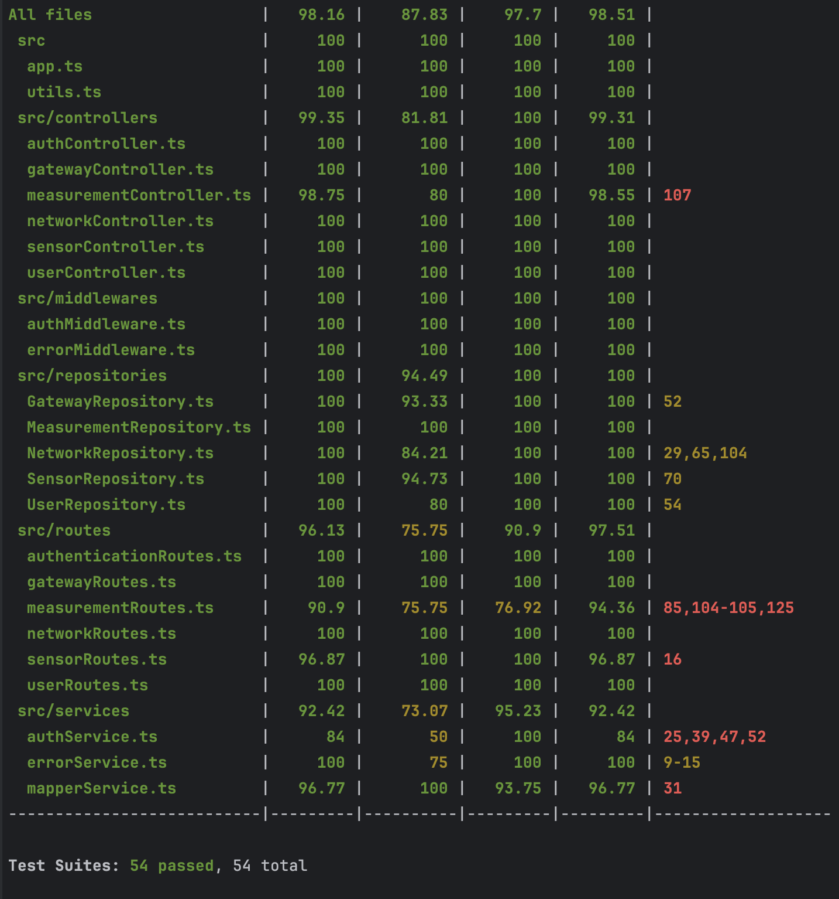

# Test Report

<The goal of this document is to explain how the application was tested, detailing how the test cases were defined and what they cover>

# Contents

- [Test Report](#test-report)
- [Contents](#contents)
- [Dependency graph](#dependency-graph)
- [Integration approach](#integration-approach)
- [Tests](#tests)
- [Coverage](#coverage)
  - [Coverage of FR](#coverage-of-fr)
  - [Coverage white box](#coverage-white-box)

# Dependency graph

```
      ┌─────────┐
      │   app   │ ──────────────────────────────────────────┐
      └─────────┘                                           │
           │                                                │
           ▼                                                │
    ┌─────────────────────────────────────────────────────┐ │
    │                   ROUTES                            │ │
    │                                                     │ │
    │  ┌─────────────────┐     ┌──────────────────────┐   │ │
    │  │ authenticationR │     │     userRoutes       │   │ │
    │  └─────────────────┘     └──────────────────────┘   │ │
    │                                                     │ │
    │  ┌─────────────────┐     ┌──────────────────────┐   │ │
    │  │  networkRoutes  │     │   gatewayRoutes      │   │ │
    │  └─────────────────┘     └──────────────────────┘   │ │
    │                                                     │ │
    │  ┌─────────────────┐     ┌──────────────────────┐   │ │
    │  │  sensorRoutes   │     │ measurementRoutes    │   │ │
    │  └─────────────────┘     └──────────────────────┘   │ │
    └─────────────────────────────────────────────────────┘ │
           │                                                │
           ▼                                                │
    ┌─────────────────────────────────────────────────────┐ │
    │                CONTROLLERS                          │ │
    │                                                     │ │
    │  ┌─────────────────┐     ┌──────────────────────┐   │ │
    │  │  authController │     │   userController     │   │ │
    │  └─────────────────┘     └──────────────────────┘   │ │
    │                                                     │ │
    │  ┌─────────────────┐     ┌──────────────────────┐   │ │
    │  │networkController│     │ gatewayController    │   │ │
    │  └─────────────────┘     └──────────────────────┘   │ │
    │                                                     │ │
    │  ┌─────────────────┐     ┌──────────────────────┐   │ │
    │  │ sensorController│     │measurementController │   │ │
    │  └─────────────────┘     └──────────────────────┘   │ │
    └─────────────────────────────────────────────────────┘ │
           │                                                │
           ▼                                                │
    ┌─────────────────────────────────────────────────────┐ │
    │                REPOSITORIES                         │ │
    │                                                     │ │
    │  ┏━━━━━━━━━━━━━━━━━┓                                │ │
    │  ┃ userRepository  ┃     ┌─────────────────────┐    │ │
    │  ┗━━━━━━━━━━━━━━━━━┛     │  networkRepository  │    │ │
    │                          └─────────────────────┘    │ │
    │                                                     │ │
    │  ┌─────────────────┐     ┌──────────────────────┐   │ │
    │  │gatewayRepository│     │  sensorRepository    │   │ │
    │  └─────────────────┘     └──────────────────────┘   │ │
    │                                                     │ │
    │  ┌─────────────────┐                                │ │
    │  │measurementReposit│                               │ │
    │  └─────────────────┘                                │ │
    └─────────────────────────────────────────────────────┘ │
           │                                                │
           ▼                                                │
    ┌─────────────────────────────────────────────────────┐ │
    │                 MIDDLEWARES                         │ │
    │                                                     │ │
    │  ┌─────────────────┐     ┌──────────────────────┐   │ │
    │  │ authMiddleware  │     │  errorMiddleware     │   │ │
    │  └─────────────────┘     └──────────────────────┘   │ │
    │                                                     │ │
    └─────────────────────────────────────────────────────┘ │
           │                                                │
           ▼                                                │
    ┌─────────────────────────────────────────────────────┐ │
    │                  SERVICES                           │ │
    │                                                     │ │
    │  ┌─────────────────┐     ┌──────────────────────┐   │ │
    │  │  authService    │     │   loggingService     │   │ │
    │  └─────────────────┘     └──────────────────────┘   │ │
    │                                                     │ │
    │  ┌─────────────────┐     ┌──────────────────────┐   │ │
    │  │  errorService   │     │   mapperService      │   │ │
    │  └─────────────────┘     └──────────────────────┘   │ │
    └─────────────────────────────────────────────────────┘ │
           │                                                │
           |                                                |
           |______________________________                  |
                                          |                 |
                                          ▼                 │
                                                            │
                                    ┌─────────────┐         │
                                    │    utils    │◄────────┘
                                    └─────────────┘
                                           │
                                           ▼
                                    ┌─────────────────┐
                                    │   Data Base     │
                                    │    ┌─────────┐  │
                                    │    │connectio│  │
                                    │    └─────────┘  │
                                    └─────────────────┘
```

# Integration approach

Abbiamo adottato un approccio di integrazione misto, combinando strategie bottom-up e top-down, con l’obiettivo di garantire una copertura completa dell’applicazione e un’individuazione efficace dei malfunzionamenti.

L’approccio si è articolato nei seguenti step:

Step 1: Test Unitari dei Componenti Core

Abbiamo iniziato testando in isolamento i componenti fondamentali del sistema:

    unit/repositories: test unitari di ciascun repository, per verificare la correttezza dell’accesso e gestione dei dati.

    unit/controllers: test unitari sulla logica dei singoli controller, utilizzando mock delle dipendenze.

    unit/middlewares: test unitari sui middleware, per assicurare un corretto comportamento nella gestione dell’autenticazione, autorizzazione ed error handling.

Step 2: Integrazione Controller + Middleware

In questa fase abbiamo verificato il corretto funzionamento dell’interazione tra controller e middleware. L’obiettivo è stato quello di garantire il corretto passaggio del controllo, la gestione coerente degli errori e il rispetto dei vincoli di sicurezza.

    integration/controllers: test di integrazione tra controller e middleware.

Step 3: Integrazione delle Route (API Testing)

Abbiamo testato l’integrazione delle route per assicurarci che ogni endpoint fosse correttamente configurato e connesso al rispettivo controller e middleware. Questa fase include anche il test dei file route.js.

    integration/routes: test di integrazione delle rotte e delle logiche REST esposte via API.

Step 4: Testing End-to-End (E2E)

Infine, abbiamo simulato scenari reali per testare l’intero stack applicativo, dalla ricezione della richiesta HTTP alla persistenza e ritorno dei dati:

    e2e/gateway

    e2e/measurements

    e2e/network

    e2e/sensor

    e2e/users

Questi test verificano il comportamento complessivo dell’applicazione in condizioni simili all’uso reale, validando la cooperazione tra tutti i componenti: rotte, controller, middleware, repository, servizi e database.


# Tests

| Test case name                                                                                                                 | Object(s) tested                                                                                                       | Test level  | Technique used                                                                   |
|:-------------------------------------------------------------------------------------------------------------------------------|:-----------------------------------------------------------------------------------------------------------------------|:------------|:---------------------------------------------------------------------------------|
| `NetworkRepository.mock.test`: create network                                                                                  | `NetworkRepository` (mocked DB)                                                                                        | Unit        | Happy Path, EP (valid creation)                                                  |
| `NetworkRepository.mock.test`: create network: conflict                                                                        | `NetworkRepository` (mocked DB)                                                                                        | Unit        | Error Guessing (ConflictError), EP (duplicate code)                              |
| `NetworkRepository.mock.test`: create network: bad request when code is empty                                                  | `NetworkRepository` (mocked DB)                                                                                        | Unit        | Error Guessing (BadRequestError), BVA (empty code)                               |
| `NetworkRepository.mock.test`: find network by code                                                                            | `NetworkRepository` (mocked DB)                                                                                        | Unit        | Happy Path, EP (existing code)                                                   |
| `NetworkRepository.mock.test`: find network by code: not found                                                                 | `NetworkRepository` (mocked DB)                                                                                        | Unit        | Error Guessing (NotFoundError), EP (non-existent code)                           |
| `NetworkRepository.mock.test`: get all networks                                                                                | `NetworkRepository` (mocked DB)                                                                                        | Unit        | Happy Path                                                                       |
| `NetworkRepository.mock.test`: update network                                                                                  | `NetworkRepository` (mocked DB)                                                                                        | Unit        | Happy Path, EP (valid update)                                                    |
| `NetworkRepository.mock.test`: update network: not found                                                                       | `NetworkRepository` (mocked DB)                                                                                        | Unit        | Error Guessing (NotFoundError), EP (non-existent code for update)                |
| `NetworkRepository.mock.test`: delete network                                                                                  | `NetworkRepository` (mocked DB)                                                                                        | Unit        | Happy Path                                                                       |
| `NetworkRepository.mock.test`: delete network: not found                                                                       | `NetworkRepository` (mocked DB)                                                                                        | Unit        | Error Guessing (NotFoundError), EP (non-existent code for delete)                |
| `sensorRepository.validation.test`: should throw BadRequestError if sensor validation fails                                    | `SensorRepository` (validation logic)                                                                                  | Unit        | Error Guessing (BadRequestError), EP (invalid sensor data from class-validator)  |
| `sensorRepository.validation.test`: should throw ConflictError if new MAC address already exists                               | `SensorRepository` (validation logic)                                                                                  | Unit        | Error Guessing (ConflictError), EP (duplicate MAC on update)                     |
| `sensorRepository.validation.test`: should throw BadRequestError if update has no changes                                      | `SensorRepository` (validation logic)                                                                                  | Unit        | Error Guessing (BadRequestError), EP (no fields to update)                       |
| `GatewayRepository.mock.test`: create gateway                                                                                  | `GatewayRepository` (mocked DB)                                                                                        | Unit        | Happy Path, EP (valid creation)                                                  |
| `GatewayRepository.mock.test`: create gateway: conflict                                                                        | `GatewayRepository` (mocked DB)                                                                                        | Unit        | Error Guessing (ConflictError), EP (duplicate MAC)                               |
| `GatewayRepository.mock.test`: find gateway by MAC address                                                                     | `GatewayRepository` (mocked DB)                                                                                        | Unit        | Happy Path, EP (existing MAC)                                                    |
| `GatewayRepository.mock.test`: find gateway by MAC address: not found                                                          | `GatewayRepository` (mocked DB)                                                                                        | Unit        | Error Guessing (NotFoundError), EP (non-existent MAC)                            |
| `GatewayRepository.mock.test`: get all gateways by network                                                                     | `GatewayRepository` (mocked DB)                                                                                        | Unit        | Happy Path                                                                       |
| `GatewayRepository.mock.test`: update gateway                                                                                  | `GatewayRepository` (mocked DB)                                                                                        | Unit        | Happy Path, EP (valid update)                                                    |
| `GatewayRepository.mock.test`: update gateway: not found                                                                       | `GatewayRepository` (mocked DB)                                                                                        | Unit        | Error Guessing (NotFoundError), EP (non-existent MAC for update)                 |
| `GatewayRepository.mock.test`: delete gateway                                                                                  | `GatewayRepository` (mocked DB)                                                                                        | Unit        | Happy Path                                                                       |
| `GatewayRepository.mock.test`: delete gateway: not found                                                                       | `GatewayRepository` (mocked DB)                                                                                        | Unit        | Error Guessing (NotFoundError), EP (non-existent MAC for delete)                 |
| `UserRepository.mock.test`: create user                                                                                        | `UserRepository` (mocked DB)                                                                                           | Unit        | Happy Path, EP (valid creation)                                                  |
| `UserRepository.mock.test`: create user: conflict                                                                              | `UserRepository` (mocked DB)                                                                                           | Unit        | Error Guessing (ConflictError), EP (duplicate username)                          |
| `UserRepository.mock.test`: find user by username                                                                              | `UserRepository` (mocked DB)                                                                                           | Unit        | Happy Path, EP (existing username)                                               |
| `UserRepository.mock.test`: find user by username: not found                                                                   | `UserRepository` (mocked DB)                                                                                           | Unit        | Error Guessing (NotFoundError), EP (non-existent username)                       |
| `UserRepository.mock.test`: delete user                                                                                        | `UserRepository` (mocked DB)                                                                                           | Unit        | Happy Path                                                                       |
| `MeasurementRepository.validation.test`: throws error when startDate is invalid (getMeasurementsBySensor)                      | `MeasurementRepository` (validation logic)                                                                             | Unit        | EP (invalid startDate), Error Guessing (BadRequestError)                         |
| `MeasurementRepository.validation.test`: throws error when endDate is invalid (getMeasurementsBySensor)                        | `MeasurementRepository` (validation logic)                                                                             | Unit        | EP (invalid endDate), Error Guessing (BadRequestError)                           |
| `MeasurementRepository.validation.test`: throws error when only startDate is invalid (getMeasurementsBySensors)                | `MeasurementRepository` (validation logic)                                                                             | Unit        | EP (invalid startDate), Error Guessing (BadRequestError)                         |
| `MeasurementRepository.validation.test`: throws error when only endDate is invalid (getMeasurementsBySensors)                  | `MeasurementRepository` (validation logic)                                                                             | Unit        | EP (invalid endDate), Error Guessing (BadRequestError)                           |
| `MeasurementRepository.validation.test`: throws error when only startDate is invalid (getMeasurementsBySensor)                 | `MeasurementRepository` (validation logic)                                                                             | Unit        | EP (invalid startDate), Error Guessing (BadRequestError)                         |
| `MeasurementRepository.validation.test`: throws error when only endDate is invalid (getMeasurementsBySensor)                   | `MeasurementRepository` (validation logic)                                                                             | Unit        | EP (invalid endDate), Error Guessing (BadRequestError)                           |
| `MeasurementRepository.validation.test`: throws error when both dates invalid (getMeasurementsBySensors)                       | `MeasurementRepository` (validation logic)                                                                             | Unit        | EP (both invalid dates), Error Guessing (BadRequestError)                        |
| `MeasurementRepository.validation.test`: throws combined BadRequestError when both dates invalid (getMeasurementsBySensors)    | `MeasurementRepository` (validation logic)                                                                             | Unit        | EP (both invalid dates, combined message), Error Guessing (BadRequestError)      |
| `UserRepository.db.test`: create user                                                                                          | `UserRepository` (SQLite DB)                                                                                           | Integration | Happy Path, EP (valid creation)                                                  |
| `UserRepository.db.test`: find user by username: not found                                                                     | `UserRepository` (SQLite DB)                                                                                           | Integration | Error Guessing (NotFoundError), EP (non-existent username)                       |
| `UserRepository.db.test`: create user: conflict                                                                                | `UserRepository` (SQLite DB)                                                                                           | Integration | Error Guessing (ConflictError), EP (duplicate username)                          |
| `SensorRepository.mock.test`: create sensor                                                                                    | `SensorRepository` (mocked DB dependencies)                                                                            | Unit        | Happy Path, EP (valid creation)                                                  |
| `SensorRepository.mock.test`: create sensor: conflict                                                                          | `SensorRepository` (mocked DB dependencies)                                                                            | Unit        | Error Guessing (ConflictError), EP (duplicate MAC)                               |
| `SensorRepository.mock.test`: find sensor by MAC address                                                                       | `SensorRepository` (mocked DB dependencies)                                                                            | Unit        | Happy Path, EP (existing MAC)                                                    |
| `SensorRepository.mock.test`: find sensor by MAC address: not found                                                            | `SensorRepository` (mocked DB dependencies)                                                                            | Unit        | Error Guessing (NotFoundError), EP (non-existent MAC)                            |
| `SensorRepository.mock.test`: get all sensors by gateway                                                                       | `SensorRepository` (mocked DB dependencies)                                                                            | Unit        | Happy Path                                                                       |
| `SensorRepository.mock.test`: update sensor                                                                                    | `SensorRepository` (mocked DB dependencies)                                                                            | Unit        | Happy Path, EP (valid update)                                                    |
| `SensorRepository.mock.test`: update sensor: not found                                                                         | `SensorRepository` (mocked DB dependencies)                                                                            | Unit        | Error Guessing (NotFoundError), EP (non-existent MAC for update)                 |
| `SensorRepository.mock.test`: delete sensor                                                                                    | `SensorRepository` (mocked DB dependencies)                                                                            | Unit        | Happy Path                                                                       |
| `SensorRepository.mock.test`: delete sensor: not found                                                                         | `SensorRepository` (mocked DB dependencies)                                                                            | Unit        | Error Guessing (NotFoundError), EP (non-existent MAC for delete)                 |
| `MeasurementRepository.db.test`: store measurements                                                                            | `MeasurementRepository` (SQLite DB)                                                                                    | Integration | Happy Path, EP (valid storage)                                                   |
| `MeasurementRepository.db.test`: store measurements: conflict                                                                  | `MeasurementRepository` (SQLite DB)                                                                                    | Integration | Error Guessing (ConflictError), EP (duplicate measurement)                       |
| `MeasurementRepository.db.test`: store measurements: validation errors                                                         | `MeasurementRepository` (SQLite DB)                                                                                    | Integration | Error Guessing (BadRequestError), EP (invalid measurement data)                  |
| `MeasurementRepository.db.test` (`getMeasurementsBySensor`): retrieves all when no dates provided                              | `MeasurementRepository` (SQLite DB)                                                                                    | Integration | Happy Path, EP (no date filter)                                                  |
| `MeasurementRepository.db.test` (`getMeasurementsBySensor`): filters by startDate                                              | `MeasurementRepository` (SQLite DB)                                                                                    | Integration | EP (startDate filter)                                                            |
| `MeasurementRepository.db.test` (`getMeasurementsBySensor`): filters by endDate                                                | `MeasurementRepository` (SQLite DB)                                                                                    | Integration | EP (endDate filter)                                                              |
| `MeasurementRepository.db.test` (`getMeasurementsBySensor`): filters by range                                                  | `MeasurementRepository` (SQLite DB)                                                                                    | Integration | EP (date range filter)                                                           |
| `MeasurementRepository.db.test` (`getMeasurementsBySensor`): throws on invalid date parameters                                 | `MeasurementRepository` (SQLite DB)                                                                                    | Integration | Error Guessing (BadRequestError), EP (invalid date parameters)                   |
| `MeasurementRepository.db.test` (`getMeasurementsBySensor`): throws when network/gateway/sensor not found                      | `MeasurementRepository` (SQLite DB)                                                                                    | Integration | Error Guessing (NotFoundError), EP (non-existent entities)                       |
| `MeasurementRepository.db.test` (`getMeasurementsBySensors`): retrieves across multiple sensors and loads relations            | `MeasurementRepository` (SQLite DB)                                                                                    | Integration | Happy Path, EP (multiple sensors)                                                |
| `MeasurementRepository.db.test` (`getMeasurementsBySensors`): retrieves when no sensor list provided                           | `MeasurementRepository` (SQLite DB)                                                                                    | Integration | Happy Path, EP (no sensor list filter)                                           |
| `MeasurementRepository.db.test` (`getMeasurementsBySensors`): applies date filters and throws on invalid dates                 | `MeasurementRepository` (SQLite DB)                                                                                    | Integration | EP (date filters), Error Guessing (BadRequestError for invalid dates)            |
| `MeasurementRepository.db.test` (`getMeasurementsBySensors`): throws when network not found                                    | `MeasurementRepository` (SQLite DB)                                                                                    | Integration | Error Guessing (NotFoundError), EP (non-existent network)                        |
| `SensorRepository.db.test`: create sensor                                                                                      | `SensorRepository` (SQLite DB)                                                                                         | Integration | Happy Path, EP (valid creation)                                                  |
| `SensorRepository.db.test`: find sensor by MAC address: not found                                                              | `SensorRepository` (SQLite DB)                                                                                         | Integration | Error Guessing (NotFoundError), EP (non-existent MAC)                            |
| `SensorRepository.db.test`: create sensor: conflict                                                                            | `SensorRepository` (SQLite DB)                                                                                         | Integration | Error Guessing (ConflictError), EP (duplicate MAC)                               |
| `SensorRepository.db.test`: get all sensors by gateway                                                                         | `SensorRepository` (SQLite DB)                                                                                         | Integration | Happy Path                                                                       |
| `SensorRepository.db.test`: update sensor                                                                                      | `SensorRepository` (SQLite DB)                                                                                         | Integration | Happy Path, EP (valid update)                                                    |
| `SensorRepository.db.test`: update sensor: not found                                                                           | `SensorRepository` (SQLite DB)                                                                                         | Integration | Error Guessing (NotFoundError), EP (non-existent MAC for update)                 |
| `SensorRepository.db.test`: delete sensor                                                                                      | `SensorRepository` (SQLite DB)                                                                                         | Integration | Happy Path                                                                       |
| `SensorRepository.db.test`: delete sensor: not found                                                                           | `SensorRepository` (SQLite DB)                                                                                         | Integration | Error Guessing (NotFoundError), EP (non-existent MAC for delete)                 |
| `UserRepository.validation.test`: getAllUsers returns all users                                                                | `UserRepository` (validation logic, mocked DB)                                                                         | Unit        | Happy Path                                                                       |
| `UserRepository.validation.test`: getUserByUsername throws BadRequestError when username is empty string                       | `UserRepository` (validation logic, mocked DB)                                                                         | Unit        | BVA (empty username), Error Guessing (BadRequestError)                           |
| `UserRepository.validation.test`: getUserByUsername throws BadRequestError when username is only whitespace                    | `UserRepository` (validation logic, mocked DB)                                                                         | Unit        | EP (whitespace username), Error Guessing (BadRequestError)                       |
| `UserRepository.validation.test`: createUser throws BadRequestError when userDAO validation fails                              | `UserRepository` (validation logic, mocked DB)                                                                         | Unit        | Error Guessing (BadRequestError), EP (invalid user data from class-validator)    |
| `NetworkRepository.db.test`: create network                                                                                    | `NetworkRepository` (SQLite DB)                                                                                        | Integration | Happy Path, EP (valid creation)                                                  |
| `NetworkRepository.db.test`: find network by code: not found                                                                   | `NetworkRepository` (SQLite DB)                                                                                        | Integration | Error Guessing (NotFoundError), EP (non-existent code)                           |
| `NetworkRepository.db.test`: create network: conflict                                                                          | `NetworkRepository` (SQLite DB)                                                                                        | Integration | Error Guessing (ConflictError), EP (duplicate code)                              |
| `NetworkRepository.db.test`: create network: bad request when code is empty                                                    | `NetworkRepository` (SQLite DB)                                                                                        | Integration | Error Guessing (BadRequestError), BVA (empty code)                               |
| `NetworkRepository.db.test`: get all networks                                                                                  | `NetworkRepository` (SQLite DB)                                                                                        | Integration | Happy Path                                                                       |
| `NetworkRepository.db.test`: update network                                                                                    | `NetworkRepository` (SQLite DB)                                                                                        | Integration | Happy Path, EP (valid update)                                                    |
| `NetworkRepository.db.test`: update network: not found                                                                         | `NetworkRepository` (SQLite DB)                                                                                        | Integration | Error Guessing (NotFoundError), EP (non-existent code for update)                |
| `NetworkRepository.db.test`: delete network                                                                                    | `NetworkRepository` (SQLite DB)                                                                                        | Integration | Happy Path                                                                       |
| `NetworkRepository.db.test`: delete network: not found                                                                         | `NetworkRepository` (SQLite DB)                                                                                        | Integration | Error Guessing (NotFoundError), EP (non-existent code for delete)                |
| `NetworkRepository.validation.test`: getNetworkByCode() - BadRequestError se validate restituisce errori                       | `NetworkRepository` (validation logic, mocked DB)                                                                      | Unit        | Error Guessing (BadRequestError), EP (invalid code from class-validator)         |
| `NetworkRepository.validation.test`: createNetwork() - Missing required fields se code è vuoto                                 | `NetworkRepository` (validation logic, mocked DB)                                                                      | Unit        | Error Guessing (BadRequestError), BVA (empty code)                               |
| `NetworkRepository.validation.test`: createNetwork throws BadRequestError with detailed joined message                         | `NetworkRepository` (validation logic, mocked DB)                                                                      | Unit        | Error Guessing (BadRequestError), EP (invalid data from class-validator)         |
| `NetworkRepository.validation.test`: deleteNetwork() - BadRequestError se validate restituisce errori                          | `NetworkRepository` (validation logic, mocked DB)                                                                      | Unit        | Error Guessing (BadRequestError), EP (invalid code from class-validator)         |
| `NetworkRepository.validation.test`: updateNetwork() - BadRequestError se non passo nulla da aggiornare                        | `NetworkRepository` (validation logic, mocked DB)                                                                      | Unit        | Error Guessing (BadRequestError), EP (no fields to update)                       |
| `GatewayRepository.db.test`: create gateway                                                                                    | `GatewayRepository` (SQLite DB)                                                                                        | Integration | Happy Path, EP (valid creation)                                                  |
| `GatewayRepository.db.test`: find gateway by MAC address: not found                                                            | `GatewayRepository` (SQLite DB)                                                                                        | Integration | Error Guessing (NotFoundError), EP (non-existent MAC)                            |
| `GatewayRepository.db.test`: create gateway: conflict                                                                          | `GatewayRepository` (SQLite DB)                                                                                        | Integration | Error Guessing (ConflictError), EP (duplicate MAC)                               |
| `GatewayRepository.db.test`: get all gateways by network                                                                       | `GatewayRepository` (SQLite DB)                                                                                        | Integration | Happy Path                                                                       |
| `GatewayRepository.db.test`: update gateway                                                                                    | `GatewayRepository` (SQLite DB)                                                                                        | Integration | Happy Path, EP (valid update)                                                    |
| `GatewayRepository.db.test`: update gateway: not found                                                                         | `GatewayRepository` (SQLite DB)                                                                                        | Integration | Error Guessing (NotFoundError), EP (non-existent MAC for update)                 |
| `GatewayRepository.db.test`: delete gateway                                                                                    | `GatewayRepository` (SQLite DB)                                                                                        | Integration | Happy Path                                                                       |
| `GatewayRepository.db.test`: delete gateway: not found                                                                         | `GatewayRepository` (SQLite DB)                                                                                        | Integration | Error Guessing (NotFoundError), EP (non-existent MAC for delete)                 |
| `GatewayRepository.validation.test`: should throw conflict if new_macAddress is already in use in the same network             | `GatewayRepository` (validation logic, real DB for constraint check)                                                   | Integration | Error Guessing (ConflictError), EP (duplicate MAC on update, DB constraint)      |
| `GatewayRepository.validation.test`: should throw BadRequestError if no update fields are provided                             | `GatewayRepository` (validation logic, real DB)                                                                        | Integration | Error Guessing (BadRequestError), EP (no fields to update)                       |
| `GatewayRepository.validation.test`: should throw BadRequestError if gateway data is invalid during creation                   | `GatewayRepository` (validation logic, real DB)                                                                        | Integration | Error Guessing (BadRequestError), EP (invalid gateway data from class-validator) |
| `GatewayRepository.validation.test`: should throw conflict if MAC address already exists during creation                       | `GatewayRepository` (validation logic, real DB for constraint check)                                                   | Integration | Error Guessing (ConflictError), EP (duplicate MAC on create, DB constraint)      |
| `authController.test`: should successfully authenticate user and return token                                                  | `authController`, `UserRepository`, `authService`, `mapperService` (all mocked)                                        | Unit        | Happy Path, EP (valid credentials)                                               |
| `authController.test`: should throw UnauthorizedError when password does not match                                             | `authController`, `UserRepository` (mocked)                                                                            | Unit        | Error Guessing (UnauthorizedError), EP (incorrect password)                      |
| `authController.test`: should propagate NotFoundError when user does not exist                                                 | `authController`, `UserRepository` (mocked)                                                                            | Unit        | Error Guessing (NotFoundError), EP (non-existent user)                           |
| `authController.test`: should work with different user types                                                                   | `authController`, `UserRepository`, `authService`, `mapperService` (all mocked)                                        | Unit        | EP (different user types)                                                        |
| `authController.test`: should work with Viewer user type                                                                       | `authController`, `UserRepository`, `authService`, `mapperService` (all mocked)                                        | Unit        | EP (Viewer user type)                                                            |
| `authController.test`: should handle empty password correctly                                                                  | `authController`, `UserRepository` (mocked)                                                                            | Unit        | BVA (empty password), Error Guessing (UnauthorizedError)                         |
| `authController.test`: should handle undefined password in DTO                                                                 | `authController`, `UserRepository` (mocked)                                                                            | Unit        | EP (undefined password), Error Guessing (UnauthorizedError)                      |
| `authController.test`: should handle case-sensitive password comparison                                                        | `authController`, `UserRepository` (mocked)                                                                            | Unit        | EP (case-sensitive password mismatch)                                            |
| `authController.test`: should propagate repository errors other than NotFoundError                                             | `authController`, `UserRepository` (mocked)                                                                            | Unit        | Error Guessing (generic repository error)                                        |
| `sensorController.integration.test`: get Sensor: mapperService integration                                                     | `sensorController`, `SensorRepository` (mocked), `mapperService`                                                       | Integration | Happy Path                                                                       |
| `sensorController.integration.test`: get all Sensors by Gateway: mapperService integration                                     | `sensorController`, `SensorRepository` (mocked), `mapperService`                                                       | Integration | Happy Path                                                                       |
| `sensorController.integration.test`: create Sensor: mapperService integration                                                  | `sensorController`, `SensorRepository` (mocked), `mapperService`                                                       | Integration | Happy Path                                                                       |
| `sensorController.integration.test`: get all Sensors by Gateway: mapperService integration with error                          | `sensorController`, `SensorRepository` (mocked)                                                                        | Integration | Error Guessing (repository error propagation)                                    |
| `sensorController.integration.test`: delete Sensor by MAC address: mapperService integration                                   | `sensorController`, `SensorRepository` (mocked)                                                                        | Integration | Happy Path                                                                       |
| `sensorController.integration.test`: update Sensor by MAC address: mapperService integration                                   | `sensorController`, `SensorRepository` (mocked), `mapperService`                                                       | Integration | Happy Path                                                                       |
| `networkController.integration.test`: get Network: mapperService integration                                                   | `networkController`, `NetworkRepository` (mocked), `mapperService` (mocked)                                            | Integration | Happy Path                                                                       |
| `networkController.integration.test`: get all Networks: mapperService integration                                              | `networkController`, `NetworkRepository` (mocked), `mapperService` (mocked)                                            | Integration | Happy Path                                                                       |
| `networkController.integration.test`: create Network: mapperService integration                                                | `networkController`, `NetworkRepository` (mocked), `mapperService` (mocked)                                            | Integration | Happy Path                                                                       |
| `networkController.integration.test`: update Network: mapperService integration                                                | `networkController`, `NetworkRepository` (mocked)                                                                      | Integration | Happy Path                                                                       |
| `networkController.integration.test`: delete Network: mapperService integration                                                | `networkController`, `NetworkRepository` (mocked)                                                                      | Integration | Happy Path                                                                       |
| `measurementsController.integration.test`: storeMeasurements should store measurements and return DTO with correct stats       | `measurementController`, `MeasurementRepository` (mocked), `mapperService`, stats logic                                | Integration | Happy Path, Output verification (stats computation)                              |
| `measurementsController.integration.test`: getMeasurementsBySensor should flag outliers correctly                              | `measurementController`, `MeasurementRepository` (mocked), `mapperService`, outlier logic                              | Integration | EP (data with and without outliers), Output verification (outlier flagging)      |
| `measurementsController.integration.test`: getMeasurementsBySensors should group measurements by sensor and compute stats      | `measurementController`, `MeasurementRepository` (mocked), `mapperService`, stats logic                                | Integration | Happy Path, EP (multiple sensors), Output verification (grouping, stats)         |
| `measurementsController.integration.test`: getStatsBySensor should compute correct statistics                                  | `measurementController`, `MeasurementRepository` (mocked), stats logic                                                 | Integration | Happy Path, Output verification (stats computation)                              |
| `measurementsController.integration.test`: getOutliersBySensor should return only outlier measurements based on trimming logic | `measurementController`, `MeasurementRepository` (mocked), outlier logic                                               | Integration | EP (data with outliers), Output verification (outlier filtering)                 |
| `measurementsController.integration.test`: getStatsBySensors should return array of sensor stats                               | `measurementController`, `MeasurementRepository` (mocked), `mapperService`, stats logic                                | Integration | Happy Path, EP (multiple sensors), Output verification (stats array)             |
| `measurementsController.integration.test`: getOutliersBySensors should filter sensors to only those with outliers              | `measurementController`, `MeasurementRepository` (mocked), `mapperService`, outlier logic                              | Integration | EP (mix of sensors with/without outliers), Output verification (filtering)       |
| `userController.integration.test`: get User: mapperService integration                                                         | `userController`, `UserRepository` (mocked), `mapperService`                                                           | Integration | Happy Path                                                                       |
| `userController.integration.test`: get All Users: mapperService integration                                                    | `userController`, `UserRepository` (mocked), `mapperService`                                                           | Integration | Happy Path                                                                       |
| `userController.integration.test`: create User: mapperService integration                                                      | `userController`, `UserRepository` (mocked), `mapperService`                                                           | Integration | Happy Path                                                                       |
| `userController.integration.test`: delete User: mapperService integration                                                      | `userController`, `UserRepository` (mocked)                                                                            | Integration | Happy Path                                                                       |
| `gatewayController.integration.test`: get Gateway: mapperService integration                                                   | `gatewayController`, `GatewayRepository` (mocked), `mapperService`                                                     | Integration | Happy Path                                                                       |
| `gatewayController.integration.test`: get all Gateways by Network: mapperService integration                                   | `gatewayController`, `GatewayRepository` (mocked), `mapperService`                                                     | Integration | Happy Path                                                                       |
| `gatewayController.integration.test`: create Gateway: mapperService integration                                                | `gatewayController`, `GatewayRepository` (mocked), `mapperService`                                                     | Integration | Happy Path                                                                       |
| `gatewayController.integration.test`: update Gateway: mapperService integration                                                | `gatewayController`, `GatewayRepository` (mocked), `mapperService`                                                     | Integration | Happy Path                                                                       |
| `gatewayController.integration.test`: delete Gateway: mapperService integration                                                | `gatewayController`, `GatewayRepository` (mocked)                                                                      | Integration | Happy Path                                                                       |
| `networkRoutes.integration.test`: get all networks                                                                             | `GET /api/v1/networks` route, `authService`, `networkController` (mocked)                                              | API         | Happy Path, RBAC (Admin, Operator, Viewer)                                       |
| `networkRoutes.integration.test`: get all networks: 401 UnauthorizedError                                                      | `GET /api/v1/networks` route, `authService` (mocked)                                                                   | API         | Error Guessing (401 Unauthorized), AuthN                                         |
| `networkRoutes.integration.test`: create network                                                                               | `POST /api/v1/networks` route, `authService`, `networkController` (mocked)                                             | API         | Happy Path, RBAC (Admin, Operator)                                               |
| `networkRoutes.integration.test`: create network: 401 UnauthorizedError                                                        | `POST /api/v1/networks` route, `authService` (mocked)                                                                  | API         | Error Guessing (401 Unauthorized), AuthN                                         |
| `networkRoutes.integration.test`: create network: 403 InsufficientRightsError                                                  | `POST /api/v1/networks` route, `authService` (mocked)                                                                  | API         | Error Guessing (403 Forbidden), RBAC                                             |
| `networkRoutes.integration.test`: get network by code                                                                          | `GET /api/v1/networks/:code` route, `authService`, `networkController` (mocked)                                        | API         | Happy Path, RBAC (Admin, Operator, Viewer)                                       |
| `networkRoutes.integration.test`: update network                                                                               | `PATCH /api/v1/networks/:code` route, `authService`, `networkController` (mocked)                                      | API         | Happy Path, RBAC (Admin, Operator)                                               |
| `networkRoutes.integration.test`: delete network                                                                               | `DELETE /api/v1/networks/:code` route, `authService`, `networkController` (mocked)                                     | API         | Happy Path, RBAC (Admin, Operator)                                               |
| `networkRoutes.integration.test`: get network by code: 404 NotFoundError                                                       | `GET /api/v1/networks/:code` route, `networkController` (mocked)                                                       | API         | Error Guessing (404 Not Found)                                                   |
| `networkRoutes.integration.test`: create network: 400 BadRequestError (invalid payload)                                        | `POST /api/v1/networks` route, `networkController` (mocked)                                                            | API         | Error Guessing (400 Bad Request), EP (invalid payload)                           |
| `networkRoutes.integration.test`: update network: 404 NotFoundError                                                            | `PATCH /api/v1/networks/:code` route, `networkController` (mocked)                                                     | API         | Error Guessing (404 Not Found)                                                   |
| `networkRoutes.integration.test`: delete network: 404 NotFoundError                                                            | `DELETE /api/v1/networks/:code` route, `networkController` (mocked)                                                    | API         | Error Guessing (404 Not Found)                                                   |
| `networkRoutes.integration.test`: returns 404 for unknown route                                                                | Non-existent API route                                                                                                 | API         | Error Guessing (404 Route Not Found)                                             |
| `gatewayRoutes.integration.test`: get all gateways by network                                                                  | `GET /networks/:code/gateways` route, `authService`, `gatewayController` (mocked)                                      | API         | Happy Path, RBAC (Admin, Operator, Viewer)                                       |
| `gatewayRoutes.integration.test`: get all gateways: 401 UnauthorizedError                                                      | `GET /networks/:code/gateways` route, `authService` (mocked)                                                           | API         | Error Guessing (401 Unauthorized), AuthN                                         |
| `gatewayRoutes.integration.test`: create gateway                                                                               | `POST /networks/:code/gateways` route, `authService`, `gatewayController` (mocked)                                     | API         | Happy Path, RBAC (Admin, Operator)                                               |
| `gatewayRoutes.integration.test`: create gateway: 401 UnauthorizedError                                                        | `POST /networks/:code/gateways` route, `authService` (mocked)                                                          | API         | Error Guessing (401 Unauthorized), AuthN                                         |
| `gatewayRoutes.integration.test`: create gateway: 403 InsufficientRightsError                                                  | `POST /networks/:code/gateways` route, `authService` (mocked)                                                          | API         | Error Guessing (403 Forbidden), RBAC                                             |
| `gatewayRoutes.integration.test`: get gateway by MAC address                                                                   | `GET /networks/:code/gateways/:mac` route, `authService`, `gatewayController` (mocked)                                 | API         | Happy Path, RBAC (Admin, Operator, Viewer)                                       |
| `gatewayRoutes.integration.test`: update gateway                                                                               | `PATCH /networks/:code/gateways/:mac` route, `authService`, `gatewayController` (mocked)                               | API         | Happy Path, RBAC (Admin, Operator)                                               |
| `gatewayRoutes.integration.test`: delete gateway                                                                               | `DELETE /networks/:code/gateways/:mac` route, `authService`, `gatewayController` (mocked)                              | API         | Happy Path, RBAC (Admin, Operator)                                               |
| `userRoutes.integration.test`: get all users                                                                                   | `GET /api/v1/users` route, `authService`, `userController` (mocked)                                                    | API         | Happy Path, RBAC (Admin)                                                         |
| `userRoutes.integration.test`: get all users: 401 UnauthorizedError                                                            | `GET /api/v1/users` route, `authService` (mocked)                                                                      | API         | Error Guessing (401 Unauthorized), AuthN                                         |
| `userRoutes.integration.test`: get all users: 403 InsufficientRightsError                                                      | `GET /api/v1/users` route, `authService` (mocked)                                                                      | API         | Error Guessing (403 Forbidden), RBAC (Non-Admin)                                 |
| `userRoutes.integration.test`: create user                                                                                     | `POST /api/v1/users` route, `authService`, `userController` (mocked)                                                   | API         | Happy Path, RBAC (Admin)                                                         |
| `userRoutes.integration.test`: create user: 401 UnauthorizedError                                                              | `POST /api/v1/users` route, `authService` (mocked)                                                                     | API         | Error Guessing (401 Unauthorized), AuthN                                         |
| `userRoutes.integration.test`: create user: 403 InsufficientRightsError                                                        | `POST /api/v1/users` route, `authService` (mocked)                                                                     | API         | Error Guessing (403 Forbidden), RBAC (Non-Admin)                                 |
| `userRoutes.integration.test`: delete user                                                                                     | `DELETE /api/v1/users/:user` route, `authService`, `userController` (mocked)                                           | API         | Happy Path, RBAC (Admin)                                                         |
| `userRoutes.integration.test`: delete user: 401 UnauthorizedError                                                              | `DELETE /api/v1/users/:user` route, `authService` (mocked)                                                             | API         | Error Guessing (401 Unauthorized), AuthN                                         |
| `userRoutes.integration.test`: delete user: 403 InsufficientRightsError                                                        | `DELETE /api/v1/users/:user` route, `authService` (mocked)                                                             | API         | Error Guessing (403 Forbidden), RBAC (Non-Admin)                                 |
| `userRoutes.integration.test`: get user by username                                                                            | `GET /api/v1/users/:user` route, `authService`, `userController` (mocked)                                              | API         | Happy Path, RBAC (Admin)                                                         |
| `userRoutes.integration.test`: get user by username: 401 UnauthorizedError                                                     | `GET /api/v1/users/:user` route, `authService` (mocked)                                                                | API         | Error Guessing (401 Unauthorized), AuthN                                         |
| `userRoutes.integration.test`: get user by username: 403 InsufficientRightsError                                               | `GET /api/v1/users/:user` route, `authService` (mocked)                                                                | API         | Error Guessing (403 Forbidden), RBAC (Non-Admin)                                 |
| `userRoutes.integration.test`: get all users: 500 Internal Server Error                                                        | `GET /api/v1/users` route, `userController` (mocked)                                                                   | API         | Error Guessing (500 Internal Server Error)                                       |
| `userRoutes.integration.test`: returns 404 for unknown route                                                                   | Non-existent API route                                                                                                 | API         | Error Guessing (404 Route Not Found)                                             |
| `measurementRoutes.integration.test`: POST /sensors/:sensorMac/measurements should store measurements                          | `POST /networks/:net/gateways/:gw/sensors/:sensor/measurements` route, `authService`, `measurementController` (mocked) | API         | Happy Path, RBAC (Admin, Operator)                                               |
| `measurementRoutes.integration.test`: GET /sensors/:sensorMac/measurements should return measurements                          | `GET /networks/:net/gateways/:gw/sensors/:sensor/measurements` route, `authService`, `measurementController` (mocked)  | API         | Happy Path, RBAC (Admin, Operator, Viewer), Query Params                         |
| `measurementRoutes.integration.test`: GET /sensors/:sensorMac/stats should return stats                                        | `GET /networks/:net/gateways/:gw/sensors/:sensor/stats` route, `authService`, `measurementController` (mocked)         | API         | Happy Path, RBAC (Admin, Operator, Viewer), Query Params                         |
| `measurementRoutes.integration.test`: GET /sensors/:sensorMac/outliers should return outliers                                  | `GET /networks/:net/gateways/:gw/sensors/:sensor/outliers` route, `authService`, `measurementController` (mocked)      | API         | Happy Path, RBAC (Admin, Operator, Viewer), Query Params                         |
| `measurementRoutes.integration.test`: GET /networks/:networkCode/measurements should return measurements for multiple sensors  | `GET /networks/:net/measurements` route, `authService`, `measurementController` (mocked)                               | API         | Happy Path, RBAC (Admin, Operator, Viewer), Query Params                         |
| `authenticationRoutes.integration.test`: should authenticate user and return token with 200 status                             | `POST /api/v1/auth` route, `authController` (mocked)                                                                   | API         | Happy Path, EP (valid credentials)                                               |
| `authenticationRoutes.integration.test`: should return 401 when credentials are invalid                                        | `POST /api/v1/auth` route, `authController` (mocked)                                                                   | API         | Error Guessing (401 Unauthorized), EP (invalid password)                         |
| `authenticationRoutes.integration.test`: should return 404 when user does not exist                                            | `POST /api/v1/auth` route, `authController` (mocked)                                                                   | API         | Error Guessing (404 Not Found), EP (non-existent user)                           |
| `authenticationRoutes.integration.test`: should handle missing username field                                                  | `POST /api/v1/auth` route, `authController` (mocked)                                                                   | API         | BVA/EP (missing username in payload)                                             |
| `authenticationRoutes.integration.test`: should handle missing password field                                                  | `POST /api/v1/auth` route, `authController` (mocked)                                                                   | API         | BVA/EP (missing password in payload)                                             |
| `authenticationRoutes.integration.test`: should handle empty request body                                                      | `POST /api/v1/auth` route, `authController` (mocked)                                                                   | API         | BVA/EP (empty payload)                                                           |
| `authenticationRoutes.integration.test`: should handle malformed JSON                                                          | `POST /api/v1/auth` route                                                                                              | API         | Error Guessing (400 Bad Request - malformed JSON)                                |
| `authenticationRoutes.integration.test`: should handle internal server errors                                                  | `POST /api/v1/auth` route, `authController` (mocked)                                                                   | API         | Error Guessing (500 Internal Server Error)                                       |
| `authenticationRoutes.integration.test`: should handle different user types authentication                                     | `POST /api/v1/auth` route, `authController` (mocked)                                                                   | API         | EP (Admin user credentials)                                                      |
| `authenticationRoutes.integration.test`: should handle operator user authentication                                            | `POST /api/v1/auth` route, `authController` (mocked)                                                                   | API         | EP (Operator user credentials)                                                   |
| `authenticationRoutes.integration.test`: should handle viewer user authentication                                              | `POST /api/v1/auth` route, `authController` (mocked)                                                                   | API         | EP (Viewer user credentials)                                                     |
| `authenticationRoutes.integration.test`: should handle special characters in credentials                                       | `POST /api/v1/auth` route, `authController` (mocked)                                                                   | API         | EP (credentials with special characters)                                         |
| `authenticationRoutes.integration.test`: should handle unicode characters in credentials                                       | `POST /api/v1/auth` route, `authController` (mocked)                                                                   | API         | EP (credentials with unicode characters)                                         |
| `authenticationRoutes.integration.test`: should handle very long credentials                                                   | `POST /api/v1/auth` route, `authController` (mocked)                                                                   | API         | BVA (long credentials)                                                           |
| `authenticationRoutes.integration.test`: should handle empty string credentials                                                | `POST /api/v1/auth` route, `authController` (mocked)                                                                   | API         | BVA/EP (empty string credentials), Error Guessing (401 Unauthorized)             |
| `authenticationRoutes.integration.test`: should handle null values in credentials                                              | `POST /api/v1/auth` route, `authController` (mocked)                                                                   | API         | BVA/EP (null credential values in payload)                                       |
| `authenticationRoutes.integration.test`: should handle additional fields in request body                                       | `POST /api/v1/auth` route, `authController` (mocked)                                                                   | API         | EP (payload with extraneous fields)                                              |
| `authenticationRoutes.integration.test` (Route error handling): should handle BadRequestError                                  | `POST /api/v1/auth` route, `authController` (mocked)                                                                   | API         | Error Guessing (400 Bad Request from controller)                                 |
| `authenticationRoutes.integration.test` (Route error handling): should handle unexpected error types                           | `POST /api/v1/auth` route, `authController` (mocked)                                                                   | API         | Error Guessing (500 Internal Server Error for unexpected error type)             |
| `sensorRoutes.integration.test`: get all sensors by gateway                                                                    | `GET /networks/:net/gateways/:gw/sensors` route, `authService`, `sensorController` (mocked)                            | API         | Happy Path, RBAC (Admin, Operator, Viewer)                                       |
| `sensorRoutes.integration.test`: get all sensors: 401 UnauthorizedError                                                        | `GET /networks/:net/gateways/:gw/sensors` route, `authService` (mocked)                                                | API         | Error Guessing (401 Unauthorized), AuthN                                         |
| `sensorRoutes.integration.test`: create sensor                                                                                 | `POST /networks/:net/gateways/:gw/sensors` route, `authService`, `sensorController` (mocked)                           | API         | Happy Path, RBAC (Admin, Operator)                                               |
| `sensorRoutes.integration.test`: create sensor: 401 UnauthorizedError                                                          | `POST /networks/:net/gateways/:gw/sensors` route, `authService` (mocked)                                               | API         | Error Guessing (401 Unauthorized), AuthN                                         |
| `sensorRoutes.integration.test`: create sensor: 403 InsufficientRightsError                                                    | `POST /networks/:net/gateways/:gw/sensors` route, `authService` (mocked)                                               | API         | Error Guessing (403 Forbidden), RBAC                                             |
| `sensorRoutes.integration.test`: get sensor by MAC address                                                                     | `GET /networks/:net/gateways/:gw/sensors/:sensor` route, `authService`, `sensorController` (mocked)                    | API         | Happy Path, RBAC (Admin, Operator, Viewer)                                       |
| `sensorRoutes.integration.test`: update sensor                                                                                 | `PATCH /networks/:net/gateways/:gw/sensors/:sensor` route, `authService`, `sensorController` (mocked)                  | API         | Happy Path, RBAC (Admin, Operator)                                               |
| `sensorRoutes.integration.test`: delete sensor                                                                                 | `DELETE /networks/:net/gateways/:gw/sensors/:sensor` route, `authService`, `sensorController` (mocked)                 | API         | Happy Path, RBAC (Admin, Operator)                                               |
| `updateNetwork.e2e.test`: 204 – admin can update a network                                                                     | `PATCH /api/v1/networks/:networkCode` API endpoint                                                                     | API (E2E)   | Happy Path, RBAC (Admin), State Transition                                       |
| `updateNetwork.e2e.test`: 204 – operator can update a network                                                                  | `PATCH /api/v1/networks/:networkCode` API endpoint                                                                     | API (E2E)   | Happy Path, RBAC (Operator), State Transition                                    |
| `updateNetwork.e2e.test`: 400 – missing required fields                                                                        | `PATCH /api/v1/networks/:networkCode` API endpoint                                                                     | API (E2E)   | Error Guessing (400 Bad Request), EP (incomplete payload)                        |
| `updateNetwork.e2e.test`: 401 – unauthenticated requests                                                                       | `PATCH /api/v1/networks/:networkCode` API endpoint                                                                     | API (E2E)   | Error Guessing (401 Unauthorized), AuthN                                         |
| `updateNetwork.e2e.test`: 403 – viewer cannot update networks                                                                  | `PATCH /api/v1/networks/:networkCode` API endpoint                                                                     | API (E2E)   | Error Guessing (403 Forbidden), RBAC (Viewer)                                    |
| `updateNetwork.e2e.test`: 404 – network not found                                                                              | `PATCH /api/v1/networks/:networkCode` API endpoint                                                                     | API (E2E)   | Error Guessing (404 Not Found), EP (non-existent network)                        |
| `updateNetwork.e2e.test`: 409 – conflict when new code already exists                                                          | `PATCH /api/v1/networks/:networkCode` API endpoint, `NetworkRepository` (mocked method)                                | API (E2E)   | Error Guessing (409 Conflict), EP (duplicate code, mocked behavior)              |
| `updateNetwork.e2e.test`: 500 – internal server error                                                                          | `PATCH /api/v1/networks/:networkCode` API endpoint, `NetworkRepository` (mocked method)                                | API (E2E)   | Error Guessing (500 Internal Server Error, mocked behavior)                      |
| `getNetworkByCode.e2e.test`: 200 – restituisce la rete con gateway e sensori                                                   | `GET /api/v1/networks/:networkCode` API endpoint                                                                       | API (E2E)   | Happy Path, RBAC (Admin, Operator, Viewer)                                       |
| `getNetworkByCode.e2e.test`: 401 – senza token risponde Unauthorized                                                           | `GET /api/v1/networks/:networkCode` API endpoint                                                                       | API (E2E)   | Error Guessing (401 Unauthorized), AuthN                                         |
| `getNetworkByCode.e2e.test`: 404 – rete non trovata                                                                            | `GET /api/v1/networks/:networkCode` API endpoint                                                                       | API (E2E)   | Error Guessing (404 Not Found), EP (non-existent network)                        |
| `getNetworkByCode.e2e.test`: 500 – errore interno del server                                                                   | `GET /api/v1/networks/:networkCode` API endpoint, `NetworkRepository` (mocked method)                                  | API (E2E)   | Error Guessing (500 Internal Server Error, mocked behavior)                      |
| `getAllNetworks.e2e.test`: get all networks                                                                                    | `GET /api/v1/networks` API endpoint                                                                                    | API (E2E)   | Happy Path, RBAC (Admin, Operator, Viewer)                                       |
| `getAllNetworks.e2e.test`: 401 for missing or invalid token                                                                    | `GET /api/v1/networks` API endpoint                                                                                    | API (E2E)   | Error Guessing (401 Unauthorized), AuthN                                         |
| `getAllNetworks.e2e.test`: 500 – errore interno del server                                                                     | `GET /api/v1/networks` API endpoint, `NetworkRepository` (mocked method)                                               | API (E2E)   | Error Guessing (500 Internal Server Error, mocked behavior)                      |
| `deleteNetwork.e2e.test`: 204 – admin can delete a network                                                                     | `DELETE /api/v1/networks/:networkCode` API endpoint                                                                    | API (E2E)   | Happy Path, RBAC (Admin), State Transition                                       |
| `deleteNetwork.e2e.test`: 204 – operator can delete a network                                                                  | `DELETE /api/v1/networks/:networkCode` API endpoint                                                                    | API (E2E)   | Happy Path, RBAC (Operator), State Transition                                    |
| `deleteNetwork.e2e.test`: 401 – unauthenticated requests                                                                       | `DELETE /api/v1/networks/:networkCode` API endpoint                                                                    | API (E2E)   | Error Guessing (401 Unauthorized), AuthN                                         |
| `deleteNetwork.e2e.test`: 403 – viewer cannot delete networks                                                                  | `DELETE /api/v1/networks/:networkCode` API endpoint                                                                    | API (E2E)   | Error Guessing (403 Forbidden), RBAC (Viewer)                                    |
| `deleteNetwork.e2e.test`: 404 – network not found                                                                              | `DELETE /api/v1/networks/:networkCode` API endpoint                                                                    | API (E2E)   | Error Guessing (404 Not Found), EP (non-existent network)                        |
| `deleteNetwork.e2e.test`: 500 – internal server error                                                                          | `DELETE /api/v1/networks/:networkCode` API endpoint, `NetworkRepository` (mocked method)                               | API (E2E)   | Error Guessing (500 Internal Server Error, mocked behavior)                      |
| `createNetwork.e2e.test`: 201 – admin can create a network                                                                     | `POST /api/v1/networks` API endpoint                                                                                   | API (E2E)   | Happy Path, RBAC (Admin)                                                         |
| `createNetwork.e2e.test`: 201 – operator can create a network                                                                  | `POST /api/v1/networks` API endpoint                                                                                   | API (E2E)   | Happy Path, RBAC (Operator)                                                      |
| `createNetwork.e2e.test`: 400 – missing required fields                                                                        | `POST /api/v1/networks` API endpoint                                                                                   | API (E2E)   | Error Guessing (400 Bad Request), EP (incomplete payload)                        |
| `createNetwork.e2e.test`: 401 – unauthenticated requests                                                                       | `POST /api/v1/networks` API endpoint                                                                                   | API (E2E)   | Error Guessing (401 Unauthorized), AuthN                                         |
| `createNetwork.e2e.test`: 403 – viewer cannot create networks                                                                  | `POST /api/v1/networks` API endpoint                                                                                   | API (E2E)   | Error Guessing (403 Forbidden), RBAC (Viewer)                                    |
| `createNetwork.e2e.test`: 409 – conflict when code already exists                                                              | `POST /api/v1/networks` API endpoint, `NetworkRepository` (mocked method)                                              | API (E2E)   | Error Guessing (409 Conflict), EP (duplicate code, mocked behavior)              |
| `createNetwork.e2e.test`: 500 – internal server error                                                                          | `POST /api/v1/networks` API endpoint, `NetworkRepository` (mocked method)                                              | API (E2E)   | Error Guessing (500 Internal Server Error, mocked behavior)                      |
| `getAllSensorsByGateway.e2e.test`: get all sensors by gateway                                                                  | `GET /networks/:net/gateways/:gw/sensors` API endpoint                                                                 | API (E2E)   | Happy Path, RBAC (Admin, Operator, Viewer)                                       |
| `getAllSensorsByGateway.e2e.test`: get all sensors by gateway: gateway not found                                               | `GET /gateways/NONEXISTENT/sensors` API endpoint (old path)                                                            | API (E2E)   | Error Guessing (404 Not Found), EP (non-existent gateway)                        |
| `getAllSensorsByGateway.e2e.test`: get all sensors by gateway: unauthorized                                                    | `GET /networks/:net/gateways/:gw/sensors` API endpoint                                                                 | API (E2E)   | Error Guessing (401 Unauthorized), AuthN                                         |
| `createSensor.e2e.test`: create sensor successfully                                                                            | `POST /networks/:net/gateways/:gw/sensors` API endpoint                                                                | API (E2E)   | Happy Path, RBAC (Admin, Operator)                                               |
| `createSensor.e2e.test`: create sensor: conflict                                                                               | `POST /networks/:net/gateways/:gw/sensors` API endpoint                                                                | API (E2E)   | Error Guessing (409 Conflict), EP (duplicate MAC)                                |
| `createSensor.e2e.test`: create sensor: gateway not found                                                                      | `POST /gateways/NONEXISTENT/sensors` API endpoint (old path)                                                           | API (E2E)   | Error Guessing (404 Not Found), EP (non-existent gateway)                        |
| `createSensor.e2e.test`: create sensor: unauthorized                                                                           | `POST /networks/:net/gateways/:gw/sensors` API endpoint                                                                | API (E2E)   | Error Guessing (401 Unauthorized), AuthN                                         |
| `createSensor.e2e.test`: create sensor: validation error                                                                       | `POST /networks/:net/gateways/:gw/sensors` API endpoint                                                                | API (E2E)   | Error Guessing (400 Bad Request), EP (invalid payload)                           |
| `getSensorByMacAddress.e2e.test`: get sensor by MAC address                                                                    | `GET /networks/:net/gateways/:gw/sensors/:sensor` API endpoint                                                         | API (E2E)   | Happy Path, RBAC (Admin, Operator, Viewer)                                       |
| `getSensorByMacAddress.e2e.test`: get sensor by MAC address: not found                                                         | `GET /networks/:net/gateways/:gw/sensors/:sensor` API endpoint                                                         | API (E2E)   | Error Guessing (404 Not Found), EP (non-existent sensor)                         |
| `getSensorByMacAddress.e2e.test`: get sensor by MAC address: unauthorized                                                      | `GET /networks/:net/gateways/:gw/sensors/:sensor` API endpoint                                                         | API (E2E)   | Error Guessing (401 Unauthorized), AuthN                                         |
| `deleteSensor.e2e.test`: delete sensor                                                                                         | `DELETE /networks/:net/gateways/:gw/sensors/:sensor` API endpoint                                                      | API (E2E)   | Happy Path, RBAC (Admin, Operator), State Transition                             |
| `deleteSensor.e2e.test`: delete sensor: not found                                                                              | `DELETE /networks/:net/gateways/:gw/sensors/:sensor` API endpoint                                                      | API (E2E)   | Error Guessing (404 Not Found), EP (non-existent sensor)                         |
| `deleteSensor.e2e.test`: delete sensor: unauthorized                                                                           | `DELETE /networks/:net/gateways/:gw/sensors/:sensor` API endpoint                                                      | API (E2E)   | Error Guessing (401 Unauthorized), AuthN                                         |
| `updateSensor.e2e.test`: update sensor                                                                                         | `PATCH /networks/:net/gateways/:gw/sensors/:sensor` API endpoint                                                       | API (E2E)   | Happy Path, RBAC (Admin, Operator), State Transition                             |
| `updateSensor.e2e.test`: update sensor: not found                                                                              | `PATCH /networks/:net/gateways/:gw/sensors/:sensor` API endpoint                                                       | API (E2E)   | Error Guessing (404 Not Found), EP (non-existent sensor)                         |
| `updateSensor.e2e.test`: update sensor: gateway not found                                                                      | `PATCH /networks/:net/gateways/NONEXISTENT/sensors/:sensor` API endpoint                                               | API (E2E)   | Error Guessing (404 Not Found), EP (non-existent gateway)                        |
| `updateSensor.e2e.test`: update sensor: unauthorized                                                                           | `PATCH /networks/:net/gateways/:gw/sensors/:sensor` API endpoint                                                       | API (E2E)   | Error Guessing (401 Unauthorized), AuthN                                         |
| `deleteUsers.e2e.test`: 204 – admin can delete a user                                                                          | `DELETE /api/v1/users/:userName` API endpoint                                                                          | API (E2E)   | Happy Path, RBAC (Admin), State Transition                                       |
| `deleteUsers.e2e.test`: 401 – no token provided                                                                                | `DELETE /api/v1/users/:userName` API endpoint                                                                          | API (E2E)   | Error Guessing (401 Unauthorized), AuthN                                         |
| `deleteUsers.e2e.test`: 403 – operator cannot delete user                                                                      | `DELETE /api/v1/users/:userName` API endpoint                                                                          | API (E2E)   | Error Guessing (403 Forbidden), RBAC (Operator)                                  |
| `deleteUsers.e2e.test`: 404 – user not found                                                                                   | `DELETE /api/v1/users/:userName` API endpoint                                                                          | API (E2E)   | Error Guessing (404 Not Found), EP (non-existent user)                           |
| `deleteUsers.e2e.test`: 500 – internal server error                                                                            | `DELETE /api/v1/users/:userName` API endpoint, `UserRepository` (mocked method)                                        | API (E2E)   | Error Guessing (500 Internal Server Error, mocked behavior)                      |
| `users.e2e.test`: 200 - get all users                                                                                          | `GET /api/v1/users` API endpoint                                                                                       | API (E2E)   | Happy Path, RBAC (Admin)                                                         |
| `users.e2e.test`: 401 – missing or malformed token                                                                             | `GET /api/v1/users` API endpoint                                                                                       | API (E2E)   | Error Guessing (401 Unauthorized), AuthN                                         |
| `users.e2e.test`: 403 – viewer cannot access users list                                                                        | `GET /api/v1/users` API endpoint                                                                                       | API (E2E)   | Error Guessing (403 Forbidden), RBAC (Viewer)                                    |
| `users.e2e.test`: 403 – operator cannot access users list                                                                      | `GET /api/v1/users` API endpoint                                                                                       | API (E2E)   | Error Guessing (403 Forbidden), RBAC (Operator)                                  |
| `users.e2e.test`: 500 – internal server error                                                                                  | `GET /api/v1/users` API endpoint, `UserRepository` (mocked method)                                                     | API (E2E)   | Error Guessing (500 Internal Server Error, mocked behavior)                      |
| `getSpecificUser.e2e.test`: 200 – admin can retrieve a user                                                                    | `GET /api/v1/users/:userName` API endpoint                                                                             | API (E2E)   | Happy Path, RBAC (Admin)                                                         |
| `getSpecificUser.e2e.test`: 401 – no token provided                                                                            | `GET /api/v1/users/:userName` API endpoint                                                                             | API (E2E)   | Error Guessing (401 Unauthorized), AuthN                                         |
| `getSpecificUser.e2e.test`: 403 – operator cannot retrieve user info                                                           | `GET /api/v1/users/:userName` API endpoint                                                                             | API (E2E)   | Error Guessing (403 Forbidden), RBAC (Operator)                                  |
| `getSpecificUser.e2e.test`: 404 – user not found                                                                               | `GET /api/v1/users/:userName` API endpoint                                                                             | API (E2E)   | Error Guessing (404 Not Found), EP (non-existent user)                           |
| `getSpecificUser.e2e.test`: 500 – internal server error on getUserByUsername                                                   | `GET /api/v1/users/:userName` API endpoint, `UserRepository` (mocked method)                                           | API (E2E)   | Error Guessing (500 Internal Server Error, mocked behavior)                      |
| `createUsers.e2e.test`: 201 – admin can create a user                                                                          | `POST /api/v1/users` API endpoint                                                                                      | API (E2E)   | Happy Path, RBAC (Admin)                                                         |
| `createUsers.e2e.test`: 400 – missing required fields                                                                          | `POST /api/v1/users` API endpoint                                                                                      | API (E2E)   | Error Guessing (400 Bad Request), EP (incomplete payload)                        |
| `createUsers.e2e.test`: 401 – unauthorized when no token is provided                                                           | `POST /api/v1/users` API endpoint                                                                                      | API (E2E)   | Error Guessing (401 Unauthorized), AuthN                                         |
| `createUsers.e2e.test`: 403 – operator cannot create users                                                                     | `POST /api/v1/users` API endpoint                                                                                      | API (E2E)   | Error Guessing (403 Forbidden), RBAC (Operator)                                  |
| `createUsers.e2e.test`: 409 – conflict when username already exists                                                            | `POST /api/v1/users` API endpoint, `UserRepository` (mocked method)                                                    | API (E2E)   | Error Guessing (409 Conflict), EP (duplicate username, mocked behavior)          |
| `createUsers.e2e.test`: 500 – internal server error                                                                            | `POST /api/v1/users` API endpoint, `UserRepository` (mocked method)                                                    | API (E2E)   | Error Guessing (500 Internal Server Error, mocked behavior)                      |
| `getStatisticsByNetwork.e2e.test`: 200 – returns stats for the given sensor(s)                                                 | `GET /networks/:net/stats` API endpoint                                                                                | API (E2E)   | Happy Path, RBAC (Admin, Operator, Viewer), Query Params, Output verification    |
| `getStatisticsByNetwork.e2e.test`: 400 – invalid startDate format                                                              | `GET /networks/:net/stats` API endpoint                                                                                | API (E2E)   | Error Guessing (400 Bad Request), EP (invalid date format)                       |
| `getStatisticsByNetwork.e2e.test`: 401 – missing token                                                                         | `GET /networks/:net/stats` API endpoint                                                                                | API (E2E)   | Error Guessing (401 Unauthorized), AuthN                                         |
| `getStatisticsByNetwork.e2e.test`: 404 – network not found                                                                     | `GET /networks/:net/stats` API endpoint                                                                                | API (E2E)   | Error Guessing (404 Not Found), EP (non-existent network)                        |
| `getStatisticsByNetwork.e2e.test`: 500 - internal server error (getMeasurementsBySensors)                                      | `GET /networks/:net/stats` API endpoint, `MeasurementRepository` (mocked method)                                       | API (E2E)   | Error Guessing (500 Internal Server Error, mocked behavior)                      |
| `getStatisticsBySensor.e2e.test`: 200 – returns statistics for the given sensor                                                | `GET /networks/:net/gateways/:gw/sensors/:sensor/stats` API endpoint                                                   | API (E2E)   | Happy Path, RBAC (Admin, Operator, Viewer), Query Params, Output verification    |
| `getStatisticsBySensor.e2e.test`: 400 – invalid date format                                                                    | `GET /networks/:net/gateways/:gw/sensors/:sensor/stats` API endpoint                                                   | API (E2E)   | Error Guessing (400 Bad Request), EP (invalid date format)                       |
| `getStatisticsBySensor.e2e.test`: 401 – unauthorized request                                                                   | `GET /networks/:net/gateways/:gw/sensors/:sensor/stats` API endpoint                                                   | API (E2E)   | Error Guessing (401 Unauthorized), AuthN                                         |
| `getStatisticsBySensor.e2e.test`: 404 – sensor/gateway/network not found                                                       | `GET /networks/:net/gateways/:gw/sensors/:sensor/stats` API endpoint                                                   | API (E2E)   | Error Guessing (404 Not Found), EP (non-existent entities)                       |
| `getStatisticsBySensor.e2e.test`: 500 - internal server error (getStatisticsBySensor)                                          | `GET /networks/:net/gateways/:gw/sensors/:sensor/stats` API endpoint, `MeasurementRepository` (mocked method)          | API (E2E)   | Error Guessing (500 Internal Server Error, mocked behavior)                      |
| `getAllMeasurementsByNetwork.e2e.test`: 200 – retrieves measurements successfully                                              | `GET /networks/:net/measurements` API endpoint                                                                         | API (E2E)   | Happy Path, RBAC (Admin, Operator, Viewer), Query Params, Output verification    |
| `getAllMeasurementsByNetwork.e2e.test`: 401 – unauthorized without token                                                       | `GET /networks/:net/measurements` API endpoint                                                                         | API (E2E)   | Error Guessing (401 Unauthorized), AuthN                                         |
| `getAllMeasurementsByNetwork.e2e.test`: 400 – bad request with invalid date format                                             | `GET /networks/:net/measurements` API endpoint                                                                         | API (E2E)   | Error Guessing (400 Bad Request), EP (invalid date format)                       |
| `getAllMeasurementsByNetwork.e2e.test`: 404 – network not found                                                                | `GET /networks/:net/measurements` API endpoint                                                                         | API (E2E)   | Error Guessing (404 Not Found), EP (non-existent network)                        |
| `getAllMeasurementsByNetwork.e2e.test`: 500 - internal server error (getAllMeasurementsByNetwork)                              | `GET /networks/:net/measurements` API endpoint, `MeasurementRepository` (mocked method)                                | API (E2E)   | Error Guessing (500 Internal Server Error, mocked behavior)                      |
| `getAllOutliersByNetwork.e2e.test`: 200 – returns only outlier measurements                                                    | `GET /networks/:net/outliers` API endpoint                                                                             | API (E2E)   | Happy Path, RBAC (Admin, Operator, Viewer), Query Params, Output verification    |
| `getAllOutliersByNetwork.e2e.test`: 400 – invalid date format                                                                  | `GET /networks/:net/outliers` API endpoint                                                                             | API (E2E)   | Error Guessing (400 Bad Request), EP (invalid date format)                       |
| `getAllOutliersByNetwork.e2e.test`: 401 – no token                                                                             | `GET /networks/:net/outliers` API endpoint                                                                             | API (E2E)   | Error Guessing (401 Unauthorized), AuthN                                         |
| `getAllOutliersByNetwork.e2e.test`: 404 – network not found                                                                    | `GET /networks/:net/outliers` API endpoint                                                                             | API (E2E)   | Error Guessing (404 Not Found), EP (non-existent network)                        |
| `getAllOutliersByNetwork.e2e.test`: 500 - internal server error (getAllOutliersByNetwork)                                      | `GET /networks/:net/outliers` API endpoint, `MeasurementRepository` (mocked method)                                    | API (E2E)   | Error Guessing (500 Internal Server Error, mocked behavior)                      |
| `getOutliersBySensor.e2e.test`: 200 – returns outlier measurements for sensor                                                  | `GET /networks/:net/gateways/:gw/sensors/:sensor/outliers` API endpoint                                                | API (E2E)   | Happy Path, RBAC (Admin, Operator, Viewer), Query Params, Output verification    |
| `getOutliersBySensor.e2e.test`: 400 – returns error for invalid startDate format                                               | `GET /networks/:net/gateways/:gw/sensors/:sensor/outliers` API endpoint                                                | API (E2E)   | Error Guessing (400 Bad Request), EP (invalid date format)                       |
| `getOutliersBySensor.e2e.test`: 401 – returns error if no auth token                                                           | `GET /networks/:net/gateways/:gw/sensors/:sensor/outliers` API endpoint                                                | API (E2E)   | Error Guessing (401 Unauthorized), AuthN                                         |
| `getOutliersBySensor.e2e.test`: 404 – returns error if sensor/gateway/network not found                                        | `GET /networks/:net/gateways/:gw/sensors/:sensor/outliers` API endpoint                                                | API (E2E)   | Error Guessing (404 Not Found), EP (non-existent entities)                       |
| `getOutliersBySensor.e2e.test`: 500 - internal server error (getAllOutliersBySensor)                                           | `GET /networks/:net/gateways/:gw/sensors/:sensor/outliers` API endpoint, `MeasurementRepository` (mocked method)       | API (E2E)   | Error Guessing (500 Internal Server Error, mocked behavior)                      |
| `getMeasurementsBySensor.e2e.test`: 200 – returns sensor measurements and stats                                                | `GET /networks/:net/gateways/:gw/sensors/:sensor/measurements` API endpoint                                            | API (E2E)   | Happy Path, RBAC (Admin, Operator, Viewer), Query Params, Output verification    |
| `getMeasurementsBySensor.e2e.test`: 400 – invalid date format triggers error                                                   | `GET /networks/:net/gateways/:gw/sensors/:sensor/measurements` API endpoint                                            | API (E2E)   | Error Guessing (400 Bad Request), EP (invalid date format)                       |
| `getMeasurementsBySensor.e2e.test`: 401 – unauthorized without token                                                           | `GET /networks/:net/gateways/:gw/sensors/:sensor/measurements` API endpoint                                            | API (E2E)   | Error Guessing (401 Unauthorized), AuthN                                         |
| `getMeasurementsBySensor.e2e.test`: 404 – returns not found for wrong sensor                                                   | `GET /networks/:net/gateways/:gw/sensors/:sensor/measurements` API endpoint                                            | API (E2E)   | Error Guessing (404 Not Found), EP (non-existent sensor)                         |
| `getMeasurementsBySensor.e2e.test`: 500 - internal server error (getMeasurementsBySensor)                                      | `GET /networks/:net/gateways/:gw/sensors/:sensor/measurements` API endpoint, `MeasurementRepository` (mocked method)   | API (E2E)   | Error Guessing (500 Internal Server Error, mocked behavior)                      |
| `createMeasurements.e2e.test`: 201 – admin can store measurements                                                              | `POST /networks/:net/gateways/:gw/sensors/:sensor/measurements` API endpoint                                           | API (E2E)   | Happy Path, RBAC (Admin)                                                         |
| `createMeasurements.e2e.test`: 201 – operator can store measurements                                                           | `POST /networks/:net/gateways/:gw/sensors/:sensor/measurements` API endpoint                                           | API (E2E)   | Happy Path, RBAC (Operator)                                                      |
| `createMeasurements.e2e.test`: 403 – viewer cannot store measurements                                                          | `POST /networks/:net/gateways/:gw/sensors/:sensor/measurements` API endpoint                                           | API (E2E)   | Error Guessing (403 Forbidden), RBAC (Viewer)                                    |
| `createMeasurements.e2e.test`: 400 – invalid input data                                                                        | `POST /networks/:net/gateways/:gw/sensors/:sensor/measurements` API endpoint                                           | API (E2E)   | Error Guessing (400 Bad Request), EP (invalid payload)                           |
| `createMeasurements.e2e.test`: 401 – unauthorized when no token is sent                                                        | `POST /networks/:net/gateways/:gw/sensors/:sensor/measurements` API endpoint                                           | API (E2E)   | Error Guessing (401 Unauthorized), AuthN                                         |
| `createMeasurements.e2e.test`: 404 – sensor not found                                                                          | `POST /networks/:net/gateways/:gw/sensors/:sensor/measurements` API endpoint                                           | API (E2E)   | Error Guessing (404 Not Found), EP (non-existent sensor)                         |
| `createMeasurements.e2e.test`: 500 - internal server error                                                                     | `POST /networks/:net/gateways/:gw/sensors/:sensor/measurements` API endpoint, `MeasurementRepository` (mocked method)  | API (E2E)   | Error Guessing (500 Internal Server Error, mocked behavior)                      |
| `getGatewayByMacAddress.e2e.test`: get gateway by MAC address                                                                  | `GET /networks/:net/gateways/:gw` API endpoint                                                                         | API (E2E)   | Happy Path, RBAC (Admin, Operator, Viewer)                                       |
| `getGatewayByMacAddress.e2e.test`: get gateway by MAC address: not found                                                       | `GET /networks/:net/gateways/:gw` API endpoint                                                                         | API (E2E)   | Error Guessing (404 Not Found), EP (non-existent gateway)                        |
| `getGatewayByMacAddress.e2e.test`: get gateway by MAC address: unauthorized                                                    | `GET /networks/:net/gateways/:gw` API endpoint                                                                         | API (E2E)   | Error Guessing (401 Unauthorized), AuthN                                         |
| `createGateway.e2e.test`: create gateway successfully                                                                          | `POST /networks/:net/gateways` API endpoint                                                                            | API (E2E)   | Happy Path, RBAC (Admin, Operator)                                               |
| `createGateway.e2e.test`: create gateway: conflict                                                                             | `POST /networks/:net/gateways` API endpoint                                                                            | API (E2E)   | Error Guessing (409 Conflict), EP (duplicate MAC)                                |
| `createGateway.e2e.test`: create gateway: network not found                                                                    | `POST /networks/NONEXISTENT/gateways` API endpoint                                                                     | API (E2E)   | Error Guessing (404 Not Found), EP (non-existent network)                        |
| `createGateway.e2e.test`: create gateway: unauthorized                                                                         | `POST /networks/:net/gateways` API endpoint                                                                            | API (E2E)   | Error Guessing (401 Unauthorized), AuthN                                         |
| `createGateway.e2e.test`: create gateway: validation error                                                                     | `POST /networks/:net/gateways` API endpoint                                                                            | API (E2E)   | Error Guessing (400 Bad Request), EP (invalid payload)                           |
| `deleteGateway.e2e.test`: delete gateway                                                                                       | `DELETE /networks/:net/gateways/:gw` API endpoint                                                                      | API (E2E)   | Happy Path, RBAC (Admin, Operator), State Transition                             |
| `deleteGateway.e2e.test`: delete gateway: not found                                                                            | `DELETE /networks/:net/gateways/:gw` API endpoint                                                                      | API (E2E)   | Error Guessing (404 Not Found), EP (non-existent gateway)                        |
| `deleteGateway.e2e.test`: delete gateway: unauthorized                                                                         | `DELETE /networks/:net/gateways/:gw` API endpoint                                                                      | API (E2E)   | Error Guessing (401 Unauthorized), AuthN                                         |
| `getAllGatewaysByNetwork.e2e.test`: get all gateways by network                                                                | `GET /networks/:net/gateways` API endpoint                                                                             | API (E2E)   | Happy Path, RBAC (Admin, Operator, Viewer)                                       |
| `getAllGatewaysByNetwork.e2e.test`: get all gateways by network: network not found                                             | `GET /networks/NONEXISTENT/gateways` API endpoint                                                                      | API (E2E)   | Error Guessing (404 Not Found), EP (non-existent network)                        |
| `getAllGatewaysByNetwork.e2e.test`: get all gateways by network: unauthorized                                                  | `GET /networks/:net/gateways` API endpoint                                                                             | API (E2E)   | Error Guessing (401 Unauthorized), AuthN                                         |
| `updateGateway.e2e.test`: update gateway                                                                                       | `PATCH /networks/:net/gateways/:gw` API endpoint                                                                       | API (E2E)   | Happy Path, RBAC (Admin, Operator), State Transition                             |
| `updateGateway.e2e.test`: update gateway: not found                                                                            | `PATCH /networks/:net/gateways/:gw` API endpoint                                                                       | API (E2E)   | Error Guessing (404 Not Found), EP (non-existent gateway)                        |
| `updateGateway.e2e.test`: update gateway: network not found                                                                    | `PATCH /networks/NONEXISTENT/gateways/:gw` API endpoint                                                                | API (E2E)   | Error Guessing (404 Not Found), EP (non-existent network)                        |
| `updateGateway.e2e.test`: update gateway: unauthorized                                                                         | `PATCH /networks/:net/gateways/:gw` API endpoint                                                                       | API (E2E)   | Error Guessing (401 Unauthorized), AuthN                                         |

# Coverage

## Coverage of FR

| Functional Requirement (FR)                                            | Total Tests | Unit Tests | Integration Tests | E2E Tests | Test(s)                                                                                                                                                                                                                                                                                                                                                                                                                                                                                                                                                                                                            |
|------------------------------------------------------------------------|-------------|------------|-------------------|-----------|--------------------------------------------------------------------------------------------------------------------------------------------------------------------------------------------------------------------------------------------------------------------------------------------------------------------------------------------------------------------------------------------------------------------------------------------------------------------------------------------------------------------------------------------------------------------------------------------------------------------|
| FR1 Authentication                                                     | 3           | 2          | 1                 | 0         | unit/controllers/authController.test.ts, unit/middlewares/authMiddleware.test.ts, integration/routes/authenticationRoutes.integration.test.ts                                                                                                                                                                                                                                                                                                                                                                                                                                                                      |
| FR1.1 Authenticate user                                                | 2           | 1          | 1                 | 0         | unit/controllers/authController.test.ts, integration/routes/authenticationRoutes.integration.test.ts                                                                                                                                                                                                                                                                                                                                                                                                                                                                                                               |
| FR2 Manage users                                                       | 9           | 3          | 2                 | 4         | unit/repositories/UserRepository.db.test.ts, unit/repositories/UserRepository.mock.test.ts, unit/repositories/UserRepository.validation.test.ts, integration/controllers/userController.integration.test.ts, integration/routes/userRoutes.integration.test.ts, e2e/users/createUsers.e2e.test.ts, e2e/users/deleteUsers.e2e.test.ts, e2e/users/getSpecificUser.e2e.test.ts, e2e/users/users.e2e.test.ts                                                                                                                                                                                                           |
| FR2.1 Retrieve all users                                               | 5           | 2          | 2                 | 1         | unit/repositories/UserRepository.mock.test.ts, unit/repositories/UserRepository.validation.test.ts, integration/routes/userRoutes.integration.test.ts, integration/controllers/userController.integration.test.ts, e2e/users/users.e2e.test.ts                                                                                                                                                                                                                                                                                                                                                                     |
| FR2.2 Create a new user                                                | 5           | 2          | 2                 | 1         | unit/repositories/UserRepository.mock.test.ts, unit/repositories/UserRepository.validation.test.ts, integration/routes/userRoutes.integration.test.ts, integration/controllers/userController.integration.test.ts, e2e/users/createUsers.e2e.test.ts                                                                                                                                                                                                                                                                                                                                                               |
| FR2.3 Retrieve a specific user                                         | 5           | 2          | 2                 | 1         | unit/repositories/UserRepository.mock.test.ts, unit/repositories/UserRepository.validation.test.ts, integration/routes/userRoutes.integration.test.ts, integration/controllers/userController.integration.test.ts, e2e/users/getSpecificUser.e2e.test.ts                                                                                                                                                                                                                                                                                                                                                           |
| FR2.4 Delete a specific user                                           | 4           | 1          | 2                 | 1         | unit/repositories/UserRepository.mock.test.ts, integration/routes/userRoutes.integration.test.ts, integration/controllers/userController.integration.test.ts, e2e/users/deleteUsers.e2e.test.ts                                                                                                                                                                                                                                                                                                                                                                                                                    |
| FR3 Manage networks                                                    | 10          | 3          | 2                 | 5         | unit/repositories/NetworkRepository.db.test.ts, unit/repositories/NetworkRepository.mock.test.ts, unit/repositories/NetworkRepository.validation.test.ts, integration/controllers/networkController.integration.test.ts, integration/routes/networkRoutes.integration.test.ts, e2e/network/createNetwork.e2e.test.ts, e2e/network/deleteNetwork.e2e.test.ts, e2e/network/getAllNetworks.e2e.test.ts, e2e/network/getNetworkByCode.e2e.test.ts, e2e/network/updateNetwork.e2e.test.ts                                                                                                                               |
| FR3.1 Retrieve all networks                                            | 5           | 2          | 2                 | 1         | unit/repositories/NetworkRepository.mock.test.ts, unit/repositories/NetworkRepository.validation.test.ts, integration/routes/networkRoutes.integration.test.ts, integration/controllers/networkController.integration.test.ts, e2e/network/getAllNetworks.e2e.test.ts                                                                                                                                                                                                                                                                                                                                              |
| FR3.2 Create a new network                                             | 5           | 2          | 2                 | 1         | unit/repositories/NetworkRepository.mock.test.ts, unit/repositories/NetworkRepository.validation.test.ts, integration/routes/networkRoutes.integration.test.ts, integration/controllers/networkController.integration.test.ts, e2e/network/createNetwork.e2e.test.ts                                                                                                                                                                                                                                                                                                                                               |
| FR3.3 Retrieve a specific network                                      | 5           | 2          | 2                 | 1         | unit/repositories/NetworkRepository.mock.test.ts, unit/repositories/NetworkRepository.validation.test.ts, integration/routes/networkRoutes.integration.test.ts, integration/controllers/networkController.integration.test.ts, e2e/network/getNetworkByCode.e2e.test.ts                                                                                                                                                                                                                                                                                                                                            |
| FR3.4 Update a network                                                 | 5           | 2          | 2                 | 1         | unit/repositories/NetworkRepository.mock.test.ts, unit/repositories/NetworkRepository.validation.test.ts, integration/routes/networkRoutes.integration.test.ts, integration/controllers/networkController.integration.test.ts, e2e/network/updateNetwork.e2e.test.ts                                                                                                                                                                                                                                                                                                                                               |
| FR3.5 Delete a specific network                                        | 4           | 1          | 2                 | 1         | unit/repositories/NetworkRepository.mock.test.ts, integration/routes/networkRoutes.integration.test.ts, integration/controllers/networkController.integration.test.ts, e2e/network/deleteNetwork.e2e.test.ts                                                                                                                                                                                                                                                                                                                                                                                                       |
| FR4 Manage gateways                                                    | 10          | 3          | 2                 | 5         | unit/repositories/GatewayRepository.db.test.ts, unit/repositories/GatewayRepository.mock.test.ts, unit/repositories/GatewayRepository.validation.test.ts, integration/controllers/gatewayController.integration.test.ts, integration/routes/gatewayRoutes.integration.test.ts, e2e/gateway/createGateway.e2e.test.ts, e2e/gateway/deleteGateway.e2e.test.ts, e2e/gateway/getAllGatewaysByNetwork.e2e.test.ts, e2e/gateway/getGatewayByMacAddress.e2e.test.ts, e2e/gateway/updateGateway.e2e.test.ts                                                                                                                |
| FR4.1 Retrieve all gateways of a network                               | 5           | 2          | 2                 | 1         | unit/repositories/GatewayRepository.mock.test.ts, unit/repositories/GatewayRepository.validation.test.ts, integration/routes/gatewayRoutes.integration.test.ts, integration/controllers/gatewayController.integration.test.ts, e2e/gateway/getAllGatewaysByNetwork.e2e.test.ts                                                                                                                                                                                                                                                                                                                                     |
| FR4.2 Create a new gateway for a network                               | 5           | 2          | 2                 | 1         | unit/repositories/GatewayRepository.mock.test.ts, unit/repositories/GatewayRepository.validation.test.ts, integration/routes/gatewayRoutes.integration.test.ts, integration/controllers/gatewayController.integration.test.ts, e2e/gateway/createGateway.e2e.test.ts                                                                                                                                                                                                                                                                                                                                               |
| FR4.3 Retrieve a specific gateway                                      | 5           | 2          | 2                 | 1         | unit/repositories/GatewayRepository.mock.test.ts, unit/repositories/GatewayRepository.validation.test.ts, integration/routes/gatewayRoutes.integration.test.ts, integration/controllers/gatewayController.integration.test.ts, e2e/gateway/getGatewayByMacAddress.e2e.test.ts                                                                                                                                                                                                                                                                                                                                      |
| FR4.4 Update a gateway                                                 | 5           | 2          | 2                 | 1         | unit/repositories/GatewayRepository.mock.test.ts, unit/repositories/GatewayRepository.validation.test.ts, integration/routes/gatewayRoutes.integration.test.ts, integration/controllers/gatewayController.integration.test.ts, e2e/gateway/updateGateway.e2e.test.ts                                                                                                                                                                                                                                                                                                                                               |
| FR4.5 Delete a specific gateway                                        | 4           | 1          | 2                 | 1         | unit/repositories/GatewayRepository.mock.test.ts, integration/routes/gatewayRoutes.integration.test.ts, integration/controllers/gatewayController.integration.test.ts, e2e/gateway/deleteGateway.e2e.test.ts                                                                                                                                                                                                                                                                                                                                                                                                       |
| FR5 Manage sensors                                                     | 10          | 3          | 2                 | 5         | unit/repositories/SensorRepository.db.test.ts, unit/repositories/SensorRepository.mock.test.ts, unit/repositories/sensorRepository.validation.test.ts, integration/controllers/sensorController.integration.test.ts, integration/routes/sensorRoutes.integration.test.ts, e2e/sensor/createSensor.e2e.test.ts, e2e/sensor/deleteSensor.e2e.test.ts, e2e/sensor/getAllSensorsByGateway.e2e.test.ts, e2e/sensor/getSensorByMacAddress.e2e.test.ts, e2e/sensor/updateSensor.e2e.test.ts                                                                                                                               |
| FR5.1 Retrieve all sensors of a gateway                                | 5           | 2          | 2                 | 1         | unit/repositories/SensorRepository.mock.test.ts, unit/repositories/sensorRepository.validation.test.ts, integration/routes/sensorRoutes.integration.test.ts, integration/controllers/sensorController.integration.test.ts, e2e/sensor/getAllSensorsByGateway.e2e.test.ts                                                                                                                                                                                                                                                                                                                                           |
| FR5.2 Create a new sensor for a gateway                                | 5           | 2          | 2                 | 1         | unit/repositories/SensorRepository.mock.test.ts, unit/repositories/sensorRepository.validation.test.ts, integration/routes/sensorRoutes.integration.test.ts, integration/controllers/sensorController.integration.test.ts, e2e/sensor/createSensor.e2e.test.ts                                                                                                                                                                                                                                                                                                                                                     |
| FR5.3 Retrieve a specific sensor                                       | 5           | 2          | 2                 | 1         | unit/repositories/SensorRepository.mock.test.ts, unit/repositories/sensorRepository.validation.test.ts, integration/routes/sensorRoutes.integration.test.ts, integration/controllers/sensorController.integration.test.ts, e2e/sensor/getSensorByMacAddress.e2e.test.ts                                                                                                                                                                                                                                                                                                                                            |
| FR5.4 Update a sensor                                                  | 5           | 2          | 2                 | 1         | unit/repositories/SensorRepository.mock.test.ts, unit/repositories/sensorRepository.validation.test.ts, integration/routes/sensorRoutes.integration.test.ts, integration/controllers/sensorController.integration.test.ts, e2e/sensor/updateSensor.e2e.test.ts                                                                                                                                                                                                                                                                                                                                                     |
| FR5.5 Delete a specific sensor                                         | 4           | 1          | 2                 | 1         | unit/repositories/SensorRepository.mock.test.ts, integration/routes/sensorRoutes.integration.test.ts, integration/controllers/sensorController.integration.test.ts, e2e/sensor/deleteSensor.e2e.test.ts                                                                                                                                                                                                                                                                                                                                                                                                            |
| FR6 Manage measurements                                                | 11          | 2          | 2                 | 7         | unit/repositories/MeasurementRepository.db.test.ts, unit/repositories/MeasurementRepository.validation.test.ts, integration/controllers/measurementsController.test.ts, integration/routes/measurementRoutes.integration.test.ts, e2e/measurements/createMeasurements.e2e.test.ts, e2e/measurements/getAllMeasurementsByNetwork.e2e.test.ts, e2e/measurements/getAllOutliersByNetwork.e2e.test.ts, e2e/measurements/getMeasurementsBySensor.e2e.test.ts, e2e/measurements/getOutliersBySensor.e2e.test.ts, e2e/measurements/getStatisticsByNetwork.e2e.test.ts, e2e/measurements/getStatisticsBySensor.e2e.test.ts |
| FR6.1 Retrieve measurements for a set of sensors of a specific network | 5           | 2          | 2                 | 1         | unit/repositories/MeasurementRepository.db.test.ts, unit/repositories/MeasurementRepository.validation.test.ts, integration/routes/measurementRoutes.integration.test.ts, integration/controllers/measurementsController.test.ts, e2e/measurements/getAllMeasurementsByNetwork.e2e.test.ts                                                                                                                                                                                                                                                                                                                         |
| FR6.2 Retrieve statistics for a set of sensors of a specific network   | 4           | 1          | 2                 | 1         | unit/repositories/MeasurementRepository.validation.test.ts, integration/routes/measurementRoutes.integration.test.ts, integration/controllers/measurementsController.test.ts, e2e/measurements/getStatisticsByNetwork.e2e.test.ts                                                                                                                                                                                                                                                                                                                                                                                  |
| FR6.3 Retrieve outliers for a set of sensors of a specific network     | 4           | 1          | 2                 | 1         | unit/repositories/MeasurementRepository.validation.test.ts, integration/routes/measurementRoutes.integration.test.ts, integration/controllers/measurementsController.test.ts, e2e/measurements/getAllOutliersByNetwork.e2e.test.ts                                                                                                                                                                                                                                                                                                                                                                                 |
| FR6.4 Store measurements for a specific sensor                         | 4           | 1          | 2                 | 1         | unit/repositories/MeasurementRepository.db.test.ts, integration/routes/measurementRoutes.integration.test.ts, integration/controllers/measurementsController.test.ts, e2e/measurements/createMeasurements.e2e.test.ts                                                                                                                                                                                                                                                                                                                                                                                              |
| FR6.5 Retrieve measurements for a specific sensor                      | 4           | 1          | 2                 | 1         | unit/repositories/MeasurementRepository.validation.test.ts, integration/routes/measurementRoutes.integration.test.ts, integration/controllers/measurementsController.test.ts, e2e/measurements/getMeasurementsBySensor.e2e.test.ts                                                                                                                                                                                                                                                                                                                                                                                 |
| FR6.6 Retrieve statistics for a specific sensor                        | 4           | 1          | 2                 | 1         | unit/repositories/MeasurementRepository.validation.test.ts, integration/routes/measurementRoutes.integration.test.ts, integration/controllers/measurementsController.test.ts, e2e/measurements/getStatisticsBySensor.e2e.test.ts                                                                                                                                                                                                                                                                                                                                                                                   |
| FR6.7 Retrieve outliers for a specific sensor                          | 4           | 1          | 2                 | 1         | unit/repositories/MeasurementRepository.validation.test.ts, integration/routes/measurementRoutes.integration.test.ts, integration/controllers/measurementsController.test.ts, e2e/measurements/getOutliersBySensor.e2e.test.ts                                                                                                                                                                                                                                                                                                                                                                                     |

## Coverage white box


